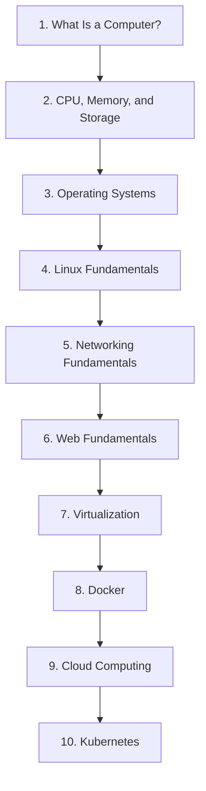
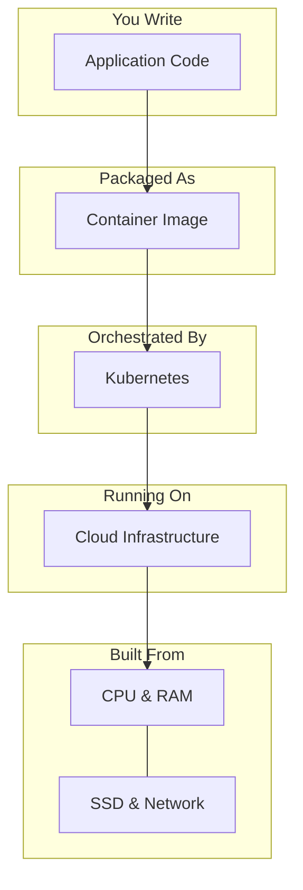

# From Linux to Cloud Native — Introduction

Welcome. This is an open-source learning path that takes you from first principles to cloud-native computing—no prior knowledge assumed.

---

## Table of Contents

- [What Is This?](#what-is-this)
- [Who Is This For?](#who-is-this-for)
- [How the Course Is Structured](#how-the-course-is-structured)
- [The Learning Path](#the-learning-path)
- [What Is Cloud Native?](#what-is-cloud-native)
- [How to Use This Course](#how-to-use-this-course)
- [Prerequisites](#prerequisites)
- [Philosophy](#philosophy)
- [Contributing](#contributing)
- [Let's Begin](#lets-begin)

---

## What Is This?

**From Linux to Cloud Native** is a free, self-paced course that teaches you the fundamentals of computing, Linux, networking, and cloud-native technologies—in that order, from the ground up.

It does not assume you already know what a CPU does. It does not assume you have used a terminal before. It starts with the question *"What is a computer?"* and builds, layer by layer, until you understand how containers, virtual machines, and Kubernetes clusters work.

The course is designed as a sequence of **ten lessons**, each one building on the ones before it. Every lesson is self-contained, written in plain language, and focused on understanding rather than memorisation.

---

## Who Is This For?

- **Complete beginners** who want to enter the world of Linux, DevOps, or cloud engineering.
- **Students** in computer science or IT programmes who want a clear, structured foundation.
- **Career changers** moving into tech from another field.
- **Self-taught developers** who skipped the fundamentals and now want to fill the gaps.
- **Anyone curious** about how modern software infrastructure actually works.

If you already have years of Linux and cloud experience, this course is probably not for you. If you have ever felt like you are "copy-pasting commands without really understanding them," you are exactly who this is for.

---

## How the Course Is Structured

Every lesson follows the same template:

| Section             | Purpose                                                         |
|---------------------|-----------------------------------------------------------------|
| Learning Objectives | What you will be able to do after completing the lesson.        |
| Introduction        | The topic explained in beginner-friendly language.              |
| Why This Matters    | Why engineers need to understand this concept.                  |
| Core Concepts       | The fundamental ideas, introduced clearly.                      |
| How It Works        | A step-by-step, mechanical explanation.                         |
| Real-World Example  | How the concept appears in everyday technology.                 |
| Hands-On Examples   | Practical exercises you can do on your own machine.             |
| Common Misconceptions | Beginner mistakes and misunderstandings, corrected.          |
| Knowledge Check     | Five review questions to test your understanding.               |
| Key Takeaways       | A summary of the most important points.                         |
| Next Lesson         | A brief preview of what comes next.                             |

Lessons use **Mermaid diagrams** to visualise relationships, **tables** to compare concepts, and **callout blocks** for important notes. Terminal commands are provided for Windows, macOS, and Linux so that you can follow along regardless of your operating system.

---

## The Learning Path

The course follows a deliberate progression. Each lesson depends on the ones before it:

| #  | Lesson                                                                               | What It Covers                                                       |
|----|--------------------------------------------------------------------------------------|----------------------------------------------------------------------|
| 1  | [What Is a Computer?](01-what-is-a-computer.md)                                      | Input, process, output, storage; hardware vs software; the OS.       |
| 2  | [CPU, Memory, and Storage](02-cpu-memory-storage.md)                                 | How the CPU executes instructions; RAM, cache, disks, and SSDs.      |
| 3  | [Operating Systems](03-operating-systems.md)                                         | Kernel vs user space; processes, threads, scheduling, and drivers.   |
| 4  | [Linux Fundamentals](04-linux-fundamentals.md)                                       | The Linux filesystem, terminal basics, users, permissions, and shell.|
| 5  | [Networking Fundamentals](05-networking-fundamentals.md)                             | IP addresses, DNS, TCP/UDP, HTTP, and how the internet works.        |
| 6  | [Web Fundamentals](06-web-fundamentals.md)                                           | Clients and servers, APIs, databases, and how web apps are built.    |
| 7  | [Virtualization](07-virtualization.md)                                               | Hypervisors, virtual machines, resource allocation, and isolation.   |
| 8  | [Docker](08-docker.md)                                                               | Containers vs VMs, images, Dockerfiles, and container orchestration. |
| 9  | [Cloud Computing](09-cloud-computing.md)                                             | IaaS, PaaS, SaaS; public/private/hybrid cloud; cloud-native design.  |
| 10 | [Kubernetes](10-kubernetes.md)                                                       | Pods, nodes, clusters, deployments, services, and scaling.           |

The reason for this order is simple: **you cannot understand Kubernetes without understanding containers; you cannot understand containers without understanding Linux; you cannot understand Linux without understanding operating systems; and you cannot understand an operating system without understanding what a computer is.** The course follows that chain of dependencies from the bottom up.

---

## What Is Cloud Native?

Since this is where the course is heading, let us define the destination.

**Cloud computing** is the practice of renting computers, storage, and networking from a provider (like AWS, Google Cloud, or Azure) instead of buying and maintaining physical servers yourself. You pay for what you use, scale up or down on demand, and never touch a physical machine.

**Cloud native** is a way of designing software specifically to take advantage of cloud computing. Instead of building one big application that runs on one big server, you build many small, independent services. Each runs inside a **container** (a lightweight, portable package). A system like **Kubernetes** orchestrates these containers—starting them, stopping them, scaling them, and reconnecting them when they fail.

The tools and patterns of cloud-native computing—containers, orchestration, microservices, infrastructure as code—are powerful. But they are also layers of abstraction. Underneath every abstraction is the same hardware you learn about in the first few lessons.

> **This course exists because abstractions fail.** When a container will not start, when a Kubernetes pod keeps crashing, when a cloud bill spikes inexplicably—the engineer who understands what is happening at every layer, from the CPU to the cluster, is the one who fixes it fastest.

---

## How to Use This Course

1. **Go in order.** Do not skip ahead. Each lesson assumes you have understood the previous one.

2. **Do the exercises.** Every lesson includes hands-on examples. They take only a few minutes, and they cement the knowledge far better than reading alone.

3. **Answer the knowledge check questions.** Try to answer them without looking at the lesson first. If you get one wrong, re-read the relevant section.

4. **Take your time.** There is no deadline. Spend an hour per lesson, or a week—whatever works for you. Depth matters more than speed.

5. **Use your own machine.** You do not need a special computer or expensive software. The early exercises work on any desktop or laptop. Later lessons will guide you through installing Linux (in a virtual machine) and Docker when the time comes.

6. **Ask questions.** If something is unclear, open an issue on the course repository. The material will improve based on your feedback.

---

## Prerequisites

You need:

- A computer (desktop or laptop) with an internet connection.
- The ability to install software on that computer (administrator access).
- Curiosity and patience.

You do **not** need:

- Any prior programming experience.
- Any prior Linux or command-line experience.
- A powerful computer—anything made in the last ten years is fine.
- To spend any money. All tools used in this course are free and open-source.

---

## Philosophy

This course follows a few core beliefs:

**Understanding beats memorisation.**
You do not need to memorise every Linux command. You need to understand *why* a command exists, *what problem* it solves, and *how* it interacts with the rest of the system. Once you have that mental model, you can look up the syntax in seconds.

**First principles first.**
Every complex system is built from simpler pieces. If you understand the pieces and how they fit together, the complex system stops being intimidating. This course never teaches a technology in isolation—it always shows where it fits in the larger picture.

**Simple language, accurate content.**
You can explain a CPU without jargon. You can explain a kernel without assuming the reader already knows what one is. This course uses ordinary words to describe technical concepts, and it never sacrifices accuracy for simplicity.

**Hands-on learning.**
Reading about a terminal is not the same as opening one. Reading about Docker is not the same as running a container. Every lesson includes exercises that you perform on your own machine, because that is how real understanding happens.

**Open and free.**
Knowledge about how computers work should not be locked behind paywalls. This course is open-source. Anyone can read it, use it, and contribute to it.

---

## Contributing

This is an open-source project. If you find an error, a confusing explanation, or a missing topic, you can help fix it.

Ways to contribute:

- **Report issues:** Open a GitHub issue describing the problem.
- **Suggest improvements:** If a section could be clearer, propose a change.
- **Submit fixes:** Correct typos, broken commands, or outdated information.
- **Add exercises:** Propose new hands-on examples that reinforce a concept.
- **Translate:** Help make the course available in other languages.

The goal is to build the best free introduction to cloud-native computing that exists. Every contribution helps.

---

## Let's Begin

Start with **Lesson 1: What Is a Computer?** It takes about 20 minutes to read and 10 minutes to do the exercises. By the end, you will have a clear mental model of what a computer is and how its components work together—the foundation for everything that follows.

[Go to Lesson 1 →](01-what-is-a-computer.md)

All lessons are linked in the [Learning Path](#the-learning-path) table above.
