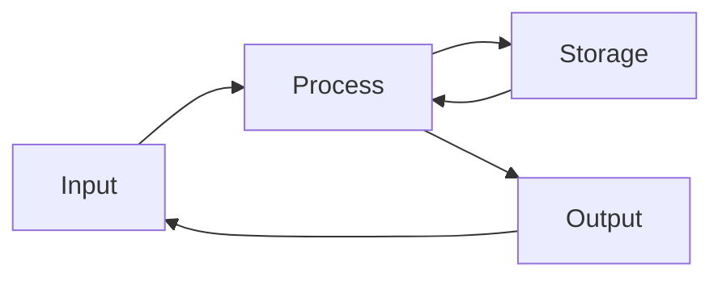
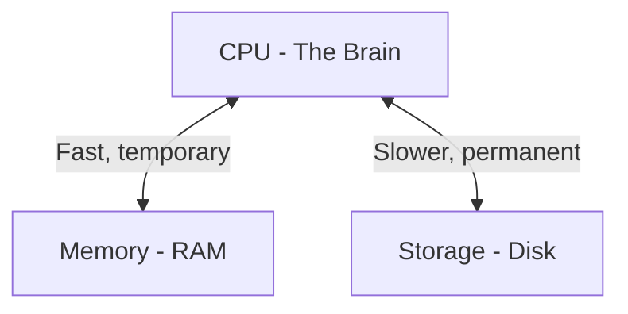
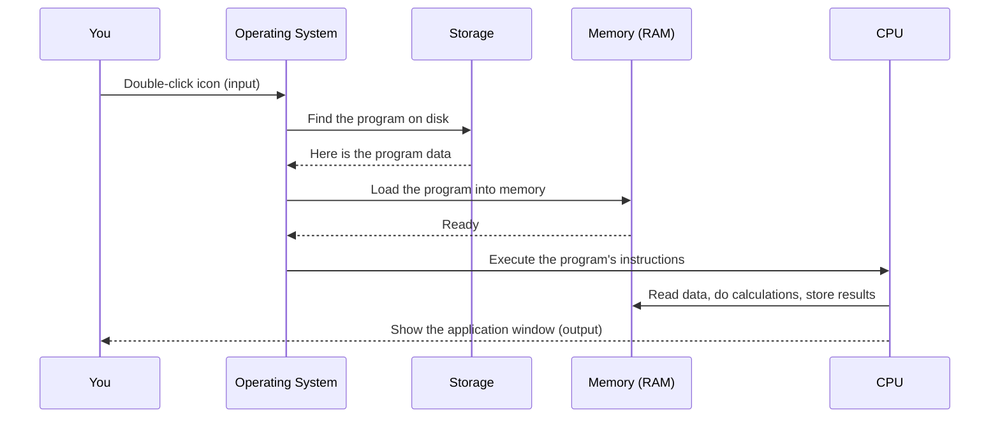

# What Is a Computer?

## Learning Objectives

By the end of this lesson, you will be able to:

- Define what a computer is in simple terms.
- Identify the four basic functions every computer performs.
- Distinguish between hardware and software.
- Understand the difference between a desktop computer and a server.
- Explain what an operating system does and why a computer needs one.

---

## Introduction

Imagine you want to send a text message to a friend. You tap the screen of your phone, and within seconds, your words appear on a device that might be thousands of kilometres away. How does that happen?

At the heart of that experience—and of almost everything digital in modern life—is a **computer**.

A computer is a machine that takes information (input), processes it according to a set of instructions (process), stores what it needs along the way (storage), and produces a result (output). That is it. No magic. No mystery.

The device on your desk, the phone in your pocket, the thermostat on your wall, the servers running websites, and even the navigation system in a car are all computers. They look different and serve different purposes, but they all share the same fundamental blueprint.

When you learn what a computer really is, you stop seeing it as a "black box" and start seeing it as a tool you can understand, control, and build upon. This lesson is the first step on that journey.

---

## Why This Matters

If you want to work with Linux, cloud computing, containers, or Kubernetes, you will spend your career telling computers what to do. Before you can command a machine effectively, you need to understand what the machine actually *is*.

Every concept later in this learning path—from "what is a process?" to "why does a container need a kernel?"—rests on the ideas introduced in this lesson. Skipping this is like trying to repair a car engine without knowing what a piston is.

Understanding the computer at this foundational level also demystifies the technology. Once you see that a computer is just a collection of simple, logical parts working together, everything built on top of it—operating systems, networks, cloud platforms—becomes easier to grasp.

---

## Core Concepts

### The Four Basic Functions

Every computer, regardless of size or purpose, does exactly four things:



| Function  | Meaning                                    | Real-World Analogy                          |
|-----------|--------------------------------------------|---------------------------------------------|
| **Input** | Receiving data from the outside world.     | A microphone capturing your voice.          |
| **Process** | Manipulating or calculating with the data. | Your brain deciding what the words mean.    |
| **Output** | Sending the result back to the world.      | Your mouth speaking a reply.                |
| **Storage** | Saving data for later use.                | Your memory storing what was said.          |

These four functions describe a loop: you provide input, the computer processes it (perhaps saving intermediate results to storage), and it produces output. Then it waits for the next input.

> **Beginner Tip:** When you get stuck troubleshooting a problem later, ask yourself: “Which of these four steps is failing?” This simple question will save you hours.

### Hardware vs Software

A computer consists of two fundamentally different kinds of things:

| Layer       | What It Is                                      | Can You Touch It? | Examples                            |
|-------------|-------------------------------------------------|--------------------|-------------------------------------|
| **Hardware** | The physical parts.                            | Yes.               | CPU, RAM, hard drive, keyboard.     |
| **Software** | Instructions that tell the hardware what to do. | No.                | Operating system, web browser, games.|

Think of hardware as the body and software as the mind. The body provides the physical capability, but without the mind instructing it, the body does nothing useful.

### The Three Essential Hardware Components

While a computer can include many devices (cameras, printers, network cards), three components are *essential*—without them, you do not have a working computer:

1. **CPU (Central Processing Unit):** The part that does the actual "thinking"—performing calculations, making decisions, and executing instructions. It is often called the "brain."

2. **Memory (RAM):** The computer’s short-term, temporary workspace. The CPU can read and write to memory extremely quickly, but memory loses everything when the power is turned off.

3. **Storage (Disk):** The computer’s long-term memory. It keeps data even when the power is off, but it is much slower than RAM.



> **Key Insight:** The relationship between these three components explains almost every performance problem you will encounter. When a computer feels "slow," it is usually because the CPU is waiting for data from storage instead of getting it quickly from memory.

### What Is an Operating System?

Hardware alone is inert. If you tried to talk to a CPU directly, you would need to write instructions in binary (ones and zeros). That would be unbelievably slow and error-prone.

An **operating system (OS)** is a piece of software that sits between you and the hardware. Its job is to:

- Manage the CPU, memory, and storage so that many programs can share them.
- Provide a consistent interface so that programmers do not need to know the details of every specific hardware component.
- Offer basic services like reading files, sending network data, and displaying graphics.

Linux, Windows, and macOS are all operating systems. Later in this learning path, you will work extensively with Linux—but for now, just know that the OS is the translator and the manager that makes the computer usable.

---

## How It Works

Let us trace what happens inside a computer when you perform a simple action: double-clicking an icon to open an application.



**Step 1 — Input:** Your double-click is an input event. The operating system detects it and identifies which program you want to run.

**Step 2 — Storage access:** The OS locates the program’s files on the storage device (hard drive or SSD). Programs live on disk when they are not running.

**Step 3 — Load into memory:** The OS copies the program from slow storage into fast RAM. The CPU can only work with data that is in memory, so this step is essential.

**Step 4 — Execute:** The CPU begins fetching, decoding, and executing the program’s instructions one by one, billions of times per second.

**Step 5 — Output:** The CPU sends instructions to the graphics hardware, which paints pixels on your screen. You see the application window appear.

This entire sequence, from click to visible window, typically completes in under a second—thanks to the coordination of hardware, operating system, and application software.

---

## Real-World Example

### Your Smartphone Is a Computer

A modern smartphone contains:

- A CPU (often called a system-on-a-chip, or SoC, which packs the CPU, GPU, and other components together).
- RAM (4–16 GB, used for running apps).
- Storage (64–512 GB, used for photos, music, and apps).
- An operating system (Android or iOS).
- Input devices (touchscreen, microphone, camera, gyroscope).
- Output devices (screen, speaker, vibration motor).

When you open a map and search for directions, the same fundamental cycle occurs:

1. **Input:** Your typed address and the GPS chip’s location data.
2. **Process:** The CPU calculates the best route using map data in memory.
3. **Storage:** The route data is saved temporarily so you can access it even if you lose the internet connection.
4. **Output:** A map with turn-by-turn directions appears on the screen.

### A Server Is Also a Computer

A **server** is a computer just like the one on your desk, but it is built and configured for a different purpose:

|                  | Desktop / Laptop                          | Server                                    |
|------------------|-------------------------------------------|-------------------------------------------|
| **Purpose**      | Used by one person at a time.             | Serves many users or applications.        |
| **Operating System** | Windows, macOS, or Linux.              | Typically Linux or Windows Server.         |
| **Form Factor**  | Tower, laptop, or all-in-one.             | Rack-mounted in a data centre.            |
| **Features**     | Screen, keyboard, GPU for graphics.       | Redundant power supplies, ECC RAM, remote management. |
| **Who Uses It**  | An individual.                            | Developers, businesses, cloud providers.  |

When you shop for a cloud virtual machine, you are essentially renting a slice of a server. When you later learn about Docker and Kubernetes, you will be running software on servers (or virtual machines that act like servers). A server is not a magical, different kind of device—it is simply a computer optimised for providing services rather than direct human interaction.

> **Cloud Connection:** Every time you launch a "virtual machine" in the cloud, a physical server somewhere splits its CPU, RAM, and storage into isolated slices using technology called a **hypervisor** (covered in Lesson 7). Your cloud VM is not a simulation—it is a real fraction of a real computer. The input-process-output-storage loop runs the same way it does on the machine in front of you.

---

## Hands-On Examples

You do not need to install anything for this lesson. Open your current computer and try these exercises to build intuition.

### Exercise 1: Identify Your Hardware

**Windows:**
Right-click the Start button → **System**. Note down your CPU model, installed RAM, and system type (64-bit).

**macOS:**
Click the Apple menu → **About This Mac**. Note down your chip (or processor) and memory.

**Linux:**
Open a terminal and run:

```bash
# Show CPU information
lscpu | head -20

# Show memory information
free -h

# Show disk information
df -h
```

Ask yourself: "How much RAM do I have? How much storage? What CPU?" This is the first habit of a system administrator.

### Exercise 2: Watch Your Computer Work

**Windows:**
Press `Ctrl + Shift + Esc` to open Task Manager. Click **More details** if needed. Observe the **Processes** tab—every line is a program running on your CPU. Watch the CPU and Memory columns change in real time.

**macOS:**
Press `Cmd + Space`, type "Activity Monitor," and press Enter. Observe the CPU and Memory tabs.

**Linux:**
Open a terminal and run:

```bash
# Interactive process viewer (press q to quit)
top

# Or, for a snapshot:
ps aux
```

The numbers you see—CPU percentage, memory usage—are your computer performing the **process** function at this very moment.

### Exercise 3: Think in Terms of Input, Process, Output, Storage

Pick an everyday computing action (saving a document, streaming a video, sending an email) and write down what the **input**, **process**, **output**, and **storage** steps are. There are no "wrong" answers here—the goal is to train yourself to see the pattern.

Example for streaming a video:

| Function   | What Happens                                        |
|------------|-----------------------------------------------------|
| Input      | The video data arrives over the network.            |
| Process    | The CPU and GPU decode the video frames.            |
| Output     | Pictures appear on the screen, sound from speakers. |
| Storage    | A small buffer is stored in memory for smooth playback. |

---

## Common Misconceptions

### "My phone isn't a computer."

Your phone is absolutely a computer. It has a CPU, RAM, storage, and an operating system. The form factor is different, but the architecture is the same. This matters because cloud-native technologies increasingly target mobile and edge devices.

### "More memory means a faster CPU."

No. Adding RAM can make a system feel faster because the CPU spends less time waiting for data from slow storage, but the CPU’s actual speed does not change. RAM and CPU are separate components with separate jobs.

### "The hard drive stores the programs I am using right now."

When a program is running, it lives in RAM. The hard drive stores programs when they are not running. This distinction is critical: if you run out of RAM, your computer must swap data back to the slow disk, which causes drastic slowdowns.

### "An operating system is just a program like any other."

It is software, yes, but it has a privileged position. The OS runs directly on the hardware and controls access to it. Ordinary programs must ask the OS for permission to read files, use the network, or draw on the screen. This separation is what keeps one buggy program from crashing the entire machine.

### "Servers are fundamentally different from desktops."

They are not. Both have CPUs, RAM, storage, and run operating systems. Servers are simply configured for reliability and multi-user workloads rather than interactive, single-user use. As a cloud engineer, you will treat servers as cattle, not pets—but under the hood, they are still just computers.

---

## Knowledge Check

1. What are the four basic functions that every computer performs?
2. What is the difference between hardware and software? Give one example of each.
3. Why must a program be loaded from storage into memory before the CPU can execute it?
4. What is the main job of an operating system?
5. Name two ways a server differs from a desktop computer.

> **Answers for self-review:**
> 1. Input, Process, Output, Storage.
> 2. Hardware is the physical parts you can touch (e.g., CPU); software is the instructions that control the hardware (e.g., web browser).
> 3. The CPU can only access data in memory (RAM), which is much faster than storage. The program must be in RAM for the CPU to read its instructions.
> 4. To manage hardware resources (CPU, memory, storage) and provide a consistent interface between users/programs and the hardware.
> 5. Servers typically serve many users/applications simultaneously and have features like redundant power supplies and remote management, whereas desktops/laptops are built for single-user interactive use and include screens and keyboards directly attached.

---

## Key Takeaways

- A computer is a machine that performs **input, process, output, and storage** in a continuous loop.
- **Hardware** is the physical body; **software** is the instructions that animate it.
- The three essential hardware components are the **CPU** (the brain), **RAM** (short-term memory), and **storage** (long-term memory).
- The **operating system** is the manager that sits between you and the hardware, making the computer usable and allowing multiple programs to run safely.
- Servers, phones, desktops, and cloud virtual machines are all fundamentally the same kind of device, just optimised for different roles.
- You do not need to memorise every detail—you need to understand the **relationships** between these components, because those relationships explain almost everything else in computing.

---

## Next Lesson

**CPU, Memory, and Storage**

Now that you know *what* a computer is, the next lesson zooms into the three essential hardware components. You will learn how a CPU executes instructions, why RAM is called "random access," and what makes SSDs faster than hard drives—giving you the mental model to reason about computer performance.
