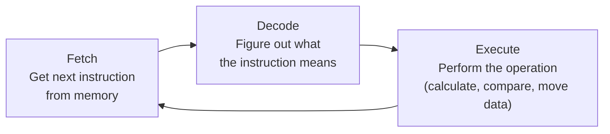
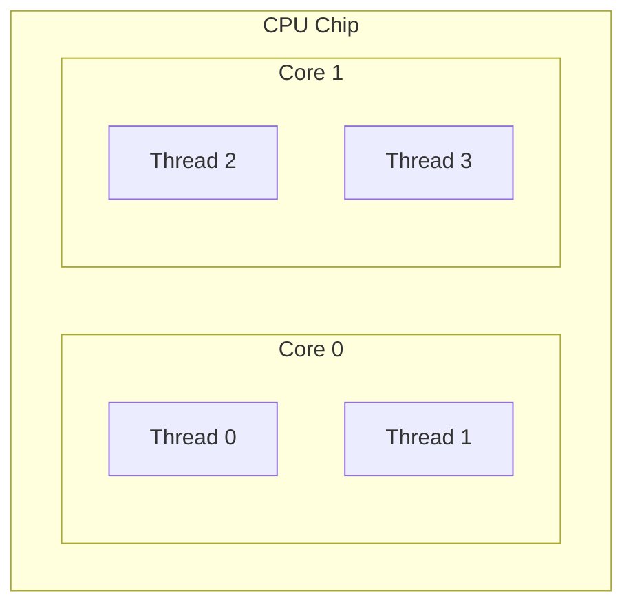
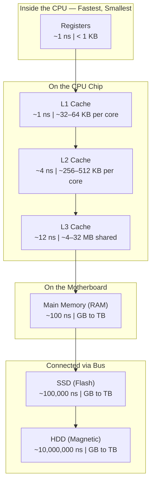
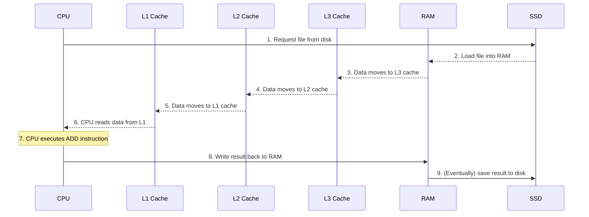

# CPU, Memory, and Storage

## Learning Objectives

By the end of this lesson, you will be able to:

- Describe the fetch-decode-execute cycle that every CPU follows.
- Explain what CPU cores and threads are, and why they matter.
- Map out the memory hierarchy from registers to disk and explain why it exists.
- Compare HDD and SSD storage in terms of speed, cost, and use cases.
- Understand why the speed gap between components is the central performance challenge in computing.
- Connect CPU, memory, and storage specifications to real-world cloud computing decisions.

---

## Introduction

In Lesson 1, you learned that a computer performs four functions: input, process, output, and storage—and that three hardware components make this possible: the CPU, memory (RAM), and storage (disk).

Now we zoom in. What actually happens inside the CPU when it "processes" data? Why can't the CPU just use the hard drive directly, skipping RAM? Why do some programs feel fast while others crawl?

These are not academic questions. When you rent a cloud server, you choose a number of CPU cores, an amount of RAM, and a type of storage—and you pay for each. Every dollar you spend, and every millisecond of performance you get (or lose), traces back to the concepts in this lesson.

By the end, you will have a mental model for computer performance that stays with you throughout your entire career.

---

## Why This Matters

In cloud computing, hardware is abstracted behind APIs and dashboards. You click a button that says "4 vCPUs, 16 GB RAM, 100 GB SSD." It is easy to treat these as magic numbers. It is expensive to get them wrong.

| If you do not understand...            | You might...                                         |
|-----------------------------------------|------------------------------------------------------|
| CPU cores and threads                   | Overpay for cores your application cannot use.       |
| The memory hierarchy                    | Wonder why your database is slow despite "enough" RAM.|
| Storage types and latency               | Pick the wrong disk and cripple application startup. |
| The speed gap between components        | Be unable to diagnose why a server is "slow."         |

Every lesson that follows—operating systems, Linux, containers, Kubernetes—depends on you understanding *why* hardware behaves the way it does. This is the lesson where you build that foundation.

---

## Core Concepts

### The CPU: More Than Just "the Brain"

A **CPU (Central Processing Unit)** is a chip containing billions of microscopic switches called **transistors**. These switches are arranged into circuits that perform arithmetic, compare values, and move data. The CPU does one thing over and over, billions of times per second: it executes instructions.

#### The Instruction Cycle

Every CPU follows the same three-step loop:



**Fetch:** The CPU asks memory for the next instruction in the program.

**Decode:** The CPU examines the instruction—is it "add two numbers"? "compare two values"? "copy data from here to there"?

**Execute:** The CPU performs the operation. An addition might take one cycle. Reading from RAM might take hundreds of cycles (the CPU waits).

This loop repeats billions of times per second. A 3 GHz CPU cycles 3 billion times per second—but that does not mean it executes 3 billion instructions per second, because some instructions take multiple cycles, and the CPU often stalls waiting for data to arrive from memory.

#### Clock Speed (GHz)

**Clock speed** is how many cycles the CPU completes per second. 1 GHz = 1 billion cycles. A 3.5 GHz processor ticks 3.5 billion times per second.

Higher clock speed means more work per second—*if* the CPU has data ready to process. This "if" is critical. A CPU with a high clock speed but no data to work on is like a chef with lightning-fast knife skills waiting for ingredients that have not arrived yet.

#### Cores and Threads

A **core** is an independent execution unit—essentially a full CPU on its own. A quad-core CPU has four cores that can run four different programs (or four parts of the same program) simultaneously.

A **thread** (in hardware terms, also called a **logical processor** or **hardware thread**) is what happens when one physical core pretends to be two, using a technique called **Simultaneous Multithreading (SMT)**—Intel calls this Hyper-Threading. While one thread is stalled waiting for data from memory, the core can work on the other thread's instructions.



> **Key point:** Two threads on one core do not give you double the performance. They give you perhaps 20–30% more, because they share the same core's resources. This distinction matters enormously when sizing cloud instances.

### The Memory Hierarchy

If the CPU is the fastest component in a computer, why not make everything that fast? Because fast memory is expensive, small, and power-hungry. Cheap memory is slow but large. Engineers solve this with a **hierarchy**: a series of ever-larger, ever-slower storage layers that keep the most urgently needed data closest to the CPU.



| Level        | Approximate Latency       | Typical Size        | Volatile? |
|--------------|---------------------------|---------------------|-----------|
| **Registers**| ~1 nanosecond             | Bytes (a few words) | Yes       |
| **L1 Cache** | ~1 nanosecond             | 32–64 KB per core   | Yes       |
| **L2 Cache** | ~4 nanoseconds            | 256–512 KB per core | Yes       |
| **L3 Cache** | ~12 nanoseconds           | 4–32 MB shared      | Yes       |
| **RAM**      | ~100 nanoseconds          | 4–512 GB            | Yes       |
| **SSD**      | ~100,000 nanoseconds      | 128 GB – 4 TB       | No        |
| **HDD**      | ~10,000,000 nanoseconds   | 256 GB – 20 TB      | No        |

> **Understand the scale:** Accessing RAM is roughly 100× slower than accessing L1 cache. Accessing an SSD is 1,000× slower than RAM. Accessing an HDD is 100,000× slower than RAM. When your program is "slow," it is almost always because data is coming from too far down this hierarchy.

#### Why the Hierarchy Exists

There is a fundamental trade-off in computer engineering, often called the **memory wall**: CPU speed has grown faster than memory speed for decades.

| Goal        | Solution                         | Trade-Off                        |
|-------------|----------------------------------|----------------------------------|
| Fast        | Put memory very close to the CPU | Expensive, small, hot            |
| Large       | Put memory far from the CPU      | Slow to access                   |
| Cheap       | Use dense, commodity technology  | Even slower                      |

No single technology satisfies all three. The hierarchy is the compromise: a little very-fast memory (registers, caches), a medium amount of fast memory (RAM), and a lot of slow storage (SSD, HDD). The CPU keeps the data it is using *right now* in the fastest level and moves everything else further down.

#### How the CPU Uses Cache

When the CPU needs data, it checks:
1. L1 cache. If found (**cache hit**) → use it immediately.
2. L2 cache. If found → copy to L1, then use it.
3. L3 cache. If found → copy to L2 and L1, then use it.
4. RAM. If found → copy up through all caches, then use it.
5. If not in RAM → load from disk (terribly slow).

This is called the **cache hierarchy lookup**. The CPU's goal is to keep **cache hits** high and **cache misses** low. Programs written to access data in predictable, local patterns (good **locality of reference**) perform dramatically better than those that jump around randomly in memory.

### Storage: HDD vs SSD

Storage is the only layer in the hierarchy that retains data without power. Two technologies dominate:

|                                  | HDD (Hard Disk Drive)                          | SSD (Solid State Drive)                         |
|----------------------------------|------------------------------------------------|-------------------------------------------------|
| **How it works**                 | Spinning magnetic platters + mechanical arm    | NAND flash chips, no moving parts               |
| **Seek time (to find data)**     | ~5–10 milliseconds                             | ~0.1 milliseconds                               |
| **Sequential read speed**        | ~100–250 MB/s                                   | ~500–7,000 MB/s (NVMe)                          |
| **Random read speed (IOPS)**     | ~100–200 IOPS                                   | ~10,000–1,000,000 IOPS                          |
| **Cost per GB**                  | Lower                                          | Higher (gap narrowing)                          |
| **Durability (physical shocks)** | Sensitive (moving parts)                       | Resilient (no moving parts)                     |
| **Noise**                        | Audible spinning/clicking                      | Silent                                          |
| **Power consumption**            | Higher                                         | Lower                                           |

**IOPS** stands for **Input/Output Operations Per Second**—how many individual read or write requests the drive can handle per second. This matters more than raw throughput for many workloads. A database doing thousands of small lookups needs high IOPS, not high MB/s.

#### Sequential vs Random Access

- **Sequential access:** Reading data in order, like copying a large video file. Both HDDs and SSDs do this reasonably well.
- **Random access:** Reading data scattered across the drive, like a database looking up thousands of unrelated records. HDDs are terrible at this (the mechanical arm must physically move), while SSDs handle it easily (no moving parts).

> **Cloud insight:** On AWS, a `gp3` EBS volume provides 3,000 IOPS baseline for random I/O. An `io2` volume can go up to 256,000 IOPS. The difference in cost and performance comes directly from the physics described above.

---

## How It Works

### A Complete Data Journey

Let us trace what happens when a program adds two numbers stored in a file on disk:



**Step 1–2:** The operating system loads the file from the SSD into RAM. This is the slowest step because the SSD-to-RAM link is the bottleneck.

**Step 3–6:** As the CPU requests pieces of the data, they migrate from RAM up through the cache hierarchy. By the time data reaches L1, it has been copied four times—but each copy places it closer to the CPU, where it can be accessed with single-nanosecond latency.

**Step 7:** The CPU executes the `ADD` instruction using data now in its registers. This takes a fraction of a nanosecond.

**Step 8–9:** The result is written back to RAM and, eventually, to the SSD. Writes follow the same hierarchy in reverse.

The overwhelming majority of time is spent in steps 1–2: moving data from storage to RAM. This is why reducing disk I/O is the single most impactful optimisation in system design.

### Why the Speed Gap Defines Performance

To feel the difference in human terms, imagine each nanosecond were one second:

| Action                               | Computer Time | Human Scale          |
|--------------------------------------|---------------|----------------------|
| CPU register access                  | 1 ns          | 1 second             |
| L1 cache access                      | 1 ns          | 1 second             |
| L2 cache access                      | 4 ns          | 4 seconds            |
| L3 cache access                      | 12 ns         | 12 seconds           |
| RAM access                           | 100 ns        | ~1.5 minutes         |
| SSD read                             | 100,000 ns    | ~1 day               |
| HDD read                             | 10,000,000 ns | ~4 months            |

When your CPU misses L1 cache and has to go to RAM, it waits the equivalent of over a minute. When it has to go to disk, it waits the equivalent of a day or more. A modern CPU has sophisticated tricks to hide these waits (out-of-order execution, prefetching, SMT), but the gap is physical, not programmable. You cannot optimise it away—you can only design around it.

---

## Real-World Example

### Cloud Instance Types

Public clouds offer instance types optimised for different hardware profiles. The categories directly mirror this lesson:

| Instance Family | Optimised For            | Real-World Use Case                              |
|-----------------|--------------------------|--------------------------------------------------|
| **Compute-optimised** | High CPU-to-memory ratio | Batch processing, scientific computing, game servers |
| **Memory-optimised**  | High memory-to-CPU ratio | Databases, in-memory caches (Redis, Memcached)  |
| **Storage-optimised** | High IOPS / throughput   | Data warehousing, log processing, search engines |
| **General purpose**   | Balanced CPU, RAM, I/O   | Web servers, small/medium databases, dev environments |

**Example:** An AWS `c7g.large` (compute-optimised) provides 2 vCPUs and 4 GB RAM. An `r7g.large` (memory-optimised) provides 2 vCPUs and 16 GB RAM—same CPU count, four times the RAM. If your application holds large data structures in memory, the memory-optimised instance prevents the OS from swapping to disk, avoiding a 10,000× slowdown.

**Example:** A database server handling 50,000 queries per second needs high random-read IOPS. An SSD-backed instance (`gp3` or `io2`) is mandatory; an HDD-backed instance would collapse under the mechanical arm's seek delays.

### CPU Credits and Burst Performance

Some cloud instances (like AWS T-series) use **CPU credits**: you accumulate credits when the CPU is idle and spend them when you need a burst of performance. This works because most workloads are "bursty"—spiky, not constant. Understanding that CPU speed is a physical limit, not a dial you turn, helps you see why sustained high CPU usage eventually exhausts credits and throttles performance.

---

## Hands-On Examples

You do not need to install anything new. Use the machine in front of you.

### Exercise 1: Inspect Your CPU

**Windows:**
Open Task Manager → **Performance** tab → **CPU**. Note:
- **Cores:** Physical cores in your machine.
- **Logical processors:** Cores × threads per core (SMT/Hyper-Threading).
- **Base speed** and **current speed** (GHz).

**macOS:**
Open Terminal and run:

```bash
# Number of physical cores
sysctl -n hw.physicalcpu

# Number of logical processors (includes SMT threads)
sysctl -n hw.logicalcpu

# CPU brand and speed
sysctl -n machdep.cpu.brand_string
```

**Linux:**
Open a terminal and run:

```bash
# Detailed CPU information
lscpu

# Just the model name and cores
lscpu | grep -E "Model name|Core|Thread|CPU MHz"
```

Compare the "CPU(s)" value to "Thread(s) per core" × "Core(s) per socket." Notice the difference: that is the SMT/Hyper-Threading multiplier you learned about.

### Exercise 2: Inspect Your Memory Hierarchy

**Linux:**
```bash
# Cache sizes reported by the kernel
lscpu | grep -i cache

# RAM size
free -h

# Check if you have swap enabled (disk used as emergency RAM)
swapon --show
```

**Windows (PowerShell):**
```powershell
# RAM size
systeminfo | Select-String "Total Physical Memory"

# Check page file (Windows equivalent of swap)
Get-CimInstance -ClassName Win32_PageFileUsage | Format-List Name, CurrentUsage, AllocatedBaseSize
```

**macOS:**
```bash
# RAM size
sysctl -n hw.memsize | awk '{print $0/1073741824 " GB"}'

# Check swap usage
sysctl -n vm.swapusage
```

If your system has swap/pagefile in use, it means RAM was full and the OS started using the disk as overflow—a 100,000× slowdown for whatever data landed there.

### Exercise 3: Feel the Difference Between RAM and Disk

**All platforms** — open a large application you have not opened recently (something that takes a few seconds to start, like a web browser or an IDE). Close it. Reopen it immediately. Notice the second launch is much faster. Why?

The first time, the program's data had to come from storage (SSD/HDD). The second time, much of that data is still in RAM (the OS caches recently-used files). You just experienced the difference between ~100,000 ns and ~100 ns access time.

### Exercise 4: Observe Disk Activity

**Windows:** Task Manager → **Performance** tab → **Disk**. Watch **Active time** and **Average response time**.

**macOS:** Activity Monitor → **Disk** tab. Watch **Data read/sec** and **Data written/sec**.

**Linux:**
```bash
# Install iostat if not available, then watch disk stats every 2 seconds
iostat -x 2

# Simpler alternative: watch the summary
iostat -h 2
```

Run a program or copy a file while watching these numbers. When "response time" spikes, that is your storage struggling to keep up—exactly what happens when you pick the wrong storage tier in the cloud.

---

## Common Misconceptions

### "More GHz always means faster."

GHz is the clock speed, but different CPU designs do different amounts of work per clock cycle (**Instructions Per Cycle**, or IPC). A 2.5 GHz CPU from 2024 can be faster than a 4 GHz CPU from 2014 because it does more work in each cycle. Always consider both clock speed and architecture generation.

### "More cores always means faster."

Only if your program is written to use multiple cores. Many programs—especially older or simpler ones—run on a single thread and use only one core. Adding cores helps only when the work can be divided into parallel tasks. A single-threaded application on a 64-core server uses exactly one core.

### "If I have enough RAM, my program will be fast."

RAM size prevents *catastrophic* slowdowns (swapping to disk), but does not eliminate the RAM-to-cache latency. A program that accesses memory in unpredictable patterns—poor locality of reference—will still be slow even with abundant RAM, because the CPU constantly waits for data to move up the hierarchy.

### "SSDs are just like HDDs but faster."

SSDs are fundamentally different technology with different performance characteristics. An HDD that is 90% full performs roughly the same as an empty one. An SSD that is 90% full can slow down significantly because of how NAND flash manages writes. Cloud providers price storage tiers around these physical realities.

### "CPU credits and burst capacity mean the CPU magically gets faster."

No. The CPU always runs at its physical clock speed. Credits control how much *time* you are allowed to use the CPU at full speed, not the speed itself. Running out of credits throttles your usage—it does not downclock the processor.

---

## Knowledge Check

1. What are the three steps of the CPU instruction cycle?
2. Why does the memory hierarchy exist instead of making all memory as fast as registers?
3. What is the approximate latency difference between an L1 cache access and a RAM access? (Order of magnitude is enough.)
4. Why is an SSD better than an HDD for a database handling many small queries?
5. A cloud instance has 64 vCPUs and your application is single-threaded. How many vCPUs can your application actually use at once?

> **Answers for self-review:**
> 1. Fetch, Decode, Execute.
> 2. Because of the trade-off between speed, capacity, and cost. Fast memory (registers, caches) is expensive and small; slow memory (RAM, disk) is cheap and large. The hierarchy puts the most-needed data closest to the CPU.
> 3. L1 cache access is ~1 ns; RAM access is ~100 ns—roughly 100× slower.
> 4. An HDD relies on a mechanical arm that must physically move to read scattered data, limiting it to ~100–200 random reads per second (IOPS). An SSD has no moving parts and can handle ~10,000+ IOPS, making it vastly better for many small, scattered queries.
> 5. One vCPU. A single-threaded application cannot use more than one logical processor at a time.

---

## Key Takeaways

- The CPU executes instructions in a relentless **fetch-decode-execute** loop, billions of times per second.
- **Clock speed (GHz)** matters, but so does architecture generation (IPC), and both are meaningless if the CPU is starved for data.
- **Cores** provide true parallelism; **threads** (SMT/Hyper-Threading) provide partial parallelism by filling idle time.
- The **memory hierarchy** exists because speed, capacity, and cost cannot be optimised simultaneously. Data moves from slow, large storage up through fast, small caches.
- **RAM is ~100× slower than L1 cache. SSD is ~1,000× slower than RAM. HDD is ~100× slower than SSD.** These ratios explain nearly all performance behaviour.
- **HDDs** are mechanical and suffer on random access; **SSDs** are electronic and handle random I/O well. IOPS measures this difference.
- In the cloud, you pay for CPU cores, RAM gigabytes, and storage IOPS/throughput. Understanding what these physically mean is how you choose the right size and avoid overpaying.

---

## Next Lesson

**Operating Systems**

Now that you understand the hardware, the next lesson introduces the software layer that manages it: the operating system. You will learn how the OS divides the CPU between programs, manages memory with virtual addressing, and provides the files, processes, and permissions that every Linux system is built upon.
