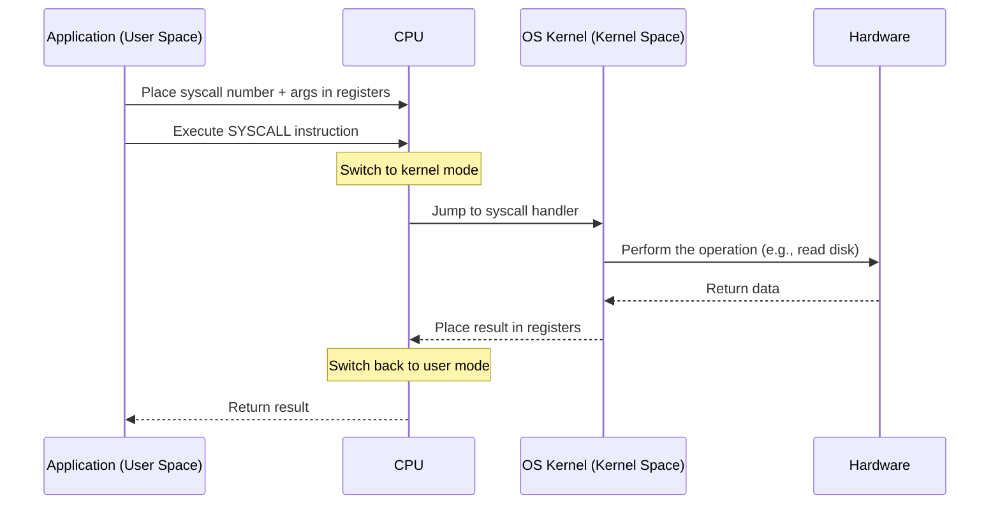
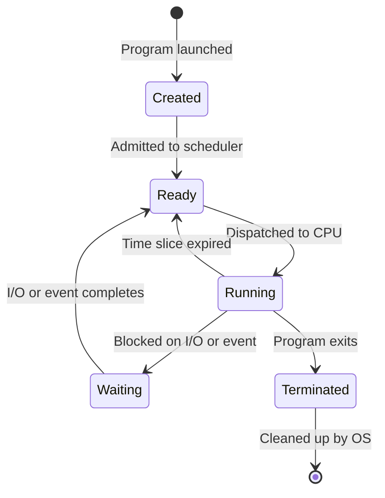
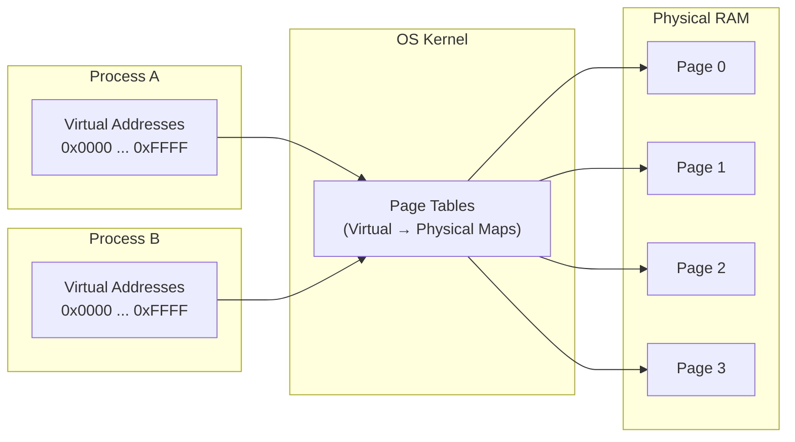
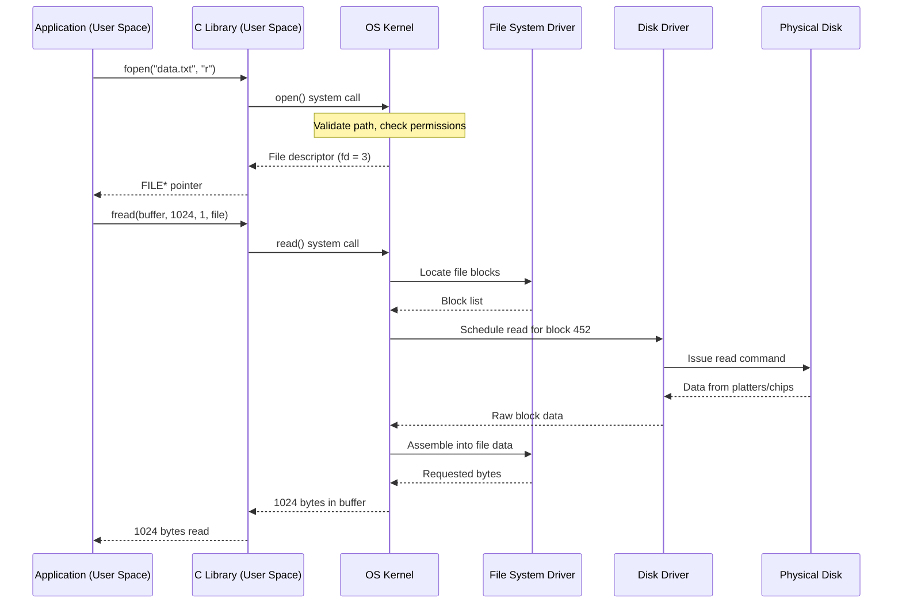
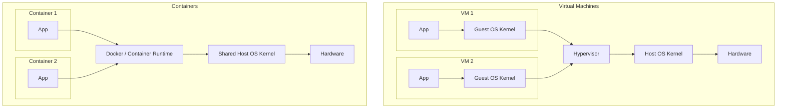

# Operating Systems

## Learning Objectives

By the end of this lesson, you will be able to:

- Explain what an operating system does beyond just "managing hardware."
- Distinguish between kernel space and user space, and explain why the boundary exists.
- Describe what a system call is and why programs must use them.
- Diagram the lifecycle of a process and explain what a context switch is.
- Understand virtual memory and why it is essential for security and stability.
- Explain the role of a file system and how it organises data.
- Connect OS concepts to real-world cloud and container behaviour.

---

## Introduction

In Lesson 2, you learned that a CPU executes instructions in a relentless fetch-decode-execute loop, that data travels through a hierarchy of caches and memory, and that storage comes in two fundamentally different technologies.

But nothing in that picture explains how your web browser, your text editor, and your music player can all run at the same time on one CPU. Nothing explains why a bug in your text editor does not crash your web browser. Nothing explains how you can have twenty programs open using 32 GB of virtual memory each on a machine with only 8 GB of physical RAM.

The answer to all of these questions is the **operating system (OS)**.

An operating system is the software layer that transforms bare hardware—a collection of circuits, buses, and storage chips—into a usable, safe, multi-tasking computer. It is the first program that runs when a computer boots, and it never stops until the computer shuts down. Every program you have ever used—every browser, every game, every cloud service—runs on top of an operating system.

This lesson explains what an OS actually does, how it does it, and why its design decisions ripple upward into everything you will learn about Linux, containers, and Kubernetes.

---

## Why This Matters

Cloud engineers work with operating systems constantly, whether they realise it or not. Every virtual machine in the cloud runs an OS. Every container shares the host machine's OS kernel. Every command you type into a terminal is interpreted by an OS shell.

| If you do not understand...       | You might...                                                     |
|------------------------------------|------------------------------------------------------------------|
| Kernel vs user space               | Misunderstand why containers share a kernel but VMs do not.      |
| Processes and scheduling            | Be unable to explain why a server's CPU is at 100%.              |
| Virtual memory                     | Wonder why your application ran out of memory when "free" showed gigabytes available. |
| File systems and permissions        | Struggle with Linux file permissions and storage mounting.       |
| System calls                       | Have no mental model for how programs actually interact with hardware. |

The OS is the foundation that Linux, Docker, and Kubernetes are built on top of. When something breaks in production—a process is killed, a container fails to start, a disk fills up—it is almost always an OS-level issue. The engineer who understands the OS diagnoses the problem; the one who does not guesses.

---

## Core Concepts

### What an Operating System Does

An operating system has two fundamental jobs:

1. **Resource Manager:** It divides the computer's CPU time, memory, storage, and I/O devices among all the programs that want to use them—fairly, safely, and efficiently.

2. **Abstraction Layer:** It hides the messy, hardware-specific details behind clean, consistent interfaces. A programmer writes to "open a file," not to "send SATA command 0x25 to disk controller 3 on PCI bus 2."

```mermaid
flowchart TD
    subgraph "User Space"
        Apps[Applications\nBrowser, Database, Game]
    end
    subgraph "Kernel Space"
        OS[Operating System Kernel\nProcess Manager | Memory Manager | File System | Network Stack]
    end
    subgraph "Hardware"
        Hw[CPU | RAM | Disk | Network Card | GPU]
    end

    Apps <-->|System Calls| OS
    OS <-->|Drivers / Instructions| Hw
```

Everything above the OS is **user space**. Everything at the OS level and below is **kernel space**. This boundary is the single most important architectural decision in modern computing.

### Kernel Space vs User Space

The **kernel** is the core of the operating system. It is the only piece of software that runs with full, unrestricted access to the hardware. It can execute any CPU instruction, access any memory address, and talk to any device directly.

Everything else—your browser, your database, your terminal—runs in **user space**. User-space programs are restricted. They cannot touch hardware directly. They cannot read another program's memory. They operate in a padded room where the worst they can do is crash themselves.

This separation is enforced by the CPU itself. Modern CPUs have at least two **privilege levels** (often called **rings**):

| Ring | Also Called     | What Runs There                         | Access                    |
|------|-----------------|-----------------------------------------|---------------------------|
| 0    | Kernel mode      | The OS kernel, device drivers           | Full hardware access      |
| 3    | User mode        | All applications, most system services  | Restricted; must ask kernel |

When a user-space program needs to do something that requires hardware access—read a file, send a network packet, allocate memory—it must ask the kernel. This request is called a **system call**.

### System Calls

A **system call (syscall)** is a controlled doorway from user space into the kernel. The program places a request number and arguments in specific CPU registers, then executes a special instruction (like `syscall` on x86 or `svc` on ARM) that triggers the CPU to switch to kernel mode, jump into the kernel's syscall handler, and perform the requested operation.



> **Key insight:** Every action your programs take that interact with the outside world—opening files, sending network data, allocating memory, creating new processes—goes through a system call. On a typical Linux system, a running application may make tens of thousands of system calls per second.

Common system calls include:

| System Call (Linux) | What It Does                 |
|---------------------|------------------------------|
| `read`              | Read data from a file/device |
| `write`             | Write data to a file/device  |
| `open`              | Open a file                  |
| `fork`              | Create a new process         |
| `execve`            | Execute a program            |
| `mmap`              | Map memory / files           |
| `socket`            | Create a network socket      |

### Processes

A **process** is a running program. It is the operating system's unit of work. When you double-click an icon or run a command in the terminal, the OS creates a process.

Every process has:

- **A process ID (PID):** A unique number identifying it.
- **An address space:** Its own private view of memory (virtual memory).
- **One or more threads:** The actual execution units that run on the CPU.
- **A state:** Running, ready, waiting, or terminated.
- **Resources:** Open files, network connections, environment variables.

#### Process States

A process is not always running. It moves through states as the OS schedules it:



- **Created:** The process is being set up (loading the program, allocating memory).
- **Ready:** The process is ready to run but waiting for CPU time.
- **Running:** The process is actively executing on a CPU core.
- **Waiting (Blocked):** The process cannot continue until something happens—like a disk read completing or a network packet arriving.
- **Terminated:** The process has finished or been killed.

> **Performance insight:** When a Linux server shows "high CPU," it means many processes are in the **Running** or **Ready** state competing for CPU time. When a server shows "high load average," it means many processes are in the **Ready** state—waiting, queued up, wanting to run but not getting CPU time.

#### Context Switching

The CPU can only run one process per core at any instant. To create the illusion of multitasking, the OS rapidly switches between processes—hundreds or thousands of times per second. Each switch is called a **context switch**.

During a context switch, the OS:
1. Saves the current process's CPU state (registers, program counter) to memory.
2. Chooses the next process to run (the **scheduler** does this).
3. Loads the next process's saved CPU state from memory.
4. Jumps to where that process left off.

Context switching is not free. Saving and restoring state takes time (microseconds), and it flushes the CPU's caches and branch-prediction tables, causing a cascade of cache misses for the newly-running process. This is why running 10,000 threads on a 4-core machine is usually slower than running 10 threads—the CPU spends more time switching than doing real work.

#### The Scheduler

The **scheduler** is the kernel component that decides which process runs next and for how long. It balances competing goals:

| Goal             | Meaning                                                        |
|------------------|----------------------------------------------------------------|
| **Fairness**     | Every process gets a fair share of CPU time.                   |
| **Responsiveness** | Interactive programs (like your terminal) respond quickly.    |
| **Throughput**   | The total amount of work completed is maximised.               |
| **Efficiency**   | CPU is kept busy; context-switch overhead is minimised.        |

Linux uses a scheduler called **CFS (Completely Fair Scheduler)** that tracks how much CPU time each process has received and always picks the one that has had the least—like a teacher making sure every student gets called on equally.

### Threads

A **thread** is a lightweight unit of execution inside a process. While a process has its own memory space, all threads within a process share the same memory. This makes threads lighter to create and switch between than full processes.

|                    | Process                                        | Thread                                                   |
|--------------------|------------------------------------------------|----------------------------------------------------------|
| **Memory**         | Own private address space                      | Shares address space with other threads in the process   |
| **Creation cost**  | Higher (full memory setup)                     | Lower (reuses process memory)                            |
| **Context switch** | More expensive (memory mappings must change)   | Cheaper (same memory mappings)                           |
| **Crash impact**   | One process crash does not affect others       | One thread crash can bring down the whole process        |
| **Communication**  | Must use IPC (pipes, sockets, shared memory)   | Can share variables directly (but must synchronise)      |

A program like a web browser uses multiple processes (one per tab in Chrome's case) for isolation—so a crashed tab does not take down every tab. A program like a database uses multiple threads inside one process for performance—so worker threads can share cached data without expensive inter-process communication.

### Virtual Memory

**Virtual memory** is one of the operating system's most powerful abstractions. It gives every process its own private, contiguous address space—its own "pretend" memory—regardless of how much physical RAM is actually available or how fragmented it is.



The key ideas:

1. **Every process thinks it has all of memory to itself.** Process A sees addresses 0 to 4 GB. Process B also sees addresses 0 to 4 GB. They do not collide because those are **virtual** addresses, mapped by the OS and CPU to different **physical** addresses.

2. **Memory is divided into fixed-size blocks called pages** (typically 4 KB each). The OS maintains **page tables** that map each virtual page to a physical page.

3. **Not all virtual pages need to be in physical RAM at once.** Pages that are not actively used can be moved to disk (this is called **swapping** or **paging**). When the process accesses a swapped-out page, the CPU triggers a **page fault**, the OS loads the page back from disk, and the process resumes—it never knows the page was gone.

4. **Isolation:** Process A cannot access Process B's memory because no virtual page in A's page table maps to B's physical pages. This is the mechanism that prevents one program from reading another's data or crashing the entire system.

> **Cloud insight:** When a cloud VM runs out of memory and starts swapping, its performance collapses—the same 100,000× slowdown you learned about in Lesson 2. Cloud monitoring tools track "swap usage" for exactly this reason. In Kubernetes, when a container exceeds its memory limit, it is killed (OOMKilled)—a deliberate policy to prevent one container's memory problem from triggering swap storms across the node.

### File Systems

A **file system** is how the operating system organises data on a storage device. Without a file system, a disk is just a raw sequence of bytes. The file system imposes structure: files, directories, metadata, and permissions.

A file system does more than store files. It tracks:

- Where each file's data blocks are physically located on disk.
- File names, sizes, creation dates, and modification dates (**metadata**).
- Which users can read, write, or execute each file (**permissions**).
- How much free space remains.

Common file systems:

| File System | Typical Use                          |
|-------------|--------------------------------------|
| **NTFS**    | Windows internal drives              |
| **APFS**    | macOS internal drives                |
| **ext4**    | Linux internal drives                |
| **XFS**     | Linux servers, large files           |
| **FAT32/exFAT** | USB drives, SD cards (portable) |

> **The file system is a core part of the OS, not an afterthought.** In Linux, almost everything is represented as a file—devices, processes, network sockets, and system configuration. Understanding the file system is essential for working with Linux, and Lesson 4 will explore this in depth.

### Device Drivers

A **device driver** is a piece of kernel-level software that translates between the OS's generic interface ("read block 452 from disk") and a specific device's proprietary protocol ("send command sequence 0x3F to controller at I/O port 0x1F0").

Drivers are why the same Linux kernel can run on a Raspberry Pi, a Dell laptop, and an AWS server—each has different hardware, but the driver abstracts the difference away so the rest of the kernel does not care.

---

## How It Works

### A Complete System Call Walkthrough

Let us trace what happens when a program reads a file—from user space, through the kernel, to the hardware, and back:



**Step 1–2:** The application calls `fopen`, a function in the C library. The C library translates this into the `open` system call and executes the `syscall` instruction.

**Step 3:** The CPU switches to kernel mode. The kernel validates that the file exists and that the process has permission to open it. If yes, it sets up internal bookkeeping and returns a **file descriptor**—a small integer the process uses to refer to the open file.

**Step 4–6:** The application calls `fread`. Again, the C library translates this to a `read` system call. The kernel's file system layer looks up which disk blocks contain the requested data.

**Step 7–9:** The kernel's block I/O layer issues a read command to the disk driver, which sends the appropriate commands to the physical hardware. The disk retrieves the data (mechanically seeking for HDDs; electronically for SSDs) and returns it.

**Step 10–12:** Data propagates back up through the kernel, into the user-space buffer, and the application receives its file contents.

Every interaction your programs have with the outside world follows this same pattern: user space → system call → kernel → driver → hardware, then back. This is not a special case; it is the universal mechanism.

### The Process Lifecycle

Let us trace the life of a process from birth to death. When you type `ls` in a Linux terminal:

1. **Creation:** The shell calls `fork()`, creating a new process—an almost-exact copy of the shell itself. The child process then calls `execve("ls")`, which replaces its entire memory image with the `ls` program. The shell (parent) calls `wait()`, pausing until `ls` finishes.

2. **Execution:** The scheduler assigns the `ls` process to a CPU core. It moves from **Ready** to **Running**. `ls` makes system calls to the kernel: `open()` to access the current directory, `getdents64()` to read the list of files, `write()` to print them to the terminal.

3. **Blocking:** While waiting for disk data (if the directory is large or on a slow drive), `ls` moves to **Waiting (Blocked)**. The scheduler gives the CPU to another process. When the disk data arrives, `ls` moves back to **Ready** and eventually resumes.

4. **Termination:** `ls` finishes printing and calls `exit()`. The kernel frees its memory, closes its file descriptors, and marks it as a **zombie**—a dead process whose exit status the parent (the shell) has not yet collected. The shell's `wait()` call returns, the zombie is reaped, and the process ID is freed.

---

## Real-World Example

### Why Containers Share the Kernel but Virtual Machines Do Not

This is one of the most important architectural differences in cloud computing, and it makes no sense without understanding operating systems.

A **virtual machine (VM)** runs a full, independent operating system—including its own kernel—on top of virtualised hardware provided by a **hypervisor**. Each VM is a complete, isolated computer.

A **container** does not run its own kernel. Instead, all containers on a host share the host's kernel. A container is just a group of processes isolated using kernel features like **namespaces** (for visibility) and **cgroups** (for resource limits).



|                    | Virtual Machine                    | Container                              |
|--------------------|------------------------------------|----------------------------------------|
| **Has its own kernel?** | Yes                           | No—shares host kernel                  |
| **Boot time**      | Seconds to minutes                | Milliseconds to seconds                |
| **Memory overhead** | ~500 MB – 1 GB per VM (OS)       | ~10–50 MB per container (just the app) |
| **Isolation**       | Strong (separate kernel)         | Weaker (shared kernel attack surface)  |
| **Can run different OS?** | Yes (Linux on Windows, etc.) | No—must match host kernel (Linux/Linux) |

This is why Docker containers on a Linux host must run Linux software—they share the host's Linux kernel. A Windows container requires a Windows host. This is also why containers are lighter and faster than VMs: there is no second kernel, no virtual hardware, no boot sequence.

> **Cloud Connection:** When you deploy to Kubernetes, every pod runs as a set of containers sharing a node's kernel. When the node's kernel crashes or needs a security patch, every pod on that node is affected. Understanding the kernel's role is how you understand container isolation—and its limits.

---

## Hands-On Examples

These exercises work on Linux and macOS. Windows users can follow along conceptually or use WSL (Windows Subsystem for Linux).

### Exercise 1: See System Calls in Action

**Linux/macOS:**

```bash
# Trace system calls made by a simple command
strace ls          # Linux

# macOS (requires disabling SIP on newer versions; if unavailable,
# try: sudo dtruss ls)
```

You will see output like:
```
openat(AT_FDCWD, ".", O_RDONLY|O_NONBLOCK) = 3
getdents64(3, /* 14 entries */, 32768)   = 392
write(1, "file1.txt\nfile2.txt\n", 22)    = 22
close(3)                                  = 0
exit_group(0)                             = ?
```

Every line is a system call: `openat` to open the directory, `getdents64` to read its entries, `write` to print to the terminal, `close` to release the file descriptor, `exit_group` to terminate. Even the simplest command makes dozens of system calls.

### Exercise 2: Inspect Processes

**Linux/macOS:**

```bash
# List all running processes
ps aux

# Interactive process viewer (press q to quit)
top

# Show process tree (parent-child relationships)
pstree          # Linux; macOS: install via Homebrew (brew install pstree)
# or list processes with parent PID
ps -eo pid,ppid,comm  # Linux/macOS
```

Look at the **PID** (process ID), **PPID** (parent process ID), **STAT** (process state: R = running, S = sleeping/waiting, Z = zombie), and **%CPU** / **%MEM** columns.

**Windows (PowerShell):**
```powershell
# List processes with parent-child relationships
Get-Process | Select-Object Id, ProcessName, CPU

# Or use a tree view
Get-Process | Format-Table Id, ProcessName -AutoSize
```

### Exercise 3: Check Memory and Swap

**Linux:**
```bash
# Show memory usage including swap
free -h

# Show per-process memory usage
ps aux --sort=-%mem | head -10
```

**macOS:**
```bash
# Memory pressure statistics
vm_stat

# Swap usage
sysctl -n vm.swapusage
```

**Windows (PowerShell):**
```powershell
# Memory statistics
Get-CimInstance -ClassName Win32_OperatingSystem | Select-Object TotalVisibleMemorySize, FreePhysicalMemory, TotalVirtualMemorySize, FreeVirtualMemory

# Page file info
Get-CimInstance -ClassName Win32_PageFileUsage | Format-List
```

If swap or page file usage is non-zero, the OS has moved memory pages to disk. On a production server, this is a red alert.

### Exercise 4: Observe a Context Switch in Real Time

**Linux:**
```bash
# Watch context switches per second (install sysstat first if needed: apt install sysstat)
pidstat -w 2

# Or watch overall system context switch rate
vmstat 2
```

The `cs` column in `vmstat` shows context switches per second. A healthy system might show a few thousand. A system thrashing under too many threads might show hundreds of thousands—each one costing a few microseconds of lost productivity.

### Exercise 5: Understand Kernel vs User Space with `uname`

**Linux/macOS:**
```bash
# Show kernel name, version, and architecture
uname -a

# Show just the kernel version
uname -r
```

On a Linux system, you will see something like `Linux hostname 6.5.0-14-generic x86_64`. That `6.5.0-14-generic` is your kernel version—the core of the operating system. Everything you run sits on top of this. In a container, running `uname -r` returns the *host's* kernel version—because containers share the kernel.

---

## Common Misconceptions

### "The operating system is just Windows, macOS, or Linux."

The operating system includes the kernel, but also includes the user-space tools, libraries, and services that come bundled with it. When people say "I use Linux," they usually mean a Linux **distribution**—the kernel plus a collection of user-space software (shell, utilities, package manager, desktop environment). The kernel is the core, but a kernel alone is not a usable system.

### "When my computer is slow, the CPU must be overloaded."

A sluggish computer is often **I/O-bound**, not CPU-bound. Processes are in the **Waiting** state, blocked on disk or network I/O. The CPU might be 5% utilised while the system feels frozen because every running program is waiting for data from a slow or failing disk.

### "More processes always means better utilisation."

Too many processes (or threads) cause **thrashing**—the CPU spends more time context-switching than doing productive work. There is an optimal point beyond which adding more processes reduces throughput. This is why web servers and databases use thread pools with a fixed size rather than spawning unlimited threads.

### "Virtual memory is just 'using disk as RAM.'"

Virtual memory is primarily about giving every process its own address space for isolation and simplifying programming. Swapping to disk is a secondary, optional use of the virtual memory system. Even if you have plenty of RAM and never swap, virtual memory is active, translating every virtual address to a physical one on every memory access.

### "Containers have their own operating system."

A container image may contain user-space files (like Ubuntu's `/bin`, `/lib`, and configuration), but it does not contain a kernel. When you run an Ubuntu container on a Fedora host, the container uses the Fedora kernel. The "Ubuntu" part refers only to the user-space filesystem layer, not the kernel.

---

## Knowledge Check

1. What are the two fundamental jobs of an operating system?
2. Why must a user-space program make a system call to read a file, rather than accessing the disk directly?
3. What are the five main process states, and what causes a process to move from Running to Waiting?
4. How does virtual memory allow two processes to both use address `0x00400000` without colliding?
5. A container running on Linux reports kernel version `6.5.0`. A VM on the same host reports kernel version `5.15.0`. Why are they different?

> **Answers for self-review:**
> 1. (1) Resource manager—dividing CPU, memory, storage, and I/O among programs; (2) Abstraction layer—hiding hardware details behind clean interfaces.
> 2. User-space programs run in a restricted CPU mode (ring 3) that cannot execute privileged instructions to access hardware directly. A system call is the only safe, controlled way to ask the kernel to perform hardware access on the program's behalf.
> 3. Created, Ready, Running, Waiting, Terminated. A process moves from Running to Waiting when it blocks on I/O or waits for an event it cannot complete immediately (e.g., reading from disk, waiting for a network packet).
> 4. Each process has its own page table. The virtual address `0x00400000` in Process A maps to a different physical page than `0x00400000` in Process B. The CPU's memory management unit (MMU) performs this translation on every memory access.
> 5. The VM runs its own kernel (5.15.0), independent of the host. The container shares the host's kernel (6.5.0) and reports the host's kernel version. This is the fundamental architectural difference: VMs have their own kernel; containers share the host's.

---

## Key Takeaways

- The **operating system** is both a **resource manager** (dividing hardware among programs) and an **abstraction layer** (hiding hardware complexity behind clean interfaces).
- The **kernel** runs in privileged kernel space with full hardware access. All applications run in restricted **user space** and must use **system calls** to request hardware operations.
- A **process** is a running program with its own virtual memory space, one or more threads, and a lifecycle of states (Created → Ready → Running → Waiting → Terminated).
- **Context switching** between processes is essential for multitasking but is not free—it costs CPU time and flushes caches.
- **Virtual memory** gives every process its own isolated address space, enables memory overcommitment (with swap as a backup), and is the foundation of process security.
- A **file system** organises raw storage into files, directories, and metadata, and enforces permissions.
- **Containers share the host kernel; VMs run their own kernel.** This single difference explains almost all performance, isolation, and compatibility trade-offs between them.
- When something fails in production, the answer is usually at the OS level. The engineer who can read kernel logs, trace system calls, and interpret process states is never out of tools.

---

## Next Lesson

**Linux Fundamentals**

Now that you understand what an operating system does, the next lesson introduces the specific OS that powers the cloud: Linux. You will explore the Linux file system hierarchy, learn essential terminal commands, understand users and permissions, and begin interacting with the system that runs the vast majority of the internet.
