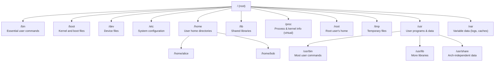
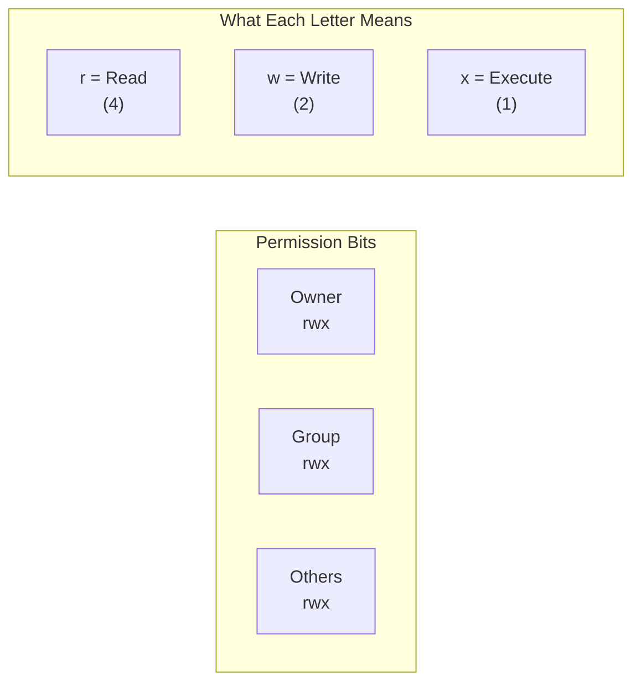
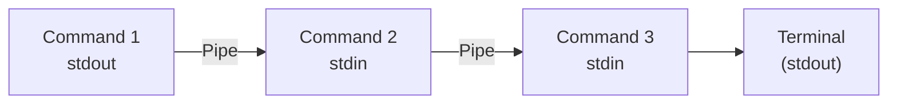
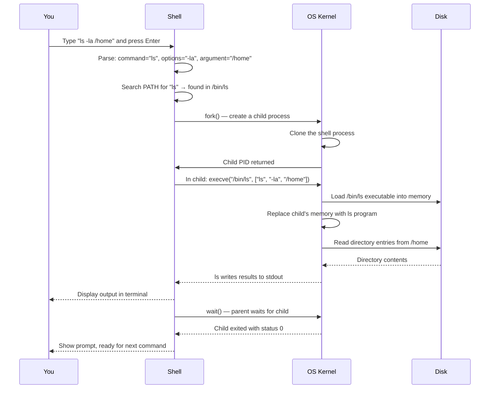

# Linux Fundamentals

## Learning Objectives

By the end of this lesson, you will be able to:

- Explain the difference between the Linux kernel and a Linux distribution.
- Navigate the Linux file system hierarchy and understand the purpose of each top-level directory.
- Use essential terminal commands to inspect, create, move, and delete files and directories.
- Read, interpret, and modify Linux file permissions.
- Understand standard input, output, and error streams, and use pipes and redirection.
- Inspect and manage running processes.
- Explain why Linux dominates cloud computing and what that means for your work.

---

## Introduction

In Lesson 3, you learned that an operating system manages hardware, isolates processes, and provides a file system. Now we meet the specific operating system that runs the internet.

Over 90% of cloud servers run Linux. Every Docker container you will ever build runs on Linux. Every Kubernetes node is a Linux machine. When you SSH into a cloud VM, you land in a Linux shell.

Linux is not just "another operating system." It is the foundation of modern infrastructure. And unlike Windows or macOS, Linux does not hide its internals behind a graphical interface. It invites you to look under the hood. The terminal is not an afterthought—it is the primary interface. Configuration is stored in plain text files, not hidden registries. Everything—devices, processes, network sockets—appears as a file.

This lesson is your first real conversation with Linux. You will learn the commands, concepts, and mental models that you will use every day as a cloud engineer.

---

## Why This Matters

If you do not understand Linux, you cannot effectively use Docker, Kubernetes, or any cloud platform. These tools expose Linux concepts directly: file mounts, user namespaces, process signals, environment variables, shell scripts.

| Without Linux...                       | You cannot...                                              |
|----------------------------------------|------------------------------------------------------------|
| File system navigation                 | Mount volumes in Docker or debug container file paths.     |
| File permissions                       | Fix "permission denied" errors in containers or cloud VMs. |
| Processes and signals                  | Understand why a container stops when it receives SIGTERM. |
| Pipes and redirection                  | Chain commands together or read application logs.          |
| The shell and environment variables    | Write a Dockerfile, a CI/CD pipeline, or a startup script. |

Linux is not a topic you learn once and move on from. It is the environment you live in. Every lesson from here forward assumes you can open a terminal and find your way around. This lesson gives you that foundation.

---

## Core Concepts

### What Is Linux, Exactly?

Strictly speaking, **Linux** is a **kernel**—the core of an operating system, as you learned in Lesson 3. Linus Torvalds started it in 1991, and thousands of developers have contributed since.

But nobody runs "just a kernel." A usable system needs user-space tools: a shell, core utilities (`ls`, `cp`, `cat`), a package manager, and system libraries. A **Linux distribution** (or **distro**) bundles the Linux kernel with a selection of user-space software into a complete, installable operating system.

| Distribution   | Known For                                      | Common Use                            |
|----------------|------------------------------------------------|---------------------------------------|
| **Ubuntu**     | Beginner-friendly, vast documentation          | Cloud VMs, desktops, learning         |
| **Debian**     | Stability, conservative package versions       | Servers, Docker base images           |
| **CentOS Stream / RHEL** | Enterprise support, long lifecycles  | Corporate data centres                |
| **Alpine**     | Tiny footprint (~5 MB)                         | Minimal Docker images                 |
| **Fedora**     | Cutting-edge features                          | Development, workstations             |
| **Amazon Linux** | Optimised for AWS                            | AWS cloud workloads                   |

> **Key distinction for cloud work:** The distribution you use for a Docker base image matters. An Ubuntu image is ~77 MB compressed. An Alpine image is ~3 MB. The difference is all user-space software—both run the same kernel from the host.

### The Linux File System Hierarchy

Windows organises files into drives (`C:\`, `D:\`). Linux has a single, unified tree starting at the root: `/`. Everything—files, directories, devices, even running processes—lives somewhere under `/`.



| Directory | Purpose                                                              | "Think of it as..."                   |
|-----------|----------------------------------------------------------------------|---------------------------------------|
| `/`       | The root. Every file and directory descends from here.               | The top of the tree.                  |
| `/bin`    | Essential commands available to all users (`ls`, `cp`, `cat`).       | A toolbox everyone can reach.         |
| `/boot`   | Files needed to start the system (kernel, bootloader).               | The engine starter.                   |
| `/dev`    | Device files—every hardware device appears here as a file.           | "Everything is a file" made real.     |
| `/etc`    | System-wide configuration files (text, not a registry).              | The control panel.                    |
| `/home`   | Personal directories for each user (`/home/alice`).                  | Each person's private room.           |
| `/proc`   | A virtual file system exposing kernel and process information.       | A window into the kernel's brain.     |
| `/root`   | Home directory for the root (superuser) account.                     | The administrator's private room.     |
| `/tmp`    | Temporary files; wiped on reboot on many systems.                    | A scratch pad.                        |
| `/usr`    | The bulk of user-space programs, libraries, and documentation.       | The main workshop.                    |
| `/var`    | Files that change frequently: logs, databases, caches, spools.       | The filing cabinet.                   |

> **This is not trivia.** When a Docker container says `VOLUME /var/lib/mysql`, you need to know what `/var` is and why database data lives there. When you edit `/etc/nginx/nginx.conf` to configure a web server, you need to know `/etc` holds configuration. The hierarchy is your map.

### Essential Terminal Commands

Before you can walk, you need to know where you are and how to move.

#### Navigation and Inspection

```bash
pwd                     # Print Working Directory — "Where am I?"
ls                      # List files in the current directory
ls -l                   # Long format: permissions, owner, size, date
ls -a                   # Show hidden files (names starting with .)
ls -la                  # Both long format and hidden files
cd /path/to/dir         # Change Directory
cd ..                   # Go up one level
cd ~                    # Go to your home directory
cd -                    # Go to the previous directory
```

#### File Operations

```bash
cat file.txt            # Print file contents to the terminal
less file.txt           # View file with scrolling (press q to quit)
head -n 10 file.txt     # Show first 10 lines
tail -f log.txt         # Show end of file, keep watching for new lines
touch newfile.txt       # Create an empty file, or update timestamp
mkdir mydir             # Create a directory
mkdir -p a/b/c          # Create nested directories in one command
cp source dest          # Copy a file
cp -r sourcedir destdir # Copy a directory recursively
mv source dest          # Move or rename a file/directory
rm file.txt             # Remove (delete) a file — no recycle bin!
rm -r directory         # Remove a directory and all its contents
rmdir emptydir          # Remove an empty directory
```

> **Warning:** `rm` is permanent. Linux does not have a recycle bin or trash can by default at the command line. When you delete something with `rm`, it is gone. Double-check before you press Enter.

#### Finding Things

```bash
find /path -name "*.log"        # Find files by name pattern
grep "error" file.txt            # Search for text inside a file
grep -r "error" /var/log/       # Recursively search directories
which python                     # Show which executable will run
```

### Users, Groups, and Permissions

Linux is a multi-user system at its core. Every file and every process belongs to a **user** and a **group**. This is not bolted on—it is baked into the kernel.

#### Users

```bash
whoami              # Who am I logged in as?
id                  # Show my user ID, group ID, and group memberships
sudo command        # Run a command as the superuser (root)
su - username       # Switch to another user
```

The **root** user (user ID 0) has unrestricted access to everything. Regular users have limited access. The `sudo` mechanism lets permitted users temporarily run commands as root—a safer alternative to logging in as root directly.

#### File Permissions

Every file has three sets of permissions, for three categories of users:



| Permission | On a File                               | On a Directory                               |
|------------|-----------------------------------------|----------------------------------------------|
| **r** (read)   | View the file's contents.            | List the directory's contents (`ls`).         |
| **w** (write)  | Modify or delete the file.           | Create, rename, or delete files inside it.    |
| **x** (execute)| Run the file as a program.            | Enter the directory (`cd` into it).           |

Let us decode a real example:

```bash
$ ls -l script.sh
-rwxr-xr-- 1 alice developers 2048 Jun 14 10:30 script.sh
```

Breaking this down:

| Part          | Meaning                                                        |
|---------------|----------------------------------------------------------------|
| `-`           | File type: `-` = regular file, `d` = directory, `l` = symlink |
| `rwx`         | Owner (alice) can read, write, and execute                      |
| `r-x`         | Group (developers) can read and execute, but not write          |
| `r--`         | Others (everyone else) can only read                            |
| `1`           | Number of hard links                                            |
| `alice`       | Owner                                                           |
| `developers`  | Group                                                           |
| `2048`        | Size in bytes                                                   |
| `Jun 14 10:30`| Last modification time                                          |

#### Changing Permissions

```bash
chmod u+x script.sh      # Add execute for the owner (u)
chmod g-w file.txt       # Remove write for the group (g)
chmod o= file.txt        # Remove all permissions for others (o)
chmod 755 script.sh      # Numeric: owner=rwx, group=r-x, others=r-x
chown alice:dev file.txt # Change owner and group
```

The numeric (octal) representation is worth memorising because you will see it everywhere:

| Number | Permissions | Meaning                     |
|--------|-------------|-----------------------------|
| 7      | rwx         | Read, write, execute        |
| 6      | rw-         | Read and write              |
| 5      | r-x         | Read and execute            |
| 4      | r--         | Read only                   |
| 0      | ---         | No permissions              |

So `chmod 755 file` means: owner gets `7` (rwx), group gets `5` (r-x), others get `5` (r-x). `chmod 644 file` means: owner gets `6` (rw-), group gets `4` (r--), others get `4` (r--). These two patterns—755 for executables and directories, 644 for regular files—cover the vast majority of cases.

### Standard Streams: stdin, stdout, stderr

Every Linux process is born with three open communication channels:

| Stream | Name           | File Descriptor | Default Destination | Purpose                      |
|--------|----------------|-----------------|---------------------|------------------------------|
| stdin  | Standard input  | 0               | Keyboard            | Data coming into the program |
| stdout | Standard output | 1               | Terminal screen     | Normal program output        |
| stderr | Standard error  | 2               | Terminal screen     | Error messages               |

These are simple, but their power comes from **redirection** and **pipes**—the ability to connect one program's output to another's input.

#### Redirection

```bash
command > file.txt       # Redirect stdout to a file (overwrites)
command >> file.txt      # Redirect stdout to a file (appends)
command 2> errors.txt    # Redirect stderr to a file
command &> all.txt       # Redirect both stdout and stderr to a file
command < input.txt      # Use a file as stdin
```

#### Pipes

The pipe (`|`) connects the stdout of one command to the stdin of another. This is the Unix philosophy in one character: small programs that do one thing well, chained together to solve complex problems.

```bash
# Count how many files are in a directory
ls | wc -l

# Find the 5 largest files in /var/log
du -sh /var/log/* | sort -hr | head -5

# Search for "ERROR" in log files, count occurrences by date
grep "ERROR" app.log | cut -d' ' -f1 | sort | uniq -c | sort -rn
```



> **Why this matters for cloud:** Cloud applications write logs to stdout/stderr, not to files. Docker and Kubernetes capture these streams and route them to logging systems. When you run `docker logs container-name`, you are reading the combined stdout/stderr of the container's main process. Understanding streams is understanding how cloud-native observability works.

### Processes in Linux

You learned about processes in Lesson 3. Now see them in Linux specifically.

```bash
ps aux                  # List all running processes with details
ps aux | grep nginx     # Find processes matching "nginx"
top                     # Interactive real-time process viewer (q to quit)
htop                    # Enhanced top (install separately)
kill PID                # Send SIGTERM to a process (polite shutdown)
kill -9 PID             # Send SIGKILL (force kill — no cleanup)
pkill -f pattern        # Kill processes by name pattern
```

Key columns in `ps aux`:

| Column | Meaning                                                    |
|--------|------------------------------------------------------------|
| USER   | Who owns the process                                       |
| PID    | Process ID                                                 |
| %CPU   | CPU usage percentage                                       |
| %MEM   | Memory usage percentage                                    |
| VSZ    | Virtual memory size (KB)                                   |
| RSS    | Resident memory—actual physical RAM used (KB)              |
| STAT   | Process state: R (running), S (sleeping), Z (zombie)       |
| START  | When the process started                                   |
| TIME   | Total CPU time consumed                                    |
| COMMAND| The command that launched the process                      |

#### Background and Foreground

```bash
command &               # Run command in the background
Ctrl+Z                  # Suspend the current foreground process
bg                      # Resume a suspended process in the background
fg                      # Bring a background process to the foreground
jobs                    # List background jobs
nohup command &         # Run immune to hangup (keeps running after logout)
```

#### Signals

Signals are how Linux tells a process to do something—usually to stop:

| Signal     | Number | Meaning                                             |
|------------|--------|-----------------------------------------------------|
| SIGTERM    | 15     | "Please shut down gracefully." The process can catch this and clean up. |
| SIGKILL    | 9      | "Die immediately." Cannot be caught or ignored.     |
| SIGINT     | 2      | Sent by `Ctrl+C` in the terminal. "Interrupt."      |
| SIGHUP     | 1      | Originally "the terminal hung up." Now often used to signal "reload your configuration." |

> **Cloud insight:** When Kubernetes stops a container, it sends SIGTERM to the main process, waits a grace period (default 30 seconds), then sends SIGKILL. If your application does not handle SIGTERM gracefully—closing connections, flushing data—you lose data on every deployment. This is a Linux signal, surfaced through layers of cloud abstraction.

### The Shell and Environment

The **shell** (typically **bash**, the Bourne-Again Shell) is both a command interpreter and a programming language. It reads your commands, expands wildcards and variables, then executes the result.

#### Environment Variables

Environment variables are key-value pairs inherited by every process from its parent. They configure behaviour without changing code.

```bash
echo $HOME              # Print HOME variable
echo $PATH              # Print executable search path
export MYVAR=hello      # Set a variable (visible to child processes)
MYVAR=hello             # Set a variable (visible only to this shell)
env                     # Print all environment variables
printenv PATH           # Print a specific variable
```

Critical environment variables:

| Variable | Purpose                                                              |
|----------|----------------------------------------------------------------------|
| `HOME`   | Path to your home directory (`/home/alice`)                          |
| `PATH`   | Colon-separated list of directories searched when you run a command  |
| `USER`   | Your username                                                        |
| `SHELL`  | Path to your login shell (`/bin/bash`)                               |
| `PWD`    | Current working directory                                            |

> **Cloud insight:** Dockerfiles use `ENV` to set environment variables inside containers. Kubernetes uses `env` in pod specs. Cloud platforms inject secrets and configuration as environment variables. Understanding `export` and variable scope in the shell is directly transferable to every layer of cloud-native tooling.

#### Shell Configuration Files

| File           | When It Runs                              |
|----------------|-------------------------------------------|
| `~/.bashrc`    | Every interactive non-login shell         |
| `~/.bash_profile` or `~/.profile` | Login shells (SSH, console login) |
| `/etc/profile` | System-wide, all users, login shells      |
| `/etc/bash.bashrc` | System-wide, all users, interactive shells |

These files let you set aliases, customise the prompt, and add directories to your `PATH`.

---

## How It Works

### A Command from Typing to Execution

When you type `ls -la /home` and press Enter, here is what happens:



Every command you type follows this pattern: **parse → fork → exec → wait**. The shell itself is just a program. `ls` is just a program. The magic is the composition:

1. The shell parses your input into a command, options, and arguments.
2. It searches `$PATH` to find the executable.
3. It calls `fork()` to create a child process.
4. In the child, it calls `execve()` to replace itself with the command.
5. The shell (parent) calls `wait()` and pauses until the child finishes.
6. The prompt returns.

### How Permissions Enforcement Works

When a process tries to open a file, the kernel performs this check in order:

1. Is the process's **effective user ID** equal to the file's owner? If yes, apply the **owner** permissions.
2. Is the process a member of the file's group? If yes, apply the **group** permissions.
3. Otherwise, apply the **others** permissions.

The first match wins. Even if the "others" permissions are more permissive than the "group" permissions, the group check takes priority if the user is in the file's group. The order is always: owner → group → others.

---

## Real-World Example

### Debugging a "Permission Denied" Error in a Docker Container

You build a Docker image. You run the container. Your application crashes with:

```
PermissionError: [Errno 13] Permission denied: '/app/data/config.json'
```

What happened? You need Linux permission knowledge to debug this:

```bash
# Enter the running container
docker exec -it container_name /bin/bash

# Check who you are
whoami                 # → appuser (not root!)

# Check the file's permissions
ls -l /app/data/config.json
# -rw-r----- 1 root root 1024 Jan 01 12:00 /app/data/config.json

# The file is owned by root:root, permissions are rw-r-----
# appuser is not root → falls to "others" → r-- (read only!)
# But the application needs to write.

# Fix: change ownership to the user running the app
chown appuser:appuser /app/data/config.json
```

This is not a Docker problem. It is not a Kubernetes problem. It is a Linux file permission problem—and it surfaces everywhere containers run. The `ls -l` output told you everything you needed: the owner, the group, and the permission bits.

### Why Logs Go to stdout, Not Files

A traditional application might open `/var/log/myapp.log` and write to it. In a container, the filesystem is ephemeral—when the container stops, that file is gone unless you explicitly mounted a volume.

The cloud-native pattern is simpler: write logs to **stdout** and **stderr**. The container runtime captures these streams. Docker stores them on the host. Kubernetes forwards them to a logging backend. You never manage log rotation inside the container—the platform handles it.

```bash
# Traditional (don't do this in containers):
echo "Server started" >> /var/log/app.log

# Cloud-native (do this):
echo "Server started"    # Goes to stdout by default
```

This is the Unix stream philosophy, adopted directly by the cloud.

---

## Hands-On Examples

These exercises require a Linux environment. Options:
- **Linux users:** Use your terminal directly.
- **macOS users:** The terminal is similar (BSD-based). Most commands work identically.
- **Windows users:** Install WSL (Windows Subsystem for Linux) or use a cloud VM for the best experience.

### Exercise 1: Explore the File System

```bash
# Where are you?
pwd

# What is at the root?
ls /

# Explore /etc — your system's configuration
ls /etc
cat /etc/hostname       # Your machine's name
cat /etc/os-release     # Which Linux distribution?

# Explore /proc — the kernel's window
cat /proc/cpuinfo | head -5    # CPU details
cat /proc/meminfo | head -5    # Memory details
ls /proc                      # One directory per running process
```

### Exercise 2: Work with Files and Directories

```bash
# Create a playground
mkdir -p ~/linux-practice/subdir
cd ~/linux-practice

# Create files
touch file1.txt file2.txt
echo "Hello, Linux!" > greeting.txt
cat greeting.txt

# List with details
ls -la

# Copy and move
cp greeting.txt subdir/
mv file1.txt renamed.txt

# Find and search
find . -name "*.txt"
grep "Hello" *
```

### Exercise 3: Understand Permissions

```bash
# Create a script
echo '#!/bin/bash' > myscript.sh
echo 'echo "It works!"' >> myscript.sh

# Try to run it
./myscript.sh            # Permission denied!

# Check permissions
ls -l myscript.sh        # -rw-r--r-- (no execute permission)

# Add execute permission
chmod +x myscript.sh

# Try again
./myscript.sh            # It works!

# Experiment with numeric permissions
chmod 700 myscript.sh    # Only owner can read/write/execute
ls -l myscript.sh        # -rwx------
```

### Exercise 4: Use Pipes and Redirection

```bash
# Save command output to a file
ls -la /etc > etc-listings.txt
head -10 etc-listings.txt

# Chain commands with pipes
ls /bin | head -20                    # First 20 commands in /bin
ls -la /etc | wc -l                   # Count entries in /etc
ps aux | grep bash | wc -l            # Count your bash processes

# Redirect stderr
ls /nonexistent 2> errors.txt         # Error goes to file
cat errors.txt

# Combine stdout and stderr
ls /etc /nonexistent &> combined.txt
cat combined.txt
```

### Exercise 5: Observe Processes

```bash
# List your processes
ps aux | grep $USER

# Start a background process
sleep 300 &
# Note the PID (e.g., 12345)

# Check it
ps -p 12345              # Replace with your PID

# Send it a signal
kill 12345               # Sends SIGTERM
# Verify it stopped
ps -p 12345              # Should show "No such process"

# Try Ctrl+Z and fg/bg
sleep 300
# Press Ctrl+Z → process suspends
jobs                     # See suspended job
bg                       # Resume in background
fg                       # Bring to foreground, Ctrl+C to kill
```

---

## Common Misconceptions

### "Linux is just a free version of Windows."

Linux is architecturally different from Windows at almost every level: case-sensitive file system, no drive letters, text-based configuration, a kernel that exposes everything as files, and a fundamentally different permission model. Treating Linux as "Windows without a GUI" leads to constant confusion.

### "I should always run commands as root."

Running as root bypasses all permission checks. This is dangerous—a typo can destroy the system (`rm -rf /` as root really does delete everything). Use `sudo` sparingly and explicitly. In containers, best practice is to run as a non-root user. Kubernetes even has a `runAsNonRoot` option to enforce this.

### "chmod 777 fixes permission problems."

Setting a file or directory to `777` (everyone can do everything) is a security vulnerability, not a fix. It means any user on the system can read, modify, or delete the file. When you have a permission problem, the fix is to understand *who* needs *what* access and grant only that—not to open the floodgates.

### "Environment variables are global."

Environment variables are inherited by child processes but never propagate upward to parents or sideways to siblings. If you run `export FOO=bar` in one terminal, it does not affect another terminal. This scoping is why Dockerfiles use `ENV` and why Kubernetes `env` definitions must be explicit.

### "The terminal is just for experts."

The terminal is the primary interface to Linux, not a fallback. Many Linux servers have no graphical interface at all—the terminal is all there is. In cloud environments, you interact with servers exclusively through SSH terminals. Becoming comfortable at the command line is not optional; it is the job.

---

## Knowledge Check

1. What is the difference between the Linux kernel and a Linux distribution?
2. In the permission string `-rwxr-xr--`, what can the **owner** do? What can the **group** do? What can **others** do?
3. What command would you use to count how many lines in `app.log` contain the word "ERROR"?
4. A process is running in the foreground and you want to suspend it. What key combination do you press?
5. Why do cloud-native applications write logs to stdout/stderr instead of files?

> **Answers for self-review:**
> 1. The Linux kernel is the core of the OS—the piece that manages hardware, processes, and memory. A distribution bundles the kernel with user-space software (shell, utilities, package manager, libraries) to create a complete, usable operating system.
> 2. Owner: read, write, execute (rwx). Group: read, execute (r-x). Others: read only (r--).
> 3. `grep "ERROR" app.log | wc -l` (or `grep -c "ERROR" app.log`).
> 4. `Ctrl+Z`. This sends SIGTSTP, which suspends the process. Resume it with `fg` (foreground) or `bg` (background).
> 5. Container file systems are ephemeral; log files would be lost when the container stops. stdout/stderr are captured by the container runtime (Docker, Kubernetes) and routed to logging systems. The platform handles log rotation, storage, and search.

---

## Key Takeaways

- **Linux = kernel + user-space.** The kernel manages hardware; the distribution provides the tools you actually use.
- The **file system hierarchy** (`/`, `/etc`, `/var`, `/home`, `/proc`) is your map. Learn it.
- **Permissions** (owner/group/others × read/write/execute) control access to every file and are enforced by the kernel. `755` for executables, `644` for data files.
- **Pipes (`|`)** and **redirection (`>`, `>>`, `<`)** let you compose small, focused commands into powerful pipelines. This is the Unix philosophy.
- Every process has **stdin (0), stdout (1), and stderr (2)**. Cloud-native applications write logs to stdout/stderr because the platform captures them.
- **Signals** (SIGTERM, SIGKILL, SIGINT) control process lifecycles. Kubernetes sends SIGTERM to stop containers—your applications must handle it gracefully.
- **Environment variables** configure processes and are inherited by child processes. They are the configuration mechanism for Docker, Kubernetes, and every CI/CD system.
- The **terminal is the primary Linux interface**. Cloud servers have no GUI. Comfort at the command line is a prerequisite for everything that follows.

---

## Next Lesson

**Networking Fundamentals**

Now that you can navigate a Linux system, the next lesson extends your reach beyond a single machine. You will learn how computers communicate—IP addresses, DNS, TCP, and HTTP—and why networking is the nervous system of cloud computing. Every container, every pod, every cloud service communicates over the network; you need to understand how.
