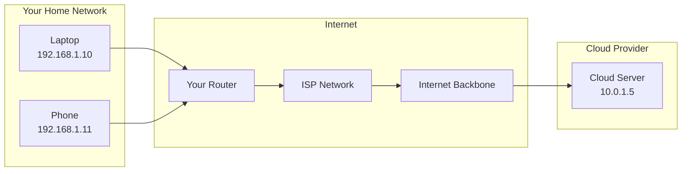
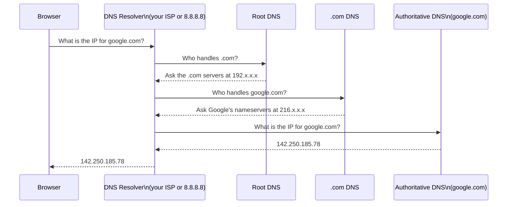
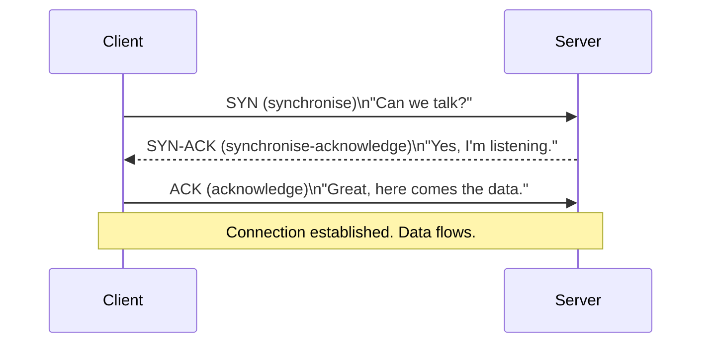
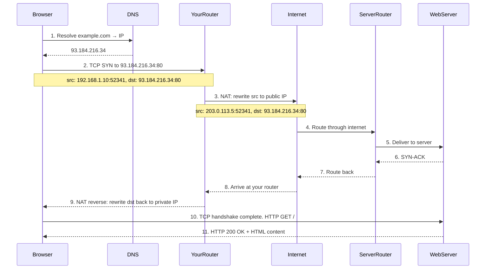
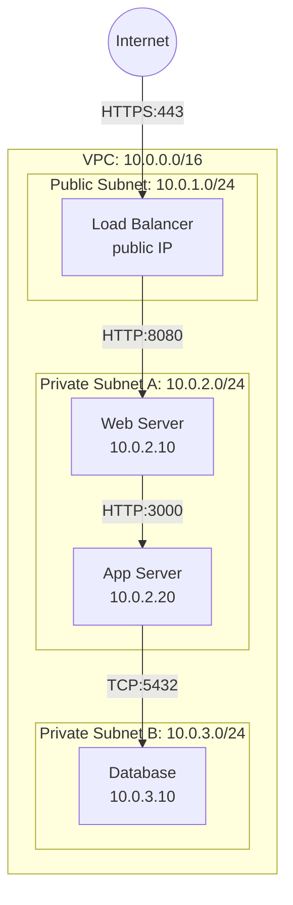

# Networking Fundamentals

## Learning Objectives

By the end of this lesson, you will be able to:

- Explain what a network is and why computers need one.
- Read and understand IPv4 addresses, subnet masks, and CIDR notation.
- Describe how DNS translates human-readable names into IP addresses.
- Contrast TCP and UDP: when to use each and why.
- Explain what a port is and how it enables multiple services on one IP address.
- Use basic networking tools to inspect and troubleshoot connectivity.
- Understand how cloud networking concepts (VPCs, subnets, security groups) map to fundamentals.

---

## Introduction

So far, you have studied a single computer: its CPU, its memory, its operating system. But a single computer, no matter how powerful, is limited. It can only do what its own hardware allows. The real power of computing comes from connecting computers together—so they can share data, distribute work, and serve users anywhere on the planet.

A **network** is two or more computers connected in a way that lets them exchange data. That is it. A network can be two laptops connected by a cable in the same room, or millions of servers spanning every continent. The principles are the same; only the scale changes.

Networking is the nervous system of cloud computing. Every container that talks to a database, every Kubernetes pod that calls an API, every user who loads a web page—all of it travels over a network. If you do not understand how data gets from point A to point B, you cannot design, debug, or secure cloud systems.

---

## Why This Matters

Cloud computing is distributed computing. Your application is not one program on one server—it is dozens of services, spread across multiple machines, communicating over a network. When something breaks, it is almost always a networking issue dressed up as an application issue.

| Without networking knowledge...           | You cannot...                                                   |
|-------------------------------------------|-----------------------------------------------------------------|
| IP addresses and subnets                  | Design a VPC or troubleshoot why two services cannot connect.   |
| DNS                                      | Understand why your domain does not resolve or set up service discovery. |
| TCP vs UDP                               | Choose the right protocol or debug timeout vs. packet-loss issues. |
| Ports and firewalls                      | Configure security groups or figure out why a port is "closed." |
| Basic diagnostic tools                    | Test connectivity with `ping`, `curl`, or `nc` without guessing. |

Every cloud service—every load balancer, every API gateway, every database endpoint—is an IP address (or a name that resolves to one) listening on a port. The concepts in this lesson are the language that cloud infrastructure speaks.

---

## Core Concepts

### What Is a Network?

A network is a communication system with three essential ingredients:

1. **A physical or wireless medium** to carry signals (copper cable, fibre optic, radio waves).
2. **A set of rules (protocols)** that govern how data is formatted, addressed, and transmitted.
3. **Devices** that send, receive, and forward data (computers, routers, switches).

The internet is not a single network. It is a **network of networks**—millions of independent networks that agree to use the same protocols (the Internet Protocol suite, or TCP/IP) so they can interconnect.



### IP Addresses

Every device on a network needs an address so that data can find it. An **IP address** is that identifier. Think of it like a postal address: to send a letter, you need to know where the recipient lives.

#### IPv4

IPv4 is the most widely used format. An IPv4 address is 32 bits long, written as four decimal numbers separated by dots:

```
192.168.1.10
```

Each number is 8 bits (0–255). With 32 bits, IPv4 can represent about 4.3 billion unique addresses. That sounded like plenty in 1981. It is not enough today—which is why IPv6 exists—but IPv4 still carries the vast majority of internet traffic through techniques like NAT (Network Address Translation).

#### Public vs Private IPs

Not all IP addresses are reachable from the internet:

| Type     | Range Examples              | Reachable From            | Purpose                              |
|----------|-----------------------------|---------------------------|--------------------------------------|
| **Public**  | Assigned by your ISP       | Anywhere on the internet  | Servers, websites, anything public   |
| **Private** | 192.168.x.x, 10.x.x.x, 172.16–31.x.x | Only within a local network | Home devices, internal servers |

> **Cloud connection:** In AWS, a VPC (Virtual Private Cloud) uses private IP ranges (typically `10.0.0.0/8` or `172.16.0.0/12`). Instances inside the VPC talk to each other using private IPs. Only resources with a public IP (or behind a load balancer with one) are reachable from the internet.

#### IPv6 (Briefly)

IPv6 uses 128-bit addresses, written as eight groups of four hexadecimal digits:

```
2001:0db8:85a3:0000:0000:8a2e:0370:7334
```

This provides an astronomically large address space—enough to give every atom on Earth its own address. Adoption is growing, especially in mobile networks and cloud providers. For this course, IPv4 understanding is sufficient, but you should know IPv6 exists and recognise its format.

### Subnets and CIDR

A **subnet** (short for sub-network) is a subdivision of an IP network. It groups devices that can communicate directly with each other without going through a router.

Subnetting answers the question: "Given an IP address, which part identifies the network and which part identifies the specific device?"

This is expressed using **CIDR notation** (Classless Inter-Domain Routing):

```
10.0.1.0/24
```

The `/24` means "the first 24 bits are the network portion; the remaining 8 bits identify devices." In this subnet, `10.0.1` is the network, and the last number (0–255) identifies individual devices.

| CIDR | Subnet Mask       | Available Addresses | Example Use                  |
|------|-------------------|---------------------|------------------------------|
| /32  | 255.255.255.255   | 1                   | A single host                |
| /28  | 255.255.255.240   | 16 (14 usable)      | Small group of servers       |
| /24  | 255.255.255.0     | 256 (254 usable)    | A typical office or VPC subnet |
| /16  | 255.255.0.0       | 65,536 (65,534 usable) | A large VPC CIDR block    |
| /8   | 255.0.0.0         | 16,777,216          | An entire private range      |

> **Key rule:** The first address in every subnet (the "network address," e.g., `10.0.1.0`) and the last address (the "broadcast address," e.g., `10.0.1.255`) are reserved and cannot be assigned to devices. That is why a `/24` gives 254 usable addresses, not 256.

In a cloud VPC, you define a CIDR block for the VPC (e.g., `10.0.0.0/16`) and then carve it into smaller subnets (e.g., `10.0.1.0/24`, `10.0.2.0/24`) across availability zones. Two subnets in the same VPC can route to each other. Two subnets in different VPCs cannot—unless you explicitly peer them.

### DNS: The Phonebook of the Internet

People remember `google.com`. Computers need `142.250.185.78`. **DNS (Domain Name System)** is the service that translates between them.



This entire chain typically completes in under 50 milliseconds. The resolver caches results so that repeated lookups skip the chain entirely.

> **Cloud insight:** DNS is not just for websites. In Kubernetes, services get DNS names (`my-service.default.svc.cluster.local`). In AWS, Route 53 provides DNS for both public domains and private, internal hostnames. Every cloud resource discovery mechanism is built on DNS.

### TCP vs UDP

When data needs to travel across a network, it must choose a **transport protocol**—a set of rules for how the data is packaged, sent, and acknowledged. The two dominant protocols are TCP and UDP.

|                        | TCP (Transmission Control Protocol)              | UDP (User Datagram Protocol)                |
|------------------------|--------------------------------------------------|---------------------------------------------|
| **Connection**         | Connection-oriented (handshake before data)      | Connectionless (send and forget)            |
| **Reliability**        | Guaranteed delivery—lost packets are resent      | No guarantee—packets may be lost or reordered |
| **Ordering**           | Data arrives in order                            | Data may arrive out of order                |
| **Overhead**           | Higher (connection setup, acknowledgments)       | Lower (no handshake, no retransmission)     |
| **Use Cases**          | Web pages (HTTP), email, file transfers, SSH     | Streaming video, VoIP, DNS, online gaming   |
| **Analogy**            | A phone call—you establish a connection, talk, confirm understanding | A postcard—you send it and hope it arrives |

#### The TCP Three-Way Handshake

Before TCP sends any application data, it establishes a connection with a three-step handshake:



This handshake is why the first request to a server takes slightly longer than subsequent ones within the same connection. It is also why connection pooling (reusing connections) is essential for performance in cloud applications.

#### When to Use Which

- **Use TCP** when you cannot afford to lose data: web pages, API calls, database queries, file transfers, email.
- **Use UDP** when speed matters more than perfect reliability: live video, voice calls, multiplayer games, DNS queries (most are UDP).

### Ports

An IP address identifies a device. A **port** identifies a specific service or application on that device. Together, `IP:port` is like a street address and apartment number.

Ports are 16-bit numbers (0–65535), divided into three ranges:

| Range           | Name              | Purpose                                                |
|-----------------|-------------------|--------------------------------------------------------|
| 0–1023          | Well-known ports  | Reserved for standard services (HTTP=80, HTTPS=443, SSH=22) |
| 1024–49151      | Registered ports  | Used by applications (MySQL=3306, PostgreSQL=5432, Redis=6379) |
| 49152–65535     | Dynamic/private   | Temporary client-side ports for outbound connections    |

Common ports you will encounter constantly:

| Port | Service           | Protocol  |
|------|-------------------|-----------|
| 22   | SSH               | TCP       |
| 53   | DNS               | TCP/UDP   |
| 80   | HTTP              | TCP       |
| 443  | HTTPS             | TCP       |
| 3306 | MySQL             | TCP       |
| 5432 | PostgreSQL        | TCP       |
| 6379 | Redis             | TCP       |
| 6443 | Kubernetes API    | TCP       |

When you run a web server on port 80 and a database on port 3306 on the same machine, the IP address is the same for both, but the port differentiates them. The operating system delivers incoming packets to the correct application based on the destination port number.

### Firewalls and Security Groups

A **firewall** is a filter that allows or blocks network traffic based on rules. Rules typically specify: source IP, destination IP, protocol (TCP/UDP), and port.

In cloud environments, firewalls take the form of **security groups** (AWS) or **network security groups** (Azure). These are virtual firewalls attached to cloud instances:

- A security group is a set of **allow** rules (no deny rules—the default is "deny all").
- Rules specify: which port, which protocol, and which source (an IP range or another security group).
- Security groups are **stateful**: if you allow outbound traffic to a server, the response traffic is automatically allowed back in.

```
# A typical web server security group:

Allow TCP port 80 from 0.0.0.0/0    (HTTP from anywhere)
Allow TCP port 443 from 0.0.0.0/0   (HTTPS from anywhere)
Allow TCP port 22 from 203.0.113.0/24  (SSH only from the office network)

# Everything else is blocked by default.
```

> **Debugging rule:** If two cloud resources cannot communicate, the answer is nearly always: (1) wrong security group, (2) wrong port, or (3) they are in different subnets/VPCs that are not connected.

---

## How It Works

### A Web Request from Start to Finish

Let us trace what happens when you type `example.com` into a browser. This integrates everything you have learned:



**Step 1 — DNS:** The browser asks a DNS resolver for the IP address of `example.com`. It receives `93.184.216.34`.

**Step 2–3 — Connection with NAT:** The browser picks a random source port (e.g., 52341) and sends a TCP SYN packet to `93.184.216.34:80`. Your home router performs **NAT (Network Address Translation)**, rewriting your private source IP (`192.168.1.10`) to your router's public IP so the response can find its way back.

**Step 4–5 — Routing:** The packet hops through a series of routers—each one examining the destination IP and forwarding the packet one step closer. The server's router delivers it to the web server.

**Step 6–9 — Handshake response:** The server responds with SYN-ACK. The response travels back through the same chain (in reverse), with your router reversing the NAT translation so the packet reaches your laptop.

**Step 10–11 — Data:** The TCP connection is now open. The browser sends `GET / HTTP/1.1` over this connection. The server responds with the HTML content of the page.

The entire sequence—DNS lookup, TCP handshake, HTTP request, response—typically completes in under 100 milliseconds when the server is nearby and the network is healthy.

---

## Real-World Example

### Designing a Simple Cloud Network

Imagine you are deploying a web application on AWS with three tiers: web servers, application servers, and a database. How do you design the network?



**Design decisions, each rooted in concepts from this lesson:**

1. **VPC CIDR `10.0.0.0/16`**: A private IP range large enough for thousands of resources, carved into smaller subnets.

2. **Public subnet**: Only the load balancer lives here. It has a public IP so the internet can reach it. Nothing else needs to be public.

3. **Private subnets**: Web and app servers have only private IPs. They cannot be reached directly from the internet—reducing the attack surface.

4. **Security groups**: The database security group allows TCP port 5432 only from the app server's security group. Nobody else—not even other instances in the same VPC—can connect.

5. **DNS**: The app server connects to the database using a DNS name (`db.internal`), not a hardcoded IP. If the database fails over to a new instance with a different IP, DNS is updated and the app keeps working without code changes.

This is not a hypothetical. Every production cloud deployment follows this pattern. And every part of it—CIDR, subnets, TCP ports, DNS, security groups—is a concept you have now learned.

---

## Hands-On Examples

These exercises work on Linux, macOS, and Windows (PowerShell or WSL).

### Exercise 1: Inspect Your Own Network Configuration

**Linux/macOS:**
```bash
# Show IP addresses and network interfaces
ip addr show        # Linux
ifconfig            # macOS (or Linux, older systems)

# Show routing table
ip route            # Linux
netstat -rn         # macOS
```

**Windows (PowerShell):**
```powershell
ipconfig /all
```

Look for your **IPv4 address** (likely `192.168.x.x` or `10.x.x.x`), your **subnet mask** (`255.255.255.0` = `/24`), and your **default gateway** (your router's IP). Notice that your address is private.

### Exercise 2: Test Connectivity with ping

```bash
# Can you reach Google's DNS server?
ping 8.8.8.8

# Can you reach your own router? (replace with your gateway IP)
ping 192.168.1.1

# Ping a domain name (tests DNS + connectivity)
ping example.com
```

`ping` uses ICMP (Internet Control Message Protocol). It sends a small packet and waits for a reply. If it works, you have basic connectivity. If it does not, something is blocking or unreachable. Press `Ctrl+C` to stop.

### Exercise 3: See DNS in Action

**Linux/macOS:**
```bash
# Look up an IP address for a domain
nslookup example.com
# or
dig example.com

# Reverse lookup: find the domain for an IP
nslookup 93.184.216.34
# or
dig -x 93.184.216.34
```

**Windows (PowerShell):**
```powershell
nslookup example.com
```

Try looking up `google.com`, `github.com`, and a domain you own if you have one. Notice that some domains return multiple IP addresses (round-robin load balancing).

### Exercise 4: Explore TCP Connections and Listening Ports

**Linux/macOS:**
```bash
# Show all listening TCP ports
ss -tlnp            # Linux (modern)
netstat -tlnp       # Linux (older) / macOS

# Show all established connections
ss -tn state established   # Linux
netstat -tn                 # macOS
```

**Windows (PowerShell):**
```powershell
netstat -an | Select-String "LISTENING"
```

Look for port `22` (SSH), `80` or `443` (web server, if running), or `3306` (MySQL, if installed). Each line shows `Local Address:Port` and the process using it. This is how you verify that a service is actually running and bound to the correct port.

### Exercise 5: Make an HTTP Request with curl

```bash
# Fetch a web page and show the HTTP response headers
curl -I https://example.com

# Full response (HTML content)
curl https://example.com

# Show verbose output (DNS lookup, TCP handshake, TLS handshake, HTTP)
curl -v https://example.com
```

The `-v` (verbose) flag is particularly instructive. Watch it print:
- `* Trying 93.184.216.34:443...` (DNS resolved, attempting TCP)
- `* Connected to example.com (93.184.216.34) port 443` (TCP handshake complete)
- `* SSL connection using TLSv1.3` (encryption established)
- `> GET / HTTP/1.1` (the actual HTTP request)
- `< HTTP/1.1 200 OK` (the response)

You just watched every layer of the networking stack in action: DNS → TCP → TLS → HTTP.

---

## Common Misconceptions

### "An IP address uniquely identifies a device forever."

IP addresses are often dynamic. Your home router gets a new public IP periodically from your ISP. Cloud instances get new private IPs when they restart (unless you assign an elastic/fixed IP). DNS exists partly because IPs change—you point at a name, and the name resolves to whatever the current IP is.

### "If a server is not responding to ping, it is down."

Many servers and firewalls block ICMP (ping) traffic deliberately. A failed ping tells you only that ICMP is blocked or unreachable—not that the server is down. Use `curl` or `nc` (netcat) to test the specific port your service uses.

### "TCP is always better than UDP because it guarantees delivery."

Guarantees come at a cost: latency, overhead, and connection state. For real-time applications (voice, video, gaming), a lost packet that arrives 200 ms later is useless—you would rather skip it and keep playing. The right protocol depends on what your application values: reliability or speed.

### "Ports are physical holes in the computer."

Ports are purely a software concept. They are numbers in a packet header that the operating system uses to deliver data to the right process. There are no physical "ports" on a network card corresponding to port 80 or port 443.

### "A /24 subnet always has 256 addresses."

A `/24` provides 256 possible values (0–255), but the first (network address, .0) and last (broadcast address, .255) are reserved. In cloud subnets, additional addresses are reserved by the provider (AWS reserves the first four and the last one in every subnet). A typical AWS `/24` subnet yields 251 usable addresses, not 256.

---

## Knowledge Check

1. What does the `/24` in `192.168.1.0/24` mean?
2. Why does a TCP connection start with a three-way handshake (SYN, SYN-ACK, ACK)?
3. What is the difference between a public IP address and a private IP address?
4. A web server and a database run on the same machine with IP `10.0.1.5`. How does the operating system know whether an incoming packet is for the web server or the database?
5. You cannot connect to your cloud database from your application. Name the first three things you should check.

> **Answers for self-review:**
> 1. The first 24 bits (the first three numbers) identify the network; the remaining 8 bits (the last number) identify individual devices. The subnet mask is `255.255.255.0`, and there are 254 usable host addresses.
> 2. The handshake synchronises sequence numbers on both sides so each can track which data has been received and which needs retransmission. It establishes that both parties are reachable and willing to communicate before any application data is sent.
> 3. A public IP is globally unique and routable on the internet. A private IP is only meaningful within a local network and cannot be reached directly from the internet. Private ranges include `10.x.x.x`, `192.168.x.x`, and `172.16–31.x.x`.
> 4. By the destination **port number**. The web server listens on a specific port (e.g., 80 or 443), and the database listens on another (e.g., 5432). The OS kernel uses the port field in each TCP/UDP packet header to deliver data to the correct process.
> 5. (1) Is the database port open in its security group for traffic from the application? (2) Are they in the same VPC/subnet, or if not, is VPC peering or a transit gateway configured? (3) Is the application using the correct hostname/IP and port?

---

## Key Takeaways

- A **network** connects computers so they can exchange data. The internet is a network of networks running the TCP/IP protocol suite.
- **IPv4 addresses** (`192.168.1.10`) identify devices. **CIDR notation** (`/24`) defines which part is the network and which is the device.
- **DNS** translates human-readable names to IP addresses through a distributed hierarchy of servers. It is the foundation of service discovery in the cloud.
- **TCP** provides reliable, ordered delivery with a three-way handshake. **UDP** provides fast, connectionless delivery with no guarantees. Choose based on whether reliability or speed matters more.
- **Ports** (0–65535) allow multiple services on one IP address. Well-known ports (80, 443, 22) are standardised; everything else is up to the application.
- **Firewalls and security groups** filter traffic by IP, port, and protocol. In the cloud, security groups are your primary network defence.
- Every cloud networking concept—VPCs, subnets, security groups, load balancers, DNS—is built directly on top of the fundamentals in this lesson.

---

## Next Lesson

**Web Fundamentals**

Now that you understand how data travels across a network, the next lesson moves up the stack to the application layer. You will learn how HTTP works in depth, what a client-server architecture looks like, how APIs connect services, and how databases fit into the picture—the core patterns that power every web and cloud application.
