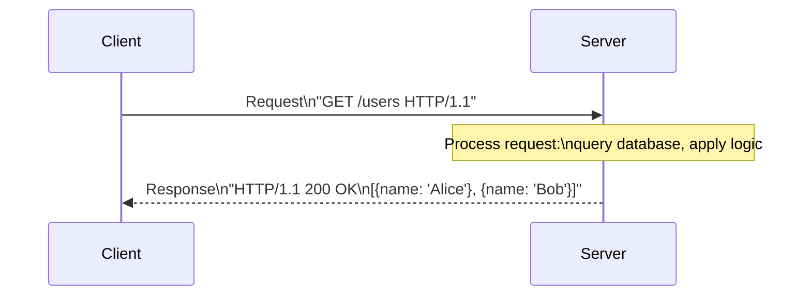
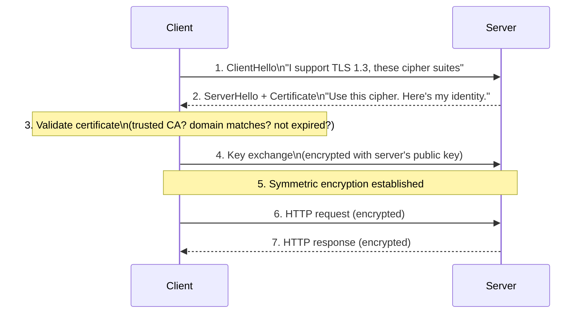
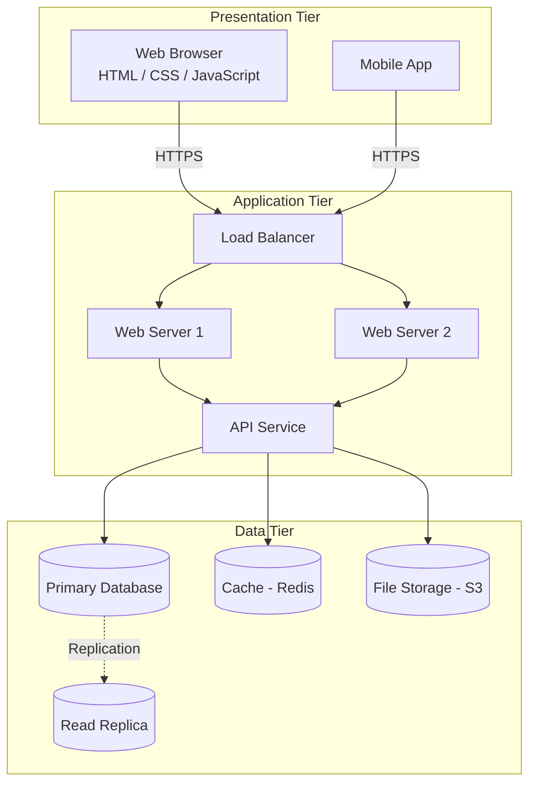
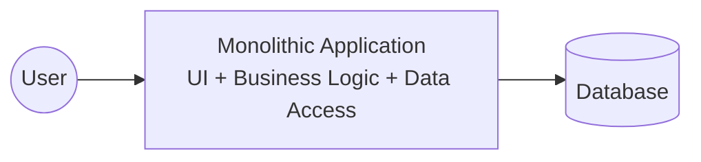
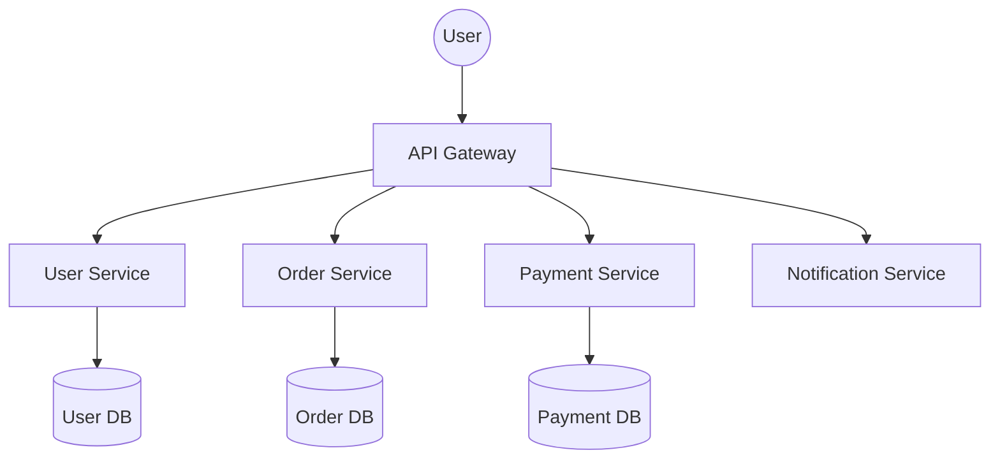

# Web Fundamentals

## Learning Objectives

By the end of this lesson, you will be able to:

- Explain the client-server model and why it dominates web architecture.
- Describe the structure of an HTTP request and response, including methods, headers, and status codes.
- Understand what HTTPS adds on top of HTTP and why it is non-negotiable.
- Define what an API is and recognise RESTful design patterns.
- Distinguish between relational and non-relational databases and know when to use each.
- Diagram a typical three-tier web application architecture.
- Connect web fundamentals to cloud-native patterns like microservices, API gateways, and managed databases.

---

## Introduction

In Lesson 5, you learned how data travels across networks: IP addresses, TCP connections, DNS resolution. But that only explains how packets move. It does not explain what they say.

When you load a web page, your browser and the server have a conversation. That conversation follows a strict protocol called **HTTP** (Hypertext Transfer Protocol). Every web page, every API call, every mobile app that talks to a backend—all of them speak HTTP.

The web is not just websites. It is the dominant application platform of our time. Cloud services expose HTTP APIs. Databases serve data to applications over HTTP-speaking middleware. Microservices communicate with each other using HTTP. Understanding the web is understanding how modern software is built, deployed, and scaled.

This lesson moves up the stack from packets to protocols. You will learn how clients and servers talk, how APIs work, and how databases fit into the picture.

---

## Why This Matters

Every cloud service you will ever use exposes an HTTP API. Every container you deploy runs an HTTP server (or is called via HTTP). Every Kubernetes Ingress routes HTTP traffic. The web is not a niche—it is the platform.

| Without web fundamentals...             | You cannot...                                                       |
|-----------------------------------------|---------------------------------------------------------------------|
| HTTP methods and status codes           | Debug a failing API call or understand what `404` vs `500` means.   |
| Request/response headers                | Set up CORS, caching, or content negotiation.                       |
| HTTPS and TLS                           | Secure your services or troubleshoot certificate errors.            |
| REST APIs                               | Design or consume the APIs that connect microservices.              |
| Database fundamentals                   | Choose the right database or understand why a query is slow.        |
| Three-tier architecture                 | Reason about where a failure occurred in a distributed system.      |

When a user reports "the app is broken," the problem could be in the frontend, the API, the backend service, or the database. Understanding each layer is how you find the fault quickly.

---

## Core Concepts

### The Client-Server Model

Every web interaction follows a simple pattern: a **client** makes a request, and a **server** sends a response.

| Role     | Job                                               | Examples                                    |
|----------|---------------------------------------------------|---------------------------------------------|
| **Client**   | Initiates requests; consumes responses.       | Web browser, mobile app, `curl`, another server |
| **Server**   | Listens for requests; processes them; responds. | Nginx, Apache, Node.js app, Python Flask     |



The client and server do not need to run on the same machine, the same operating system, or even be written in the same language. They only need to agree on the format of the messages they exchange—and that format is HTTP.

### HTTP: The Language of the Web

HTTP is a **request-response** protocol built on top of TCP. The client sends a request; the server sends back exactly one response. The connection may be reused for multiple requests (HTTP keep-alive), but each request gets one response.

#### HTTP Request Structure

```
GET /users?page=2 HTTP/1.1
Host: api.example.com
Accept: application/json
Authorization: Bearer eyJhbGciOi...
User-Agent: Mozilla/5.0
```

| Part               | Example                    | Purpose                                           |
|--------------------|----------------------------|---------------------------------------------------|
| **Method**         | `GET`                      | What action to perform                            |
| **Path**           | `/users?page=2`            | Which resource to act on (query string optional)  |
| **Protocol version** | `HTTP/1.1`              | Which HTTP version the client speaks              |
| **Headers**        | `Host: api.example.com`    | Metadata: authentication, content type, caching   |
| **Body**           | (optional)                 | Data sent with POST/PUT (JSON, form data, files)  |

#### HTTP Methods (Verbs)

| Method   | Meaning                  | Safe? | Idempotent? | Example Use                     |
|----------|--------------------------|-------|-------------|---------------------------------|
| **GET**      | Retrieve a resource  | Yes   | Yes         | Load a web page, fetch user list |
| **POST**     | Create a new resource | No    | No          | Submit a form, create a user    |
| **PUT**      | Replace a resource    | No    | Yes         | Update an entire user profile   |
| **PATCH**    | Partially update      | No    | No          | Change just one field           |
| **DELETE**   | Remove a resource     | No    | Yes         | Delete a user account           |
| **HEAD**     | Like GET, no body     | Yes   | Yes         | Check if resource exists        |
| **OPTIONS**  | Discover allowed methods | Yes | Yes        | CORS preflight requests         |

- **Safe** means the request does not modify data. `GET` should never change server state.
- **Idempotent** means making the same request multiple times has the same effect as making it once. `DELETE` is idempotent because deleting something that is already gone is still "gone."

#### HTTP Response Structure

```
HTTP/1.1 200 OK
Content-Type: application/json
Content-Length: 48
Cache-Control: max-age=3600

{"id": 42, "name": "Alice", "email": "alice@example.com"}
```

| Part               | Example                    | Purpose                                           |
|--------------------|----------------------------|---------------------------------------------------|
| **Protocol version** | `HTTP/1.1`              | Which HTTP version the server speaks              |
| **Status code**    | `200`                      | Numeric result of the request                     |
| **Reason phrase**  | `OK`                       | Human-readable description of the status          |
| **Headers**        | `Content-Type: application/json` | Metadata about the response                |
| **Body**           | `{"id": 42, ...}`          | The actual response data (JSON, HTML, binary)     |

#### HTTP Status Codes

Status codes are grouped by the first digit:

| Range   | Category       | Meaning                                              | Examples                          |
|---------|----------------|------------------------------------------------------|-----------------------------------|
| **1xx** | Informational  | Request received, continuing                         | `100 Continue`                    |
| **2xx** | Success        | Request was understood and accepted                  | `200 OK`, `201 Created`, `204 No Content` |
| **3xx** | Redirection    | Further action needed to complete the request        | `301 Moved Permanently`, `302 Found`, `304 Not Modified` |
| **4xx** | Client Error   | The request was malformed or unauthorised            | `400 Bad Request`, `401 Unauthorized`, `403 Forbidden`, `404 Not Found`, `429 Too Many Requests` |
| **5xx** | Server Error   | The server failed to process a valid request         | `500 Internal Server Error`, `502 Bad Gateway`, `503 Service Unavailable` |

> **Debugging rule:** If you get a `4xx`, the problem is on your side (bad request, missing auth, wrong URL). If you get a `5xx`, the problem is on the server side. A `502 Bad Gateway` from a cloud load balancer often means the backend server is down or not responding.

#### HTTP Headers

Headers carry metadata about the request or response. They are key-value pairs:

| Header                       | Direction     | Purpose                                             |
|------------------------------|---------------|-----------------------------------------------------|
| `Host`                       | Request       | Which domain the request is for (required in HTTP/1.1) |
| `Content-Type`               | Both          | Format of the body: `application/json`, `text/html` |
| `Content-Length`             | Both          | Size of the body in bytes                           |
| `Authorization`              | Request       | Authentication credentials (e.g., `Bearer token`)   |
| `Accept`                     | Request       | What formats the client can handle                  |
| `Cache-Control`              | Response      | How long the response can be cached                 |
| `Set-Cookie`                 | Response      | Send a cookie to the client                         |
| `Location`                   | Response      | Used with 3xx redirects to specify the new URL      |

### HTTPS: HTTP with Encryption

HTTP sends data in plain text. Anyone between the client and server—your ISP, a public Wi-Fi operator, a compromised router—can read every request and response. **HTTPS** (HTTP over TLS) encrypts the entire conversation.



**Step 1–2:** The client and server agree on a cipher suite (which encryption algorithm to use). The server presents its digital **certificate**, which proves its identity.

**Step 3:** The client validates the certificate: was it issued by a trusted Certificate Authority (CA)? Does the domain on the certificate match the one being visited? Has the certificate expired?

**Step 4–5:** The client and server perform a key exchange (usually Diffie-Hellman) to establish a shared secret. From this point on, all data is encrypted with symmetric encryption—fast and secure.

**Step 6–7:** Regular HTTP continues inside the encrypted tunnel. An observer can see that you are talking to `api.example.com`, but cannot see the URL path, headers, or body.

> **Today, HTTPS is the baseline.** Browsers mark plain HTTP sites as "Not Secure." Cloud providers like AWS and Google Cloud offer free TLS certificates through services like ACM (AWS Certificate Manager). There is no good reason to run a production service over plain HTTP.

### APIs: How Programs Talk to Programs

An **API (Application Programming Interface)** is a contract that defines how one piece of software can interact with another. When people say "API" in web contexts, they usually mean an **HTTP API**—a set of URLs that return data (usually JSON) instead of HTML.

#### REST: The Dominant Style

**REST (Representational State Transfer)** is a set of conventions for designing HTTP APIs. A RESTful API treats everything as a **resource** (users, orders, products) identified by a URL, and uses HTTP methods to operate on them:

```
GET    /users          → List all users
GET    /users/42       → Get user with ID 42
POST   /users          → Create a new user
PUT    /users/42       → Replace user 42 entirely
PATCH  /users/42       → Update part of user 42
DELETE /users/42       → Delete user 42
```

A JSON response from `GET /users/42` might look like:

```json
{
  "id": 42,
  "name": "Alice",
  "email": "alice@example.com",
  "created_at": "2026-01-15T08:30:00Z"
}
```

REST APIs are stateless: each request contains all the information the server needs to process it. The server does not remember previous requests from the same client. If authentication is needed, the client sends credentials (usually a token in the `Authorization` header) with every request.

> **Cloud insight:** In a microservices architecture, services communicate with each other using HTTP APIs. A user service might call `GET /orders?user_id=42` on the order service. Every inter-service call is an HTTP request. Cloud API gateways (like AWS API Gateway or Kong) sit in front of these services, handling authentication, rate limiting, and routing.

### Databases: Where Data Lives

Applications process data. But data must survive beyond a single request. A **database** is a structured system for storing, querying, and managing data persistently.

#### Relational Databases (SQL)

A relational database organises data into **tables** with rows and columns, similar to a spreadsheet. Tables are connected by **relationships** (foreign keys). You query them using **SQL** (Structured Query Language).

| Table: users  |                 |                  |
|---------------|-----------------|------------------|
| id (PK)       | name            | email            |
| 1             | Alice           | alice@mail.com   |
| 2             | Bob             | bob@mail.com     |

| Table: orders |                 |                    |
|---------------|-----------------|--------------------|
| id (PK)       | user_id (FK)    | total              |
| 101           | 1               | 29.99              |
| 102           | 1               | 54.00              |
| 103           | 2               | 12.50              |

```sql
-- Get all orders for user "Alice"
SELECT orders.id, orders.total
FROM orders
JOIN users ON orders.user_id = users.id
WHERE users.name = 'Alice';
```

Key properties (ACID):
- **Atomicity:** A transaction either fully completes or fully rolls back.
- **Consistency:** The database never violates its own rules.
- **Isolation:** Concurrent transactions do not interfere.
- **Durability:** Once committed, data survives crashes.

Popular relational databases: **PostgreSQL**, **MySQL**, **MariaDB**, **SQLite** (embedded).

#### Non-Relational Databases (NoSQL)

NoSQL databases sacrifice some relational guarantees for scalability, flexibility, or special-purpose performance:

| Type               | How It Stores Data                    | Example Use Case                   | Popular Systems          |
|--------------------|---------------------------------------|------------------------------------|--------------------------|
| **Document store** | JSON-like documents                   | User profiles, product catalogues  | MongoDB, CouchDB          |
| **Key-value store**| Simple key → value pairs             | Caching, session storage           | Redis, DynamoDB           |
| **Column-family**  | Columns grouped into families        | Time-series data, analytics        | Cassandra, HBase          |
| **Graph**          | Nodes and edges (relationships)       | Social networks, recommendations   | Neo4j, Neptune            |

#### Choosing a Database

| Use a relational DB when...                     | Use a NoSQL DB when...                              |
|-------------------------------------------------|-----------------------------------------------------|
| Data has a fixed, predictable structure         | Data structure varies or evolves frequently         |
| You need complex queries across multiple tables | You mostly query by a single key                    |
| Consistency and correctness are critical (money, inventory) | You need extreme write throughput or horizontal scale |
| You benefit from mature tooling and SQL         | You need low-latency caching or document flexibility |

> **Cloud insight:** Cloud providers offer **managed databases** (AWS RDS, Google Cloud SQL, Azure Database). They handle backups, patching, replication, and failover. You get a connection string and start querying. Understanding the database types helps you choose the right managed service.

---

## How It Works

### A Typical Three-Tier Web Application

Most web applications follow a **three-tier architecture**. Each tier has a distinct responsibility:



| Tier              | Responsibility                                | Technologies                                  |
|-------------------|-----------------------------------------------|-----------------------------------------------|
| **Presentation**  | User interface, user interaction              | HTML, CSS, JavaScript, React, Swift, Kotlin   |
| **Application**   | Business logic, rules, processing             | Node.js, Python, Go, Java; API servers        |
| **Data**          | Persistent storage, caching, file storage     | PostgreSQL, MongoDB, Redis, S3, Elasticsearch |

**Why three tiers?** Separation of concerns. You can:
- Update the UI without touching the database.
- Scale the application tier horizontally (add more web servers) without changing the other tiers.
- Replace the database engine without rewriting the application (only the data-access layer changes).
- Cache at the application tier to reduce database load.

This pattern scales from a hobby project running on a single machine to a global deployment spanning hundreds of servers. The cloud native tools you will learn—containers, Kubernetes—all serve to deploy and manage these three tiers at scale.

---

## Real-World Example

### From Monolith to Microservices

A **monolith** is an application where all three tiers are bundled together into a single deployable unit—one codebase, one process, one database. This is how most applications start.



A monolith is simple to develop and deploy. But as it grows, problems emerge:
- A change to the payment module requires redeploying the entire application.
- A bug in the notification module can crash the whole system.
- The entire application must scale together, even if only one feature is under load.

**Microservices** split the monolith into independent services, each with its own codebase, its own deployment pipeline, and often its own database:



|                | Monolith                                  | Microservices                             |
|----------------|-------------------------------------------|-------------------------------------------|
| **Deployment** | One unit; slow and risky                  | Many small, independent deployments       |
| **Scaling**    | Scale everything together                 | Scale only the services under load        |
| **Failure**    | One bug can take down the whole system    | Failures are isolated                     |
| **Complexity** | Simple to start, complex to maintain      | Complex to orchestrate, simpler to evolve |
| **Team organisation** | One team on one codebase           | Multiple teams, each owning services      |

> **This is not a binary choice.** Most successful systems start as a monolith and gradually extract services as the need arises. Kubernetes, Docker, and service meshes exist to handle the orchestration complexity that microservices introduce. You do not need microservices on day one—but you should understand the pattern.

---

## Hands-On Examples

### Exercise 1: Inspect an HTTP Request with Browser DevTools

1. Open your browser. Press `F12` (or `Cmd+Option+I` on macOS) to open Developer Tools.
2. Go to the **Network** tab.
3. Visit `https://example.com`.
4. Click the first request (`example.com`). Examine:
   - **Headers:** Request headers (what your browser sent) and response headers (what the server returned).
   - **Response:** The HTML body the server sent.
   - **Timing:** DNS lookup, TCP handshake, TLS setup, request sent, response received.
5. Look for the **status code** (`200 OK`).

This is the fastest way to debug any web request. You can see exactly what was sent, what was received, and how long each step took.

### Exercise 2: Make HTTP Requests from the Terminal

```bash
# Simple GET request
curl https://api.github.com/users/octocat

# GET with headers displayed
curl -i https://example.com

# POST JSON data
curl -X POST https://httpbin.org/post \
  -H "Content-Type: application/json" \
  -d '{"name": "Alice", "email": "alice@example.com"}'

# Follow redirects
curl -L http://github.com

# Show detailed timing breakdown
curl -w "\nDNS: %{time_namelookup}s\nTCP: %{time_connect}s\nTLS: %{time_appconnect}s\nTotal: %{time_total}s\n" \
  -o /dev/null -s https://example.com
```

### Exercise 3: Explore HTTP Status Codes

```bash
# 200 OK
curl -I https://example.com

# 301 Moved Permanently
curl -I http://github.com

# 404 Not Found
curl -I https://example.com/nonexistent

# 405 Method Not Allowed
curl -X DELETE https://example.com
```

For each response, note the status code and any interesting headers (`Location` on redirects, `Content-Type`, caching headers).

### Exercise 4: Inspect TLS Certificates

```bash
# Show the certificate chain for a domain
openssl s_client -connect example.com:443 -showcerts < /dev/null 2>/dev/null | \
  openssl x509 -noout -text | grep -E "Subject:|Issuer:|Not Before|Not After"

# Or simpler: check when a certificate expires
curl -vI https://example.com 2>&1 | grep -E "expire|subject|issuer"
```

**Windows (PowerShell):**
```powershell
# Test TLS connectivity and view certificate
[System.Net.ServicePointManager]::ServerCertificateValidationCallback = {$true}
$req = [System.Net.WebRequest]::Create("https://example.com")
$req.GetResponse() | Out-Null
```

### Exercise 5: Set Up a Minimal HTTP Server

**Python (any OS with Python installed):**

```bash
# Start a simple HTTP server in the current directory
python3 -m http.server 8080

# In another terminal, test it:
curl http://localhost:8080
```

This starts a real HTTP server on port 8080, serving the files in your current directory. Open `http://localhost:8080` in your browser. You just became a web server operator. Press `Ctrl+C` in the server terminal to stop it.

For a more useful exercise, create a small HTML file:

```bash
echo "<h1>Hello from my web server!</h1>" > index.html
python3 -m http.server 8080
```

Now `curl http://localhost:8080` returns your HTML. This is HTTP in its simplest form: a server listening on a port, responding to requests with data.

---

## Common Misconceptions

### "HTTP and HTTPS are completely different protocols."

HTTPS is HTTP running inside a TLS-encrypted tunnel. The request and response format—methods, status codes, headers—are identical. The only difference is that the TCP connection is encrypted before any HTTP data flows. An application that speaks HTTP can speak HTTPS by changing `http://` to `https://` (assuming the client library supports TLS).

### "A REST API must return JSON."

REST does not prescribe a data format. JSON is the most common because it is lightweight and universally supported, but a REST API can return XML, HTML, plain text, or even images. The key REST constraint is that the API is stateless and resource-oriented.

### "NoSQL means 'no SQL at all'."

NoSQL stands for "Not Only SQL." Many NoSQL databases support SQL-like query languages. The distinction is about the data model (documents, key-value, graph) and the trade-offs around consistency and scalability, not about whether SQL syntax is available.

### "POST and PUT are interchangeable."

`POST` means "create a new resource" (the server decides the ID). `PUT` means "put this resource at this exact URL" (the client specifies the full URL). Repeating a `POST` creates multiple resources; repeating a `PUT` overwrites the same resource. This difference matters for API design and data integrity.

### "If my database is fast, my application is fast."

Database speed is only one piece. Network latency between the app and the database, missing indexes, N+1 query problems (one query per row in a loop), and the absence of caching can all make an application slow even when the database itself responds in microseconds. Performance is a system property, not a database property.

---

## Knowledge Check

1. What are the three parts of an HTTP request?
2. A client receives a `403 Forbidden` response. What category of problem does this indicate, and whose side is it likely on?
3. Why does HTTPS perform a TLS handshake before sending any HTTP data?
4. What is the difference between a relational database and a document store?
5. Name the three tiers of a typical web application and what each is responsible for.

> **Answers for self-review:**
> 1. The request line (method, path, protocol version), headers (metadata key-value pairs), and an optional body (data for POST/PUT).
> 2. `403` is a 4xx client error. The server understood the request but refuses to fulfil it—usually because the client lacks proper authentication or authorisation. The problem is on the client side (missing or invalid credentials).
> 3. The TLS handshake establishes encryption before any application data flows, ensuring that the HTTP request and response (including sensitive headers like `Authorization` tokens, and the body itself) cannot be read by anyone intercepting the network traffic.
> 4. A relational database stores data in tables with predefined schemas, rows, and columns; relationships are enforced through foreign keys, and data is queried with SQL. A document store stores data as flexible, JSON-like documents without a fixed schema; relationships are often embedded or handled at the application level.
> 5. Presentation tier (user interface), Application tier (business logic and request processing), Data tier (persistent storage and caching).

---

## Key Takeaways

- The **client-server model** is the foundation of the web: the client initiates requests, the server responds. They communicate using **HTTP**.
- An **HTTP request** consists of a method, path, headers, and an optional body. The **response** consists of a status code, headers, and a body.
- **Status codes** are grouped by first digit: 2xx (success), 3xx (redirection), 4xx (client error), 5xx (server error). Learn to read them.
- **HTTPS** encrypts HTTP inside TLS. The certificate proves the server's identity. Plain HTTP is unacceptable for production.
- **REST APIs** treat everything as a resource identified by a URL and use HTTP methods as verbs. JSON is the most common data format.
- **Relational databases** (SQL) use tables and enforce structure; **NoSQL databases** optimise for flexibility or specialised workloads. Choose based on your data model and access patterns.
- The **three-tier architecture** (presentation, application, data) separates concerns and enables independent scaling. It scales from a single server to a global deployment.
- **Microservices** split a monolith into independent services communicating over HTTP. Containers and Kubernetes exist to manage the resulting complexity.

---

## Next Lesson

**Virtualization**

Now that you understand how web applications are built and deployed, the next lesson asks: how do you run multiple applications on the same physical hardware without them interfering with each other? You will learn how hypervisors create virtual machines, why virtualization transformed data centres, and how it sets the stage for containers and cloud computing.
