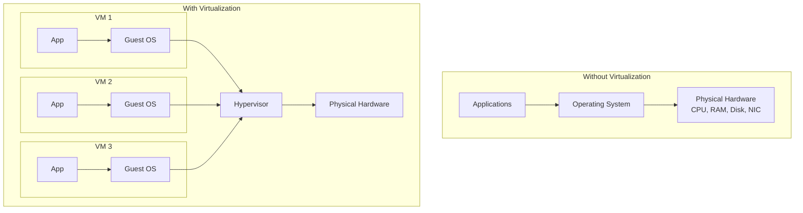
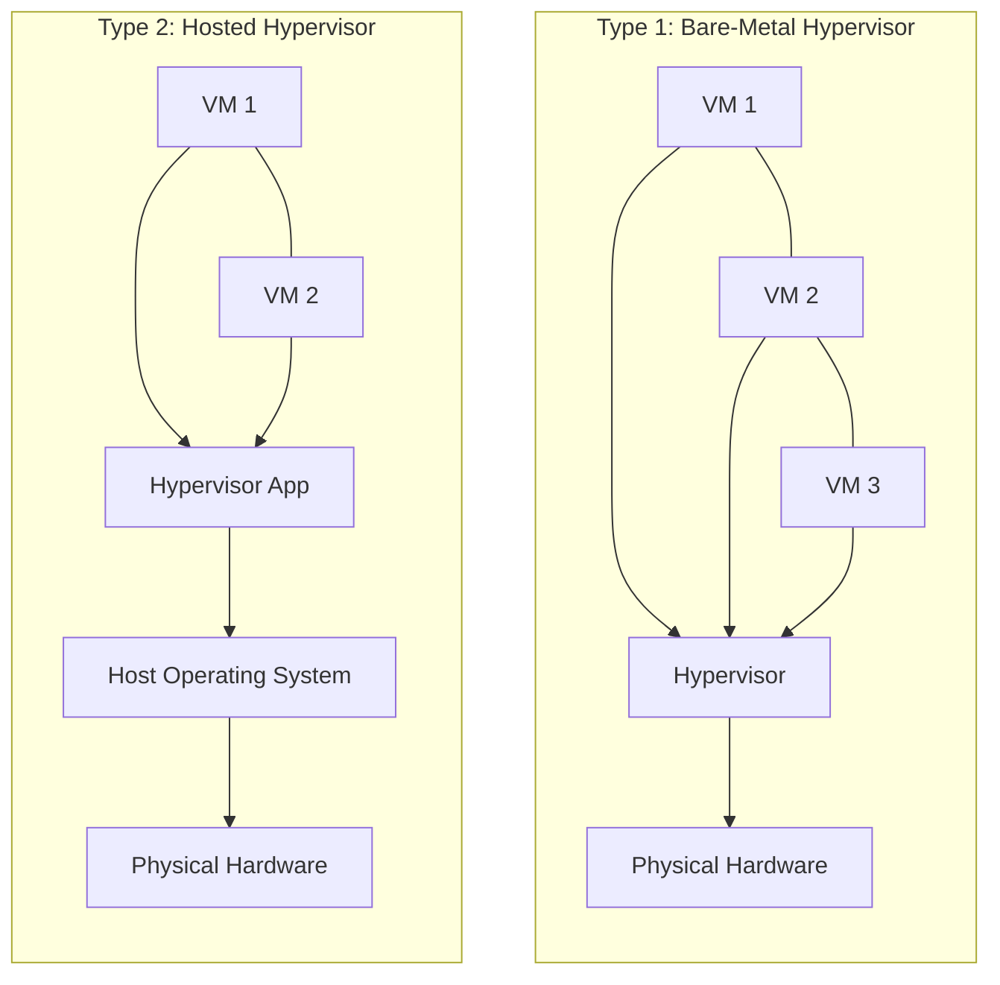
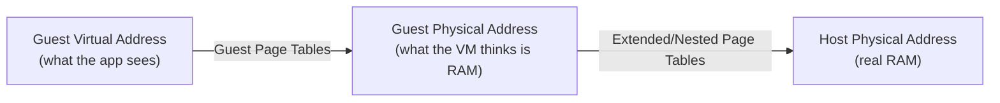
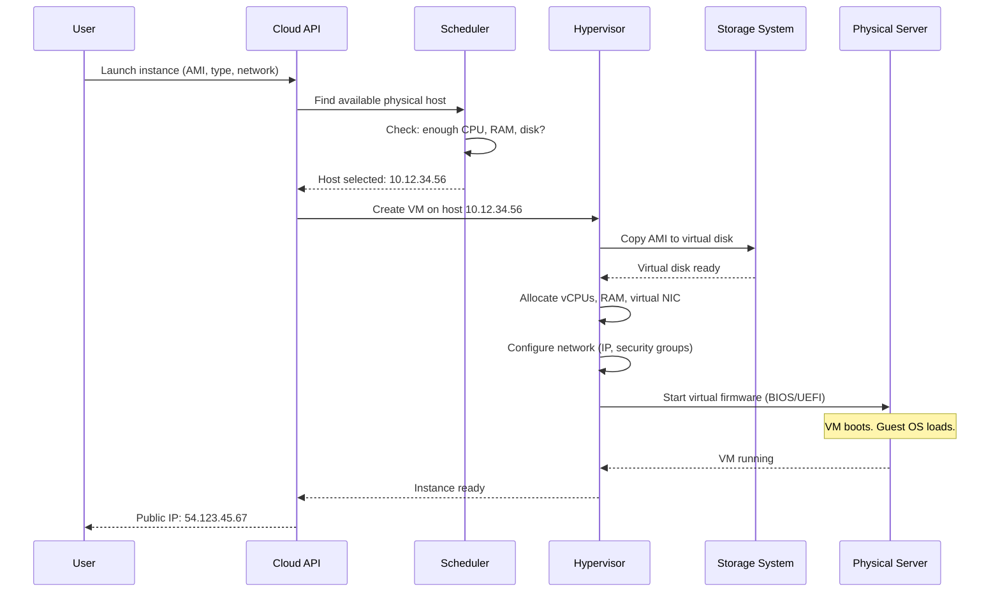
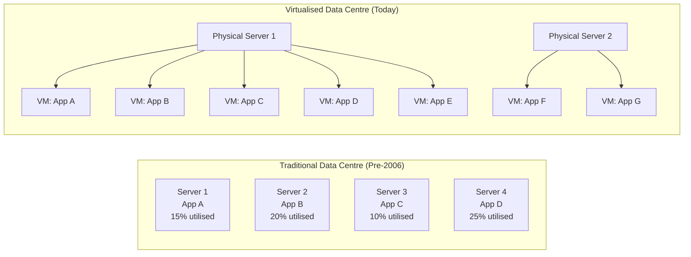

# Virtualization

## Learning Objectives

By the end of this lesson, you will be able to:

- Explain what virtualization is and why it transformed computing.
- Distinguish between Type 1 and Type 2 hypervisors and describe where each is used.
- Understand how a hypervisor virtualises CPU, memory, storage, and networking.
- Describe the benefits of virtual machines: isolation, density, snapshots, and live migration.
- Explain why virtualization is the foundation of cloud computing.
- Compare virtual machines and containers at a high level.

---

## Introduction

Imagine you own a large building. You could live in the entire building yourself, using every room. But that would be wasteful—most rooms would sit empty. A smarter approach: divide the building into apartments. Each apartment has its own kitchen, bathroom, and front door. Tenants live independently, unaware of each other. If one tenant floods their kitchen, the other apartments stay dry.

**Virtualization** does exactly this with computers. It takes one physical server and divides it into multiple **virtual machines (VMs)**—each running its own operating system, its own applications, fully isolated from the others. The software that creates and manages these VMs is called a **hypervisor**.

Before virtualization, a typical server ran one operating system and one application (or a handful of closely related ones). Data centres were filled with underutilised machines, each consuming power, space, and cooling. Virtualization changed everything: a single server could now run dozens of VMs, each an independent computer in its own right.

This lesson explains how virtualization works, why it matters, and how it set the stage for cloud computing.

---

## Why This Matters

Virtualization is the technology that made cloud computing economically feasible. Without it, "renting a server by the hour" would mean waiting for a physical machine to be assembled, cabled, and booted. With virtualization, a cloud provider can create a new VM in seconds from a pool of physical hardware.

| Without virtualization knowledge...     | You cannot...                                                   |
|-----------------------------------------|-----------------------------------------------------------------|
| Hypervisors and resource allocation     | Understand what a "cloud instance" actually is.                 |
| VM isolation                            | Reason about why one customer's VM cannot see another's data.   |
| Snapshots and migration                 | Use cloud features like AMIs (machine images) or live migration.|
| The VM vs container distinction         | Fully grasp why containers are lighter—and less isolated—than VMs. |

Every "virtual server" you rent in the cloud—every EC2 instance, every Google Compute Engine VM, every Azure VM—is a virtual machine running on a hypervisor. Understanding virtualization means understanding what you are actually paying for.

---

## Core Concepts

### What Is Virtualization?

Virtualization is the separation of a resource from its physical implementation. In computing, it means using software to create a simulated (virtual) version of a computer—complete with virtual CPU, virtual memory, virtual disk, and virtual network card—that behaves exactly like a physical computer.

The piece of software that does this is the **hypervisor** (also called a **Virtual Machine Monitor**, or VMM). The hypervisor sits between the physical hardware and the virtual machines, intercepting and translating every interaction.



Each VM believes it is running on real hardware. The guest operating system inside a VM does not know—and does not need to know—that its "CPU" is actually a time-sliced share of a physical CPU, or that its "disk" is actually a file on the host's storage.

### Hypervisors: Type 1 vs Type 2

Hypervisors come in two architectures:



|                          | Type 1 (Bare-Metal)                          | Type 2 (Hosted)                                |
|--------------------------|----------------------------------------------|------------------------------------------------|
| **Where it runs**        | Directly on the physical hardware            | As an application on top of a host OS          |
| **Performance**          | Higher (less overhead)                       | Lower (host OS adds overhead)                  |
| **Examples**             | VMware ESXi, KVM, Microsoft Hyper-V, Xen     | VMware Workstation, VirtualBox, Parallels      |
| **Primary use**          | Data centres, cloud providers, enterprise    | Development, testing, running a different OS on a desktop |
| **What manages it**      | The hypervisor itself is the OS              | The host OS (Windows, macOS, Linux)            |

> **Cloud reality:** When you launch an EC2 instance on AWS, it runs on a Type 1 hypervisor—a customised version of KVM combined with AWS's Nitro hardware offload. Your VM shares physical hardware with other customers' VMs, but the hypervisor enforces strict isolation between them.

### How the Hypervisor Virtualises Each Component

#### CPU Virtualization

The CPU can only execute one instruction stream per core at a time. The hypervisor gives each virtual CPU (vCPU) a time slice on a physical core, rapidly switching between them—the same context-switching concept from Lesson 3, applied to entire virtual machines.

Modern CPUs have hardware virtualization extensions (**Intel VT-x**, **AMD-V**) that make this efficient. Before these extensions existed, hypervisors had to use a slower technique called **binary translation** to catch and rewrite sensitive instructions. Today, the CPU itself understands that a hypervisor is running and provides direct support:

1. The hypervisor configures the CPU to trap (intercept) any instruction from a guest VM that would affect the whole machine.
2. When a guest tries to execute a privileged instruction (like modifying the page table or accessing I/O), the CPU pauses the VM and hands control to the hypervisor.
3. The hypervisor emulates the instruction safely, then resumes the VM.
4. The guest OS never knows the difference—it thinks it executed the instruction directly on real hardware.

This is called **trap-and-emulate**, and hardware support makes it fast enough that a VM runs at near-native speed—typically 95–99% of bare-metal performance.

#### Memory Virtualization

In Lesson 3, you learned that every process has its own virtual address space mapped by page tables. Virtualization adds another layer: the guest OS has its own page tables, mapping **guest virtual addresses** to **guest physical addresses** (what the VM thinks is physical RAM). But the VM's "physical" RAM is itself virtual—it is a chunk of the host's real physical RAM.

So we need two layers of translation:



- **Shadow page tables** (older approach): The hypervisor maintains its own page tables that directly map guest virtual addresses to host physical addresses, bypassing the guest's tables. Every time the guest updates its page tables, the hypervisor must update the shadows. This is correct but adds overhead.

- **Extended Page Tables** (Intel EPT) / **Nested Page Tables** (AMD NPT): Modern CPUs can walk both page tables in hardware. The CPU's memory management unit (MMU) translates guest virtual → guest physical (using the guest's page tables), then guest physical → host physical (using the hypervisor's extended page tables), all in one go. This is much faster than shadow page tables.

> **Key point:** The hypervisor guarantees that no VM can access another VM's memory. Each VM's "physical" RAM maps to a distinct, non-overlapping region of real RAM. This is enforced by hardware.

#### Storage Virtualization

A VM's hard drive is not a physical disk—it is a **virtual disk**, stored as a file (or set of files) on the host's real storage. Common virtual disk formats include VMDK (VMware), VHD/VHDX (Hyper-V), and QCOW2 (KVM/QEMU).

The guest OS sends disk read/write commands to what it thinks is a SATA or SCSI controller. The hypervisor intercepts these commands and translates them into reads and writes to the virtual disk file on the host's file system.

Benefits:
- **Snapshots:** Capture the state of a virtual disk at a point in time. If a software update goes wrong, revert to the snapshot in seconds.
- **Cloning:** Copy a virtual disk to create an identical VM. This is how cloud providers create new instances from an AMI (Amazon Machine Image) or a custom image.
- **Thin provisioning:** The virtual disk file starts small and grows as the guest writes data. You can create a 100 GB virtual disk that initially consumes only 2 GB on the host.

#### Network Virtualization

A VM's network card is not a physical NIC—it is a **virtual NIC** connected to a **virtual switch** inside the hypervisor. The virtual switch routes traffic between VMs on the same host and to the physical network.

Common networking modes:

| Mode         | VM Can Reach...                           | Analogy                                    |
|--------------|-------------------------------------------|--------------------------------------------|
| **NAT**      | The internet (via host IP)                | An apartment building with one street address |
| **Bridged**  | The local network directly (its own IP)   | Each apartment has its own street address  |
| **Host-only**| Only the host and other VMs               | Internal intercom only                     |
| **Internal** | Only other VMs on the same virtual switch | A private hallway with no outside access   |

In cloud environments, this is abstracted further into VPCs, subnets, and security groups (which you studied in Lesson 5). But underneath, the VPC is a software-defined network built on virtual switches.

### Benefits of Virtualization

| Benefit              | What It Means                                                               |
|----------------------|-----------------------------------------------------------------------------|
| **Server consolidation** | Run dozens of VMs on one physical server instead of one OS per machine. |
| **Isolation**        | A crash, misconfiguration, or security breach in one VM does not affect others. |
| **Portability**      | A VM is just files. Copy them to another physical server and the VM runs identically. |
| **Snapshots**        | Save the exact state of a VM. Revert instantly if something goes wrong.     |
| **Live migration**   | Move a running VM from one physical host to another with zero downtime.     |
| **Resource flexibility** | Add vCPUs, RAM, or disk to a VM without opening a physical case.       |
| **Hardware abstraction** | The guest OS sees standardised virtual hardware regardless of the physical hardware underneath. |

> **The killer feature for cloud:** Live migration. A cloud provider can move your VM to a different physical host for maintenance—or to balance load—and you never notice. Your IP address stays the same, your connections stay open, your application keeps running. This is how cloud providers perform hardware maintenance without scheduling downtime for every customer.

---

## How It Works

### Booting a Virtual Machine

Let us trace what happens when you launch a cloud VM:



**Step 1 — Request:** You choose an AMI (the disk image containing the OS and software), an instance type (how many vCPUs and how much RAM), and network settings. You click "Launch."

**Step 2 — Placement:** The cloud scheduler finds a physical server with enough free CPU, RAM, and disk capacity. If one region is full, it may place the VM in another availability zone with available capacity.

**Step 3 — Provisioning:** The hypervisor on the selected host creates the VM. It copies the AMI to a virtual disk, allocates vCPUs and RAM, and attaches a virtual NIC to the customer's VPC.

**Step 4 — Boot:** The VM powers on. The virtual BIOS/UEFI runs, loads the bootloader, and starts the guest OS. This takes 30–120 seconds depending on the OS.

**Step 5 — Ready:** The VM gets a private IP (inside the VPC) and optionally a public IP. You receive the connection details. You can now SSH into it.

This entire process—from click to SSH-ready—typically takes under two minutes. Before virtualization, acquiring a server meant waiting days or weeks for hardware procurement, racking, and cabling.

---

## Real-World Example

### Virtualization Made Cloud Computing Possible

Before 2006, if you wanted to run a web application, you either:
- Bought or rented a physical server (expensive, slow to provision).
- Used shared web hosting (cheap, but you shared the OS with other customers—no isolation, no root access, no custom software).

Virtualization changed the economics. A provider could:
1. Buy a powerful physical server (say, 64 cores, 512 GB RAM).
2. Install a Type 1 hypervisor.
3. Divide it into 32 VMs, each with 2 vCPUs and 16 GB RAM.
4. Rent each VM to a different customer.

The physical server cost might be $20,000. If each customer pays $50/month for their VM, the server generates $1,600/month—paying for itself in about a year. After that, it is pure profit (minus power, cooling, and maintenance).

Scale this to thousands of servers across dozens of data centres, and you have AWS, Google Cloud, and Azure.



The virtualised model uses fewer physical servers, less power, less cooling, and less space—while running more applications with better isolation. This is why cloud computing can offer compute by the hour at prices that undercut owning hardware.

---

## Hands-On Examples

You can run virtual machines on your own computer. This is how you will install Linux for later lessons if you are on Windows or macOS.

### Exercise 1: Install VirtualBox (Type 2 Hypervisor)

VirtualBox is a free, open-source Type 2 hypervisor. It runs on Windows, macOS, and Linux.

1. Download from [virtualbox.org](https://www.virtualbox.org).
2. Install and launch it.
3. You will see an empty VM list. This is your hypervisor management console.

### Exercise 2: Inspect Your Host's Virtualization Support

**Linux:**
```bash
# Check if your CPU supports hardware virtualization
grep -E "vmx|svm" /proc/cpuinfo
# vmx = Intel VT-x
# svm = AMD-V
# If output appears, your CPU supports hardware virtualization.
```

**Windows (PowerShell):**
```powershell
# Check if Hyper-V is available
Get-WindowsOptionalFeature -Online -FeatureName Microsoft-Hyper-V-All
```

**macOS:**
```bash
# Check if VT-x is supported (Intel Macs)
sysctl -n machdep.cpu.features | grep -o "VMX"
# Apple Silicon Macs use a different architecture but support native virtualization.
```

If your CPU lacks virtualization extensions, VirtualBox can still run VMs using software emulation—but they will be noticeably slower. Almost all CPUs made since 2010 include these extensions.

### Exercise 3: Observe a Real Hypervisor (Linux KVM)

If you are on a Linux system, KVM (Kernel-based Virtual Machine) turns the Linux kernel itself into a Type 1 hypervisor:

```bash
# Check if KVM is available
ls -la /dev/kvm

# If you see the device, KVM is ready.
# Install QEMU and libvirt for VM management:
# Ubuntu/Debian: sudo apt install qemu-kvm libvirt-daemon-system virt-manager
# Fedora: sudo dnf install @virtualization

# List running VMs
sudo virsh list --all

# Show hypervisor capabilities
virsh capabilities | head -30
```

### Exercise 4: Compare VM and Process Isolation

This is a thought exercise that previews containers. When you run a VM:
- The guest OS kernel handles system calls from applications inside the VM.
- The hypervisor handles "hypercalls" from the guest kernel.
- Two VMs on the same host cannot see each other's memory, processes, or files.

When you run a process directly on your host (no VM):
- The host kernel handles system calls directly.
- Processes can see each other in `ps aux` (unless namespaced).
- Isolation depends on user permissions, not a hypervisor.

Everything in Lesson 8 (Docker) and Lesson 10 (Kubernetes) builds on this comparison between full virtualization and OS-level isolation.

---

## Common Misconceptions

### "A virtual machine is just a slow, fake computer."

A modern VM running on hardware with virtualization extensions achieves 95–99% of bare-metal performance for CPU-bound work. The overhead is almost entirely in I/O (disk and network), and even that gap has narrowed with technologies like SR-IOV (which gives VMs direct access to physical network cards) and NVMe virtualisation.

### "Type 1 hypervisors don't have an operating system."

A Type 1 hypervisor *is* a specialised operating system. It manages hardware, schedules CPU time, allocates memory, and handles I/O—exactly what an OS does. The difference is that its "applications" are entire virtual machines rather than individual processes. KVM blurs the line further by embedding the hypervisor inside a general-purpose Linux kernel.

### "Virtualization and containers are competing technologies."

They are complementary. In most cloud deployments, containers run inside virtual machines. The VM provides strong isolation and security; the container provides lightweight packaging and fast startup. Kubernetes nodes are typically VMs. You use both, not one or the other.

### "Snapshots are backups."

A snapshot captures the state of a VM at a moment in time, but it typically depends on the original virtual disk. If the underlying storage fails, snapshots fail too. Snapshots are for quick rollbacks before risky operations (upgrades, configuration changes). They are not a substitute for proper, separate backups stored on different media.

### "More vCPUs always means better performance."

Adding vCPUs to a VM increases CPU contention on the physical host. The hypervisor must schedule all those vCPUs on real cores. If the host is oversubscribed, adding vCPUs can make the VM *slower* because the hypervisor waits until all requested vCPUs are available simultaneously before scheduling the VM (a problem called **co-scheduling** or **CPU ready time** in VMware). Right-size your VMs based on actual workload, not assumptions.

---

## Knowledge Check

1. What is the fundamental difference between a Type 1 and a Type 2 hypervisor?
2. How does a hypervisor prevent one VM from reading another VM's memory?
3. What hardware feature makes modern CPU virtualization efficient, and what did hypervisors use before it existed?
4. Why was virtualization the key enabler for cloud computing?
5. A cloud provider needs to perform physical maintenance on a server hosting your VM. How can they do this without shutting down your VM?

> **Answers for self-review:**
> 1. A Type 1 hypervisor runs directly on the physical hardware (bare metal). A Type 2 hypervisor runs as an application on top of a host operating system. Type 1 is used in data centres; Type 2 is used on desktops/laptops.
> 2. Each VM's "physical" memory maps to a distinct, non-overlapping region of real physical RAM. The hypervisor's extended/nested page tables enforce this mapping in hardware. No guest physical address in VM A can resolve to a host physical address that belongs to VM B.
> 3. Hardware virtualization extensions (Intel VT-x, AMD-V) allow the CPU to efficiently trap and emulate privileged instructions. Before these, hypervisors used binary translation—scanning guest code and rewriting sensitive instructions before execution, which was much slower.
> 4. Virtualization allowed a single physical server to run multiple isolated VMs, each rented to a different customer. This turned underutilised hardware into a multi-tenant platform with per-hour billing, making compute affordable and instantly provisionable.
> 5. Live migration. The hypervisor copies the VM's memory, CPU state, and network connections to another physical host while the VM is still running. Once the copy is synchronised, the hypervisor switches execution to the new host in a fraction of a second. The VM's IP address and connections are preserved.

---

## Key Takeaways

- **Virtualization** uses a **hypervisor** to divide one physical server into multiple isolated **virtual machines**, each running its own OS.
- **Type 1 hypervisors** (KVM, ESXi, Hyper-V) run on bare metal and power data centres. **Type 2 hypervisors** (VirtualBox, VMware Workstation) run on a host OS for development and testing.
- The hypervisor virtualises **CPU** (time-slicing with hardware trap-and-emulate), **memory** (extended/nested page tables), **storage** (virtual disk files), and **networking** (virtual switches).
- **Hardware virtualization extensions** (Intel VT-x, AMD-V) make VMs run at near-native speed—the difference between usable and unusable.
- Virtualization enables **server consolidation, isolation, snapshots, live migration, and resource flexibility**—the capabilities that made cloud computing economically viable.
- In the cloud, every "virtual server" is a VM on a Type 1 hypervisor. The cloud provider manages the physical hardware; you manage the guest OS and applications.
- Containers (next lesson) provide a lighter form of isolation by sharing the host kernel, but they build on concepts introduced by virtualization.

---

## Next Lesson

**Docker**

Now that you understand virtualization—how one machine becomes many—the next lesson introduces a lighter, faster alternative: containers. You will learn how Docker packages applications with their dependencies, why containers share the host kernel instead of running their own OS, and how this changes the speed, density, and workflow of software deployment.
