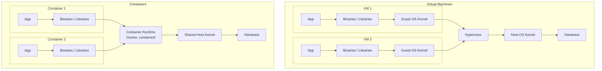
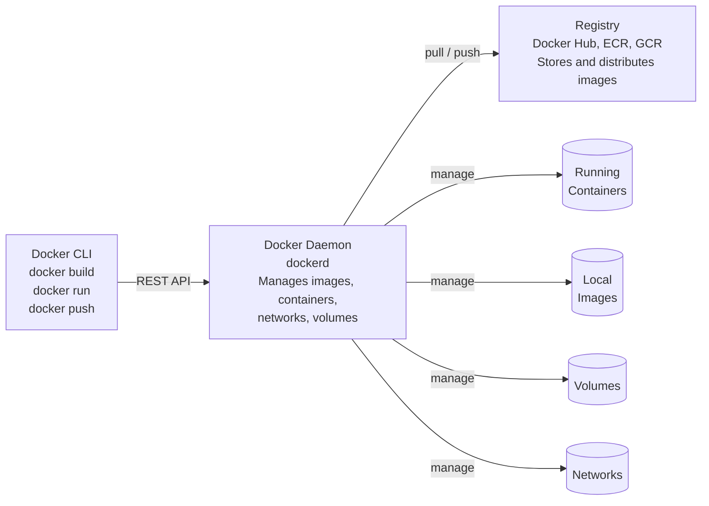
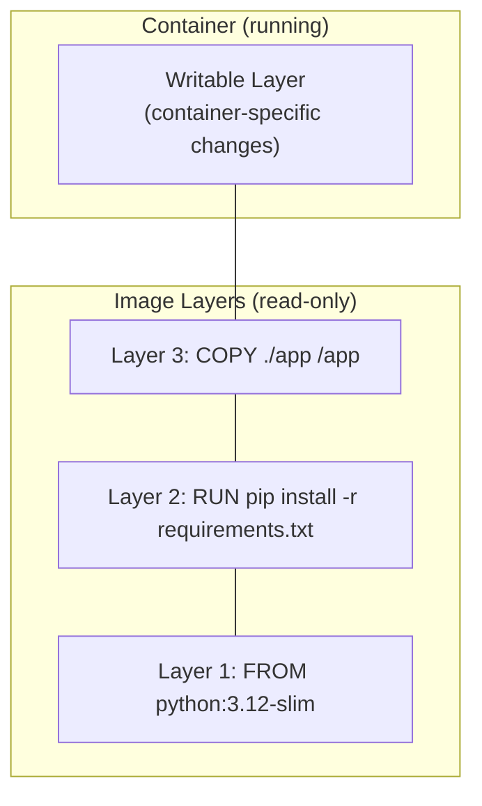
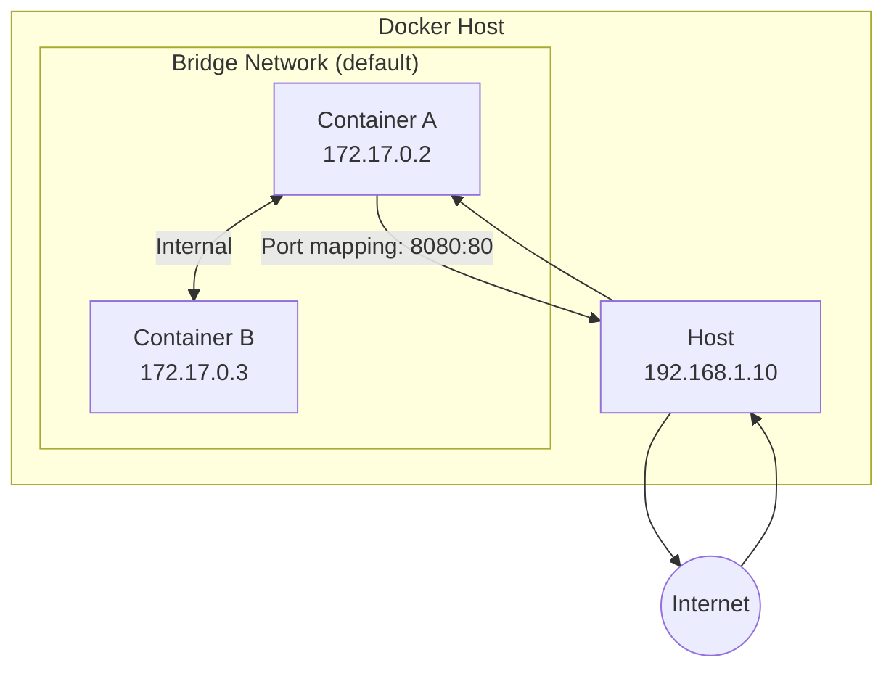
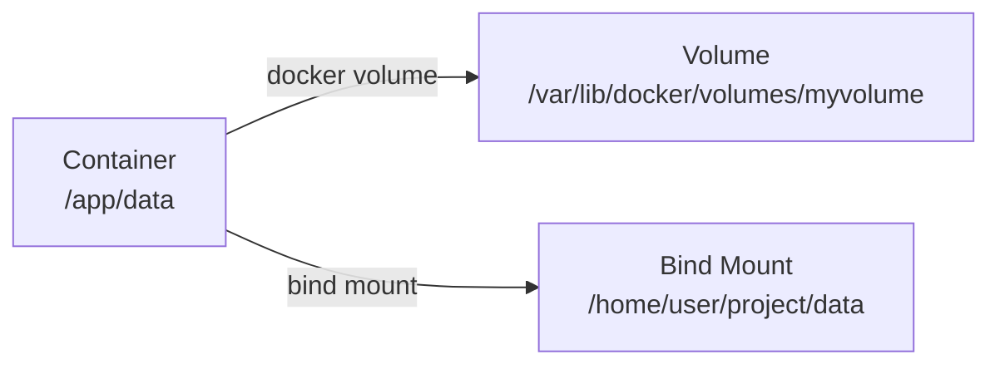
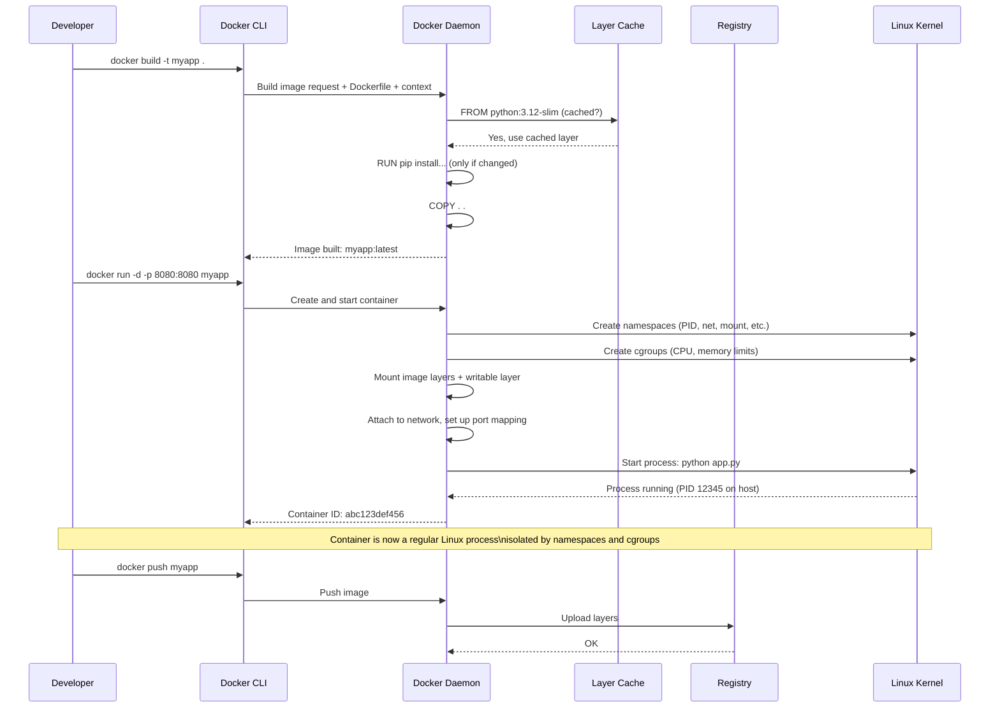

# Docker

## Learning Objectives

By the end of this lesson, you will be able to:

- Explain what a container is and how it differs from a virtual machine.
- Understand Docker's architecture: the daemon, client, images, containers, and registries.
- Read and write a Dockerfile to package an application.
- Build, run, stop, and inspect containers.
- Use volumes to persist data beyond a container's lifetime.
- Map ports to make containerised services reachable.
- Understand why Docker transformed software deployment and how it enables cloud-native workflows.

---

## Introduction

In Lesson 7, you learned that virtual machines let you run multiple operating systems on one physical server. VMs are powerful and isolated—but they are also heavy. Each VM runs a full OS kernel, consuming gigabytes of RAM and taking tens of seconds to boot.

Now imagine a different approach. Instead of virtualising the hardware, what if you could virtualise just the operating system? What if you could package an application with its dependencies into a lightweight, isolated unit that starts in milliseconds and shares the host's kernel?

That is a **container**. And **Docker** is the tool that made containers accessible to everyone.

Docker changed how software is built, shipped, and run. Before Docker, deploying an application meant wrestling with dependency conflicts ("it works on my machine"), manual server configuration, and slow VM provisioning. After Docker, you build once and run anywhere—your laptop, a CI/CD pipeline, a cloud VM, a Kubernetes cluster.

This lesson is your entry into the container ecosystem. By the end, you will understand not just *what* Docker does, but *why* it works the way it does—and you will build and run your own containers.

---

## Why This Matters

Containers are the standard unit of software delivery in the cloud. Every Kubernetes pod runs containers. Every CI/CD pipeline builds container images. Every cloud platform offers a container registry and a container runtime.

| Without Docker knowledge...      | You cannot...                                                         |
|----------------------------------|-----------------------------------------------------------------------|
| Images and layers                | Understand why builds are fast (or slow) or debug image size issues.  |
| Dockerfiles                      | Package your application for any environment consistently.            |
| Container networking and ports   | Connect services together or expose them to users.                    |
| Volumes                          | Handle stateful data (databases, file uploads) in a container world.  |
| The build-ship-run lifecycle     | Participate in modern CI/CD or DevOps workflows.                      |

Docker is not the only container runtime—alternatives like Podman and containerd exist—but its concepts, terminology, and tooling are the industry standard. Learn Docker, and you understand containers.

---

## Core Concepts

### Containers vs Virtual Machines

You have already seen this comparison in Lesson 3 and Lesson 7. Here it is again, now with a focus on practical implications:



|                     | Virtual Machine                          | Container                                |
|---------------------|------------------------------------------|------------------------------------------|
| **Includes OS kernel?** | Yes (its own)                        | No (shares host kernel)                  |
| **Startup time**    | 30–120 seconds                          | Milliseconds to a few seconds            |
| **Typical disk size** | Several GB (OS + app)                 | Tens to hundreds of MB (app + deps only) |
| **Memory overhead** | ~500 MB – 1 GB for the guest OS         | ~10–50 MB per container                  |
| **Isolation level** | Strong (separate kernel)                | Weaker (shared kernel, namespaces)       |
| **Density per host** | Tens                                    | Hundreds to thousands                    |
| **Portability**     | Less portable (OS-specific, large)      | Highly portable (runs anywhere Docker runs) |

A container is not a mini-VM. It is a regular Linux process—or a group of processes—with extra isolation provided by the kernel. Two Linux features make this possible:

- **Namespaces:** Restrict what a process can *see*. A container gets its own view of PIDs, network interfaces, mount points, users, and more—so it feels like it is alone on the system.
- **Control groups (cgroups):** Restrict what a process can *use*. You can limit how much CPU, RAM, and disk I/O a container consumes.

Docker wraps these kernel features in a user-friendly interface. But underneath, a running container is just a set of isolated processes.

### Docker Architecture

Docker has three main components:



| Component          | Role                                                       |
|--------------------|------------------------------------------------------------|
| **Docker CLI**     | The `docker` command you type. Sends requests to the daemon. |
| **Docker Daemon**  | Background service (`dockerd`) that builds, runs, and manages containers. |
| **Registry**       | A server that stores and distributes container images. Docker Hub is the default public registry. |

The CLI and daemon can run on different machines. You can type `docker run` on your laptop and have the container start on a remote server—this is how Docker-based development and deployment pipelines work.

### Images and Containers

These two terms cause more confusion than anything else in Docker:

| Term       | What It Is                                                    | Analogy                                                      |
|------------|---------------------------------------------------------------|--------------------------------------------------------------|
| **Image**  | A read-only template with instructions for creating a container. Contains the application, dependencies, and configuration. | A **recipe** or a **class** in programming.                  |
| **Container** | A running instance of an image. Has a writable layer on top of the read-only image layers. | A **dish made from the recipe** or an **object instantiated from the class**. |

You build an image once. You can run a thousand containers from that same image. Each container is isolated from the others, even though they share the same image.

#### Image Layers

Docker images are built from **layers**. Each instruction in a Dockerfile creates a new layer. Layers are stacked and cached:



Because layers are cached and shared, Docker is incredibly efficient:
- If you change your application code and rebuild, only the top layer changes. The base image and dependency layers are reused from cache.
- If you run 50 containers from the same image, they share the same read-only layers. Only the thin writable layer is unique to each container. Memory and disk are not duplicated.

This is why Docker images are much smaller than VM images and why builds are fast after the first one.

### The Dockerfile

A **Dockerfile** is a text file containing instructions for building an image. It is the blueprint for your container.

Here is a complete Dockerfile for a Python web application:

```dockerfile
# 1. Start from a base image (Python with a minimal Debian)
FROM python:3.12-slim

# 2. Set the working directory inside the container
WORKDIR /app

# 3. Copy dependency file first (for caching)
COPY requirements.txt .

# 4. Install dependencies
RUN pip install --no-cache-dir -r requirements.txt

# 5. Copy the rest of the application
COPY . .

# 6. Document which port the application listens on
EXPOSE 8080

# 7. Set environment variables
ENV APP_ENV=production

# 8. Define the command to run when the container starts
CMD ["python", "app.py"]
```

Key Dockerfile instructions:

| Instruction  | Purpose                                                                    |
|--------------|----------------------------------------------------------------------------|
| `FROM`       | Specifies the base image. Every Dockerfile starts here.                    |
| `WORKDIR`    | Sets the working directory for subsequent instructions.                    |
| `COPY`       | Copies files from the host into the image.                                 |
| `RUN`        | Executes a command during the build (e.g., install packages).              |
| `EXPOSE`     | Documents which port the container listens on (informational; does not publish). |
| `ENV`        | Sets environment variables inside the container.                           |
| `CMD`        | Defines the default command to run when the container starts.              |
| `ENTRYPOINT` | Like `CMD`, but harder to override. Often used together.                   |

> **The caching trick:** Copy `requirements.txt` (or `package.json`, `Gemfile`, etc.) *before* copying the full source code. Docker caches each layer. If you change your source code but not your dependencies, the `RUN pip install` layer is reused from cache—saving minutes on every build. Change the order, and you reinstall dependencies every time.

### Docker Commands: The Essentials

#### Building

```bash
# Build an image from a Dockerfile in the current directory
docker build -t myapp:latest .

# -t names the image (name:tag)
# . is the build context (where Docker looks for the Dockerfile and files to COPY)
```

#### Running

```bash
# Run a container from an image
docker run -d --name mycontainer -p 8080:8080 myapp:latest

# -d          Run in detached mode (background)
# --name      Give the container a name (otherwise Docker generates one)
# -p HOST:CONTAINER  Map host port 8080 to container port 8080
# myapp:latest       Image to run
```

#### Inspecting and Managing

```bash
docker ps                  # List running containers
docker ps -a               # List all containers (including stopped)
docker images              # List local images
docker logs mycontainer    # View container logs (stdout/stderr)
docker exec -it mycontainer bash  # Open a shell inside a running container
docker inspect mycontainer # Detailed JSON metadata about a container
```

#### Stopping and Cleaning Up

```bash
docker stop mycontainer    # Gracefully stop (SIGTERM, then SIGKILL after timeout)
docker start mycontainer   # Restart a stopped container
docker rm mycontainer      # Remove a stopped container
docker rmi myapp:latest    # Remove an image
docker system prune -a     # Remove ALL unused containers, images, networks
```

### Container Networking

By default, containers run in an isolated network. They cannot reach the host, and the host cannot reach them—unless you explicitly connect them.



Key networking concepts:

| Concept           | Command / Explanation                                                   |
|-------------------|------------------------------------------------------------------------|
| **Port mapping**  | `-p 8080:80` maps host port 8080 to container port 80. Traffic to `localhost:8080` reaches the container. |
| **Bridge network**| The default network. Containers can reach each other by IP or container name. |
| **User-defined bridge** | `docker network create mynet` — containers on the same user network can resolve each other by name (built-in DNS). |
| **Host network**  | `--network host` — the container shares the host's network stack (no isolation). |
| **None**          | `--network none` — the container has no network access. |

> **Best practice:** Create a user-defined bridge network for your application. Containers on the same network can reach each other by container name—no hardcoded IPs. This is how Docker Compose connects services.

### Volumes: Persistent Data

Containers are ephemeral. When you remove a container, everything in its writable layer is deleted. This is by design—containers should be stateless and disposable.

But most applications need to keep data somewhere: databases, uploaded files, configuration. **Volumes** solve this.



| Type            | Command                                      | Use Case                                 |
|-----------------|----------------------------------------------|------------------------------------------|
| **Volume**      | `docker run -v myvolume:/app/data ...`       | Managed by Docker. Best for persistent app data. |
| **Bind mount**  | `docker run -v /host/path:/app/data ...`     | Mounts a specific host directory. Good for development (live code reload). |
| **tmpfs**       | `docker run --tmpfs /app/tmp ...`            | In-memory temporary storage. Never touches disk. |

```bash
# Create a named volume
docker volume create dbdata

# Run a container with the volume mounted
docker run -d -v dbdata:/var/lib/mysql mysql:8

# The database data now lives in the volume.
# Remove the container—the volume (and data) persists.
# Start a new container with the same volume—the data is still there.
```

> **Cloud insight:** In Kubernetes, volumes work the same way—a pod requests storage, and the cluster provides it. In cloud platforms, volumes often map to network-attached storage (AWS EBS, Google Persistent Disk) that survives node failures.

### Docker Compose: Multi-Container Applications

Most applications need more than one container—a web server, an API, a database, a cache. **Docker Compose** lets you define and run multi-container applications with a single YAML file.

Example `docker-compose.yml` for a web application with a database:

```yaml
services:
  web:
    build: .
    ports:
      - "8080:8080"
    environment:
      - DATABASE_URL=postgres://db:5432/myapp
    depends_on:
      - db

  db:
    image: postgres:16
    volumes:
      - pgdata:/var/lib/postgresql/data
    environment:
      - POSTGRES_PASSWORD=secret

volumes:
  pgdata:
```

```bash
# Start all services
docker compose up -d

# View logs from all services
docker compose logs -f

# Stop all services
docker compose down

# Stop and remove volumes (destroys data!)
docker compose down -v
```

Docker Compose automatically:
- Creates a network so `web` can reach `db` by its service name (`db`).
- Starts services in dependency order (respecting `depends_on`).
- Manages volumes declared in the file.

---

## How It Works

### From Dockerfile to Running Container

Let us trace the full lifecycle:



**Build phase:** The daemon reads the Dockerfile, pulls the base image if needed, executes each instruction in order, and caches each resulting layer. The final image is a stack of read-only layers with metadata.

**Run phase:** The daemon asks the kernel to create a set of namespaces (giving the container its own view of PIDs, network, mounts, etc.) and cgroups (limiting resources). It unpacks the image layers and adds a thin writable layer on top. It starts the process defined by `CMD` or `ENTRYPOINT`. The container is now running.

**Push phase:** The daemon uploads each layer (if not already present) to a registry. Other machines can `docker pull` the image and run identical containers.

---

## Real-World Example

### The "It Works on My Machine" Problem—Solved

A developer builds a Python application on their Mac. It works perfectly. They send it to a colleague on Windows. It fails—wrong Python version, missing system library, different file path conventions.

Before Docker, the solution was elaborate: virtual environments, detailed setup docs, provisioning scripts, and still things broke in subtle ways.

With Docker:

```dockerfile
FROM python:3.12-slim
WORKDIR /app
COPY requirements.txt .
RUN pip install -r requirements.txt
COPY . .
CMD ["python", "app.py"]
```

One `docker build` and one `docker run`. The developer, the colleague, the CI/CD pipeline, the staging server, and the production Kubernetes cluster all build and run the exact same image. The Python version, the system libraries, the file paths—everything is identical because they are baked into the image.

This is the core value proposition of containers: **build once, run anywhere**. Not "anywhere with the right dependencies installed," but literally anywhere that has a container runtime. This reproducibility is why containers are the foundation of modern CI/CD, microservices, and cloud-native deployment.

---

## Hands-On Examples

Install Docker Desktop from [docker.com](https://www.docker.com/products/docker-desktop/) before starting. It works on Windows, macOS, and Linux.

### Exercise 1: Run Your First Container

```bash
# Run a container that prints a message and exits
docker run hello-world

# What just happened?
# 1. Docker checked if hello-world:latest was available locally.
# 2. It wasn't, so Docker pulled it from Docker Hub.
# 3. Docker created a container from the image.
# 4. The container ran, printed a message, and exited.
```

### Exercise 2: Run an Interactive Container

```bash
# Run Ubuntu and open a bash shell inside it
docker run -it ubuntu bash

# You are now inside an Ubuntu container.
# Try these commands inside the container:
cat /etc/os-release    # Confirm you're in Ubuntu
whoami                 # You are root (inside the container)
ps aux                 # See processes—only your shell and ps
ls /                   # Explore the file system
exit                   # Leave the container (it stops)

# Notice: the container's / is not your host's /.
# The container has its own isolated file system.
```

### Exercise 3: Build Your Own Image

Create a new directory and add two files:

**`Dockerfile`:**
```dockerfile
FROM nginx:alpine
COPY index.html /usr/share/nginx/html/index.html
```

**`index.html`:**
```html
<h1>Hello from my Docker container!</h1>
```

Then build and run:

```bash
# Build the image
docker build -t my-nginx .

# Run it
docker run -d -p 8080:80 --name myserver my-nginx

# Test it
curl http://localhost:8080
# → <h1>Hello from my Docker container!</h1>

# Open http://localhost:8080 in your browser.

# View logs
docker logs myserver

# Stop and remove
docker stop myserver
docker rm myserver
```

### Exercise 4: Explore Layers

```bash
# See the layers that make up an image
docker history nginx:alpine
# Each line is a layer—a Dockerfile instruction plus a size.

# See the layer details
docker inspect nginx:alpine | grep -A 10 "Layers"

# Check disk usage
docker system df
# Shows space used by images, containers, volumes, and build cache.
```

### Exercise 5: Persist Data with a Volume

```bash
# Create a volume
docker volume create mydata

# Write data to it via a temporary container
docker run --rm -v mydata:/data alpine sh -c "echo 'Persistent!' > /data/msg.txt"

# The container is gone (--rm removed it).
# Read the data from another container.
docker run --rm -v mydata:/data alpine cat /data/msg.txt
# → Persistent!

# The data survived because it lives in the volume, not the container.

# Clean up
docker volume rm mydata
```

### Exercise 6: Docker Compose

Create a `docker-compose.yml` file:

```yaml
services:
  web:
    image: nginx:alpine
    ports:
      - "8080:80"

  app:
    image: alpine
    command: sh -c "while true; do echo 'App running...'; sleep 5; done"
```

```bash
# Start both services
docker compose up -d

# Check they are running
docker compose ps

# View logs
docker compose logs -f
# Press Ctrl+C to stop viewing logs (containers keep running)

# Stop everything
docker compose down
```

---

## Common Misconceptions

### "Containers are just lightweight VMs."

A container is not a VM at all. It has no kernel, no init system, no virtual hardware. It is a process (or group of processes) isolated by kernel namespaces and limited by cgroups. Treating a container like a mini-VM leads to anti-patterns like running SSH daemons inside containers or "managing" them like long-lived servers.

### "A container should run multiple services."

A container should run **one process** (or one logical service). If you need a web server, an application server, and a database, run them in three separate containers. This is the single-responsibility principle applied to infrastructure. Docker Compose and Kubernetes exist to orchestrate multiple containers, not to stuff everything into one.

### "Docker images are secure by default."

Images from Docker Hub may contain outdated software, known vulnerabilities, or even malware. Always use official or verified images when possible. Scan images for vulnerabilities (`docker scout`, Trivy, Snyk). Use minimal base images (Alpine or distroless) to reduce the attack surface. Do not run containers as root—use the `USER` directive in your Dockerfile.

### "I should use `latest` tag in production."

The `latest` tag is a moving target. It points to whatever was most recently pushed without an explicit tag. Today's `latest` might be tomorrow's broken release. Always pin to a specific version tag (`python:3.12-slim`, not `python:latest`). Reproducibility is the point of containers—`latest` destroys it.

### "Containers replace virtual machines entirely."

Containers and VMs are complementary. VMs provide strong isolation and can run different operating systems. Containers provide speed and density. Most production Kubernetes clusters run containers inside VMs—the VM isolates the tenant or the cluster, and containers provide fast, efficient application packaging within that boundary.

---

## Knowledge Check

1. What two Linux kernel features enable containers? What does each one do?
2. Why does copying `requirements.txt` before the full source code in a Dockerfile speed up builds?
3. A container is removed (`docker rm`). The data written to `/app/data` inside the container is gone. How could you have prevented this?
4. What is the difference between a Docker image and a Docker container?
5. Why is it a bad practice to use the `latest` tag for production deployments?

> **Answers for self-review:**
> 1. **Namespaces** restrict what a process can *see* (PIDs, network, mounts, users), giving each container its own isolated view. **Cgroups** (control groups) restrict what a process can *use* (CPU, RAM, disk I/O), enforcing resource limits.
> 2. Docker caches each layer. If `requirements.txt` hasn't changed, the cached `RUN pip install` layer is reused. If you copy the full source first, any code change invalidates that layer and all subsequent layers, forcing a full reinstall of dependencies.
> 3. By mounting a **volume** or **bind mount** at `/app/data`. Volumes exist independently of containers. When the container is removed, the volume—and its data—persists and can be attached to a new container.
> 4. An **image** is a read-only template (like a recipe or class). A **container** is a running instance of an image with a writable layer on top (like a dish or object). You build an image once; you can run many containers from it.
> 5. `latest` is a moving tag—it points to whatever was most recently pushed. It provides no reproducibility: rebuilding a `latest` image tomorrow may produce a different result with breaking changes. Always pin to explicit version tags.

---

## Key Takeaways

- A **container** is an isolated process (or group of processes) that shares the host kernel. It is not a VM.
- **Docker** wraps kernel namespaces and cgroups in a friendly interface. The daemon manages images, containers, networks, and volumes.
- An **image** is a stack of read-only layers built from a **Dockerfile**. A **container** adds a writable layer on top.
- **Layers are cached.** Structure your Dockerfile so that frequently-changing instructions come last.
- **Port mapping** (`-p`) connects a container's port to the host. **Volumes** (`-v`) persist data beyond the container's lifetime.
- **Docker Compose** defines multi-container applications in a YAML file. Services on the same network resolve each other by name.
- The container workflow is **build → ship → run**: build an image, push it to a registry, pull and run it anywhere.
- Containers solve the "it works on my machine" problem by packaging the application with its exact dependencies into a single, portable unit.

---

## Next Lesson

**Cloud Computing**

Now that you can package and run applications in containers, the next lesson zooms out to the infrastructure that runs them at scale. You will learn what cloud computing really is—the service models (IaaS, PaaS, SaaS), the deployment models (public, private, hybrid), and the design principles (elasticity, self-service, pay-as-you-go) that make the cloud the default platform for modern software.
