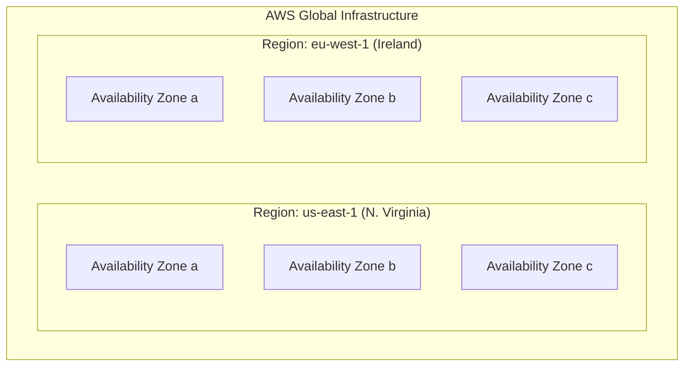
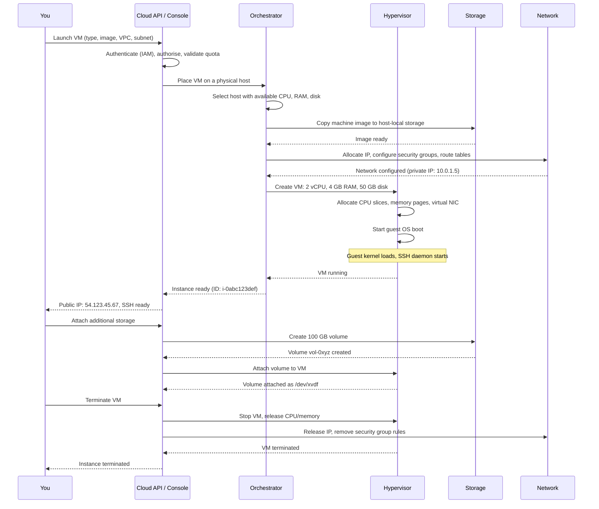
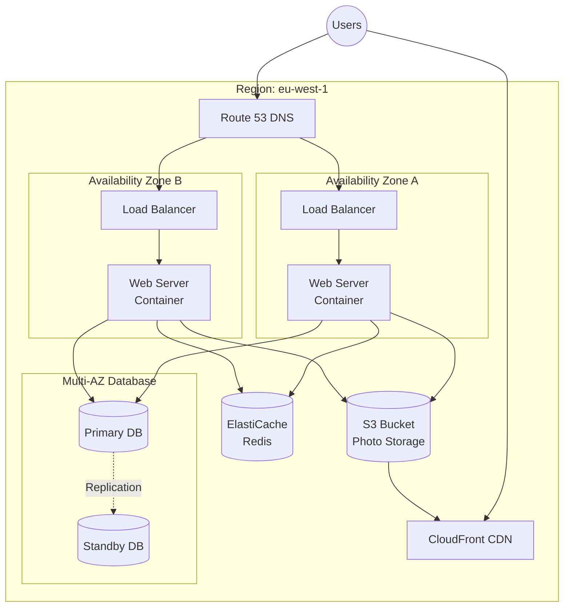

# Cloud Computing

## Learning Objectives

By the end of this lesson, you will be able to:

- Define cloud computing and explain its five essential characteristics.
- Distinguish between IaaS, PaaS, and SaaS, and give an example of each.
- Compare public, private, and hybrid cloud deployment models.
- Explain why regions and availability zones matter for reliability.
- Describe the economic shift from CAPEX to OPEX that cloud enables.
- Identify the core cloud services: compute, storage, database, and networking.
- Understand the principles of cloud-native design and why they matter.

---

## Introduction

Every concept you have learned so far—CPUs, memory, operating systems, Linux, networking, HTTP, virtualization, containers—exists so that computers can run software. But where do the computers come from?

Before the cloud, you bought them. You researched specifications, placed orders, waited for delivery, racked servers in a data centre, cabled them, installed operating systems, and only then—weeks or months later—could you deploy your application. If you needed more capacity, you repeated the process. If you bought too much, the excess sat idle. If you bought too little, your users suffered.

**Cloud computing** changed this model entirely. It turned computing into a utility—like electricity or water. You do not build a power plant to run your laptop. You plug into a socket and pay for what you use. Cloud computing does the same for servers, storage, databases, and networks: you use what you need, when you need it, and pay only for what you consume.

This lesson explains what cloud computing really is, how it works, and why it is the foundation upon which containers, Kubernetes, and all modern infrastructure are built.

---

## Why This Matters

Cloud computing is not a trend. It is the default. Over 90% of new applications are built on cloud platforms. Every Docker container you run, every Kubernetes cluster you manage, every CI/CD pipeline you configure—it all runs on cloud infrastructure.

| Without cloud knowledge...          | You cannot...                                                        |
|-------------------------------------|----------------------------------------------------------------------|
| Service models (IaaS, PaaS, SaaS)   | Choose the right abstraction level for your workload.                |
| Regions and availability zones      | Design systems that survive data centre failures.                    |
| Core services (compute, storage, DB)| Select the right building blocks for your application.               |
| Cloud economics (CAPEX vs OPEX)     | Understand why your organisation is migrating to the cloud.          |
| Cloud-native principles             | Build systems that take advantage of—not fight against—the platform. |

You do not need to memorise every AWS or Azure service. You need to understand the *categories* of services, the *patterns* of cloud architecture, and the *principles* that guide good design. The specific service names you can look up.

---

## Core Concepts

### What Is Cloud Computing?

The U.S. National Institute of Standards and Technology (NIST) defines cloud computing by five essential characteristics:

| Characteristic           | What It Means                                                                 |
|--------------------------|-------------------------------------------------------------------------------|
| **On-demand self-service**   | You provision resources (servers, storage) yourself, without talking to a human. |
| **Broad network access**     | Resources are reachable over the internet from anywhere.                      |
| **Resource pooling**         | The provider's physical servers are shared among many customers (multi-tenancy). |
| **Rapid elasticity**         | You can scale up or down instantly—from one server to thousands.              |
| **Measured service**         | You pay only for what you use, metered by the hour, the GB, or the request.   |

A service is "cloud" if it has all five. A rented physical server in a data centre that takes two days to provision is not cloud—it lacks self-service and rapid elasticity.

### Service Models: IaaS, PaaS, SaaS

Cloud services are offered at three levels of abstraction. Think of them as "how much do you want to manage yourself?"

```mermaid
flowchart TD
    subgraph "On-Premises"
        O_App[Application]
        O_Data[Data]
        O_Runtime[Runtime]
        O_Middleware[Middleware]
        O_OS[Operating System]
        O_Virt[Virtualization]
        O_Servers[Servers]
        O_Storage[Storage]
        O_Network[Networking]
        O_App --> O_Data --> O_Runtime --> O_Middleware --> O_OS --> O_Virt --> O_Servers --> O_Storage --> O_Network
    end

    subgraph "IaaS"
        I_App[Application]
        I_Data[Data]
        I_Runtime[Runtime]
        I_Middleware[Middleware]
        I_OS[Operating System]
        I_App --> I_Data --> I_Runtime --> I_Middleware --> I_OS
    end

    subgraph "PaaS"
        P_App[Application]
        P_Data[Data]
        P_App --> P_Data
    end

    subgraph "SaaS"
        S_All["Everything managed\nby provider"]
    end
```



| Model | What You Manage                     | What the Provider Manages              | Examples                                     |
|-------|-------------------------------------|----------------------------------------|----------------------------------------------|
| **IaaS** (Infrastructure as a Service) | OS, middleware, runtime, data, application | Virtualization, servers, storage, networking | AWS EC2, Google Compute Engine, Azure VMs    |
| **PaaS** (Platform as a Service)   | Application, data                   | Everything else (OS, runtime, middleware) | AWS Elastic Beanstalk, Google App Engine, Heroku |
| **SaaS** (Software as a Service)   | Nothing (you just use the software)  | Everything                             | Gmail, Google Workspace, Slack, Salesforce   |

**When to use each:**

- **IaaS:** You need full control over the operating system—installing custom software, configuring kernel parameters, running containers. This is what most cloud engineers work with.
- **PaaS:** You have code to deploy and you do not want to think about servers, patching, or scaling. The platform handles it. Good for web applications and APIs.
- **SaaS:** You need a business application (email, CRM, collaboration) and someone else manages everything. You just log in.

> **The trend:** Cloud engineering is moving up the stack. Teams start with IaaS, adopt containers (which abstract the OS), then adopt Kubernetes (which abstracts the servers), then adopt serverless (which abstracts everything below the function). Each step reduces what you manage—and what you control.

### Deployment Models: Public, Private, Hybrid

| Model            | Description                                                              | Used By                                        |
|------------------|--------------------------------------------------------------------------|------------------------------------------------|
| **Public cloud** | Resources owned by a provider, shared among many customers over the internet. | Startups, enterprises, most new applications.  |
| **Private cloud**| Resources dedicated to a single organisation, on-premises or hosted.      | Regulated industries, governments, legacy systems. |
| **Hybrid cloud** | A mix of public and private, with data and applications moving between them. | Enterprises migrating gradually to the cloud.  |
| **Multi-cloud**  | Using multiple public cloud providers simultaneously.                    | Organisations avoiding vendor lock-in.         |

Most organisations end up with a hybrid or multi-cloud strategy—not by design, but by reality. Some workloads stay on-premises for regulatory reasons; others run in the public cloud for elasticity.

### Regions and Availability Zones

Cloud providers build data centres all over the world. They organise them into **regions** and **availability zones (AZs)**:



| Concept              | What It Is                                                              |
|----------------------|-------------------------------------------------------------------------|
| **Region**           | A geographic area with multiple, isolated data centres.                  |
| **Availability Zone**| One or more discrete data centres within a region, with independent power, cooling, and networking. |
| **Edge location**    | A site for caching content close to users (CloudFront, Cloud CDN).      |

**Why this matters for reliability:**

- Deploy across multiple **AZs** within a region: if one data centre loses power, your application keeps running in another.
- Deploy across multiple **regions**: if an entire region has a major outage, you fail over to another part of the world.
- **Latency:** Place resources in the region closest to your users. A request from London to a server in Ireland (~50 ms round trip) is much faster than to one in Virginia (~100 ms).

> **Rule of thumb:** For production workloads, never deploy in a single AZ. Use at least two—preferably three.

### Core Cloud Services

Every cloud provider offers the same categories of services. The names differ; the concepts are identical:

| Category          | What It Does                                | AWS Example          | Azure Example         | GCP Example            |
|-------------------|---------------------------------------------|----------------------|-----------------------|------------------------|
| **Compute**       | Runs your code (VMs, containers, functions) | EC2, Lambda, ECS     | VMs, Functions, AKS   | Compute Engine, Cloud Run |
| **Storage**       | Stores files and objects                    | S3, EBS, EFS         | Blob Storage, Disk    | Cloud Storage, Persistent Disk |
| **Database**      | Managed relational and NoSQL databases      | RDS, DynamoDB        | SQL Database, Cosmos DB | Cloud SQL, Firestore  |
| **Networking**    | Connects and secures resources              | VPC, CloudFront, Route 53 | VNet, CDN, DNS   | VPC, Cloud CDN, Cloud DNS |
| **Identity**      | Manages users, roles, and permissions       | IAM                  | Entra ID (Azure AD)   | Cloud IAM             |
| **Observability** | Monitors, logs, and alerts                  | CloudWatch           | Monitor               | Cloud Monitoring       |

You do not need to memorise these. You need to know the **categories** so you can ask the right questions: "I need a database. Should it be relational or NoSQL? Managed or self-hosted? Single-AZ or multi-AZ?" The specific service name follows from the requirements.

### The Economic Shift: CAPEX to OPEX

Before cloud: **CAPEX** (Capital Expenditure). You spent large amounts upfront on hardware, software licences, and data centre space. You then depreciated it over years. If your business grew faster than expected, you could not add capacity quickly. If it grew slower, you were stuck with idle assets.

With cloud: **OPEX** (Operational Expenditure). You pay monthly (or hourly, or per-request) for what you use. No upfront investment. No depreciation. If traffic spikes, you scale up and pay more that month. If traffic drops, you scale down and pay less.

|               | CAPEX (Own Hardware)             | OPEX (Cloud)                      |
|---------------|----------------------------------|-----------------------------------|
| **Upfront cost**  | High (servers, licences, facility) | Near zero                         |
| **Scaling up**    | Weeks to months                  | Minutes                           |
| **Scaling down**  | Cannot—assets already bought     | Immediate; stop paying            |
| **Risk**          | Over-provisioning or under-provisioning | Pay for what you use           |
| **Tax treatment** | Depreciated over years           | Expensed in the current year      |

This shift is why startups can launch global services with a credit card, and why enterprises are migrating legacy systems. The economics are compelling even before you consider the technical benefits.

---

## How It Works

### Provisioning a Cloud Resource

Let us trace what happens when you launch a virtual machine in the cloud—tying together everything from Lessons 1 through 8:



**Everything you have learned is in this sequence:**

- The **hypervisor** (Lesson 7) creates the virtual machine on physical hardware.
- The **operating system** (Lesson 3) boots inside the VM—the guest kernel from the machine image.
- **CPU and memory** (Lesson 2) are allocated as vCPUs and RAM from the physical host.
- **Networking** (Lesson 5): A private IP from the VPC subnet, security group rules, possibly a public IP with NAT.
- **Storage** (Lesson 2): The root disk is a virtual disk. Additional volumes can be attached at runtime.
- **Linux** (Lesson 4): Your machine image is typically a Linux distribution. You SSH in and use the commands you learned.

Cloud computing is not magic. It is the orchestrated combination of virtualization, networking, storage, and operating systems—automated through APIs so that you can control it all without touching a physical machine.

---

## Real-World Example

### Designing a Cloud-Native Web Application

Imagine you are building a photo-sharing application. How do you design it for the cloud?



**Design decisions, each grounded in concepts you have learned:**

1. **Multi-AZ deployment:** Web servers run in two availability zones. If AZ A fails, the load balancer routes all traffic to AZ B. No downtime.

2. **Load balancer:** Distributes traffic across web servers. Health checks detect unhealthy instances and stop sending them traffic. This is a managed service—you never manage the load balancer software.

3. **Containers:** Web servers run as Docker containers (Lesson 8). The image is built once, stored in a container registry, and deployed identically in both AZs.

4. **Managed database:** A relational database with automatic replication to a standby in another AZ. If the primary fails, the provider promotes the standby automatically. You get a connection string; the provider handles backups, patching, and failover.

5. **Cache:** Redis (ElastiCache) stores frequently-accessed data in memory (Lesson 2: RAM is 1000× faster than SSD). Reduces database load and speeds up responses.

6. **Object storage:** Photos go to S3, not the web server's local disk. Object storage is durable (data is copied across multiple AZs automatically), scalable (no size limit), and cheaper than block storage.

7. **CDN:** CloudFront caches photos at edge locations near users. A user in Tokyo sees photos served from a Tokyo edge location, not from Ireland—cutting latency from ~200 ms to ~10 ms.

8. **DNS:** Route 53 resolves the domain name to the load balancer's IP. If you change the load balancer, you update DNS—no code changes.

> **This architecture would have required a team of system administrators and tens of thousands of dollars in hardware a generation ago. Today, a single developer can provision it in an afternoon, and it scales from 100 users to 100 million without architectural changes.**

---

## Hands-On Examples

These exercises use AWS as an example, but the concepts apply to any cloud provider. You will need an AWS account (free tier is sufficient).

### Exercise 1: Explore the Management Console

1. Sign in to the AWS Management Console.
2. Notice the **region selector** in the top-right corner. Toggle between regions. Observe that resources in one region are not visible in another.
3. Navigate to **EC2** (compute), **S3** (storage), **RDS** (databases), and **VPC** (networking). Do not create anything—just observe the categories.

### Exercise 2: Understand IAM (Identity and Access Management)

1. Go to **IAM** → **Users**. You will see your account's users.
2. Go to **IAM** → **Roles**. Roles grant permissions to AWS services (e.g., allowing EC2 to read from S3).
3. Go to **IAM** → **Policies**. Policies are JSON documents defining who can do what.

IAM is how cloud platforms enforce security. The principle of **least privilege**—granting only the permissions necessary—is fundamental to cloud security.

### Exercise 3: Launch a Virtual Machine

```bash
# Install the AWS CLI first (if not already installed):
# https://aws.amazon.com/cli/

# Configure credentials
aws configure

# Launch a t2.micro instance (free tier eligible)
aws ec2 run-instances \
  --image-id ami-0c55b159cbfafe1f0 \
  --instance-type t2.micro \
  --key-name MyKeyPair \
  --security-group-ids sg-0abc123 \
  --subnet-id subnet-0def456 \
  --count 1

# List your instances
aws ec2 describe-instances --query "Reservations[*].Instances[*].[InstanceId,State.Name,PublicIpAddress]"

# Terminate when done
aws ec2 terminate-instances --instance-ids i-0abc123def
```

### Exercise 4: Create an S3 Bucket

```bash
# Create a bucket (name must be globally unique)
aws s3 mb s3://my-unique-bucket-name-2026

# Upload a file
echo "Hello from the cloud!" > test.txt
aws s3 cp test.txt s3://my-unique-bucket-name-2026/

# List bucket contents
aws s3 ls s3://my-unique-bucket-name-2026/

# Make the file publicly readable (temporary—for learning only)
aws s3 presign s3://my-unique-bucket-name-2026/test.txt --expires-in 3600

# Clean up
aws s3 rm s3://my-unique-bucket-name-2026/test.txt
aws s3 rb s3://my-unique-bucket-name-2026/
```

### Exercise 5: Estimate Costs

1. Go to the **AWS Pricing Calculator** (calculator.aws).
2. Add an EC2 instance: `t3.medium`, Linux, on-demand, 730 hours/month (always on).
3. Add an RDS database: `db.t3.medium`, MySQL, single-AZ, 20 GB storage.
4. Add an Application Load Balancer: 10 GB data processed per month.
5. Observe the monthly estimate.

This is the OPEX model in action. You can price an entire architecture before you provision a single resource. No purchase orders, no waiting—just numbers.

---

## Common Misconceptions

### "The cloud is just someone else's computer."

This is technically true but misses the point. The cloud is not just rented hardware—it is a platform with managed services, APIs, automation, and global infrastructure. You are not renting a server; you are consuming a capability (run code, store data, query a database) without managing the underlying hardware. The difference is the difference between renting a kitchen and ordering a meal.

### "Moving to the cloud automatically saves money."

Lift-and-shift migrations (moving VMs to the cloud without redesigning them) are often *more* expensive than on-premises because you pay for idle resources 24/7. Cloud savings come from: right-sizing (using only what you need), elasticity (scaling down when idle), and adopting managed services (reducing operational overhead). Cloud economics reward redesign, not relocation.

### "The cloud is inherently secure."

The cloud provider secures the *infrastructure* (physical data centres, hypervisors, network). You are responsible for securing *what you put in it* (OS patches, application code, IAM policies, database access). This is the **Shared Responsibility Model**. Misconfigured S3 buckets and overly permissive IAM roles are among the most common causes of cloud security breaches.

### "I need to learn every AWS/Azure/GCP service."

There are over 200 AWS services. Nobody knows them all. Focus on the **categories** (compute, storage, database, networking, identity, observability) and the **principles** (least privilege, elasticity, loose coupling, fault tolerance). The specific service names change; the concepts do not.

### "Serverless means there are no servers."

"Serverless" (Lambda, Cloud Functions) means *you* do not manage servers. The provider still runs your code on servers—you just cannot see them, SSH into them, or configure them. The abstraction is deeper, but the hardware still exists. Understanding the underlying concepts (CPU, memory, cold starts) helps you use serverless effectively.

---

## Knowledge Check

1. What are the five essential characteristics of cloud computing according to NIST?
2. What is the difference between IaaS, PaaS, and SaaS? Give one example of each.
3. Why should a production application be deployed across multiple availability zones?
4. What is the Shared Responsibility Model, and why does it matter?
5. How does cloud computing change the economics of IT from CAPEX to OPEX?

> **Answers for self-review:**
> 1. On-demand self-service, broad network access, resource pooling, rapid elasticity, and measured service.
> 2. **IaaS** provides virtualised infrastructure (VMs, storage, networking)—you manage the OS and above (example: AWS EC2). **PaaS** provides a platform for running applications—you manage only your code and data (example: Google App Engine). **SaaS** provides complete software—the provider manages everything (example: Gmail).
> 3. Availability zones are physically isolated data centres within a region. If one AZ fails (power outage, fire, network cut), your application continues running in the other AZ(s). Deploying to a single AZ is a single point of failure.
> 4. The cloud provider secures the infrastructure (physical security, hypervisor, network fabric). The customer secures everything they put in the cloud (OS patches, application code, IAM policies, data encryption, network access rules). Confusion about this boundary leads to security gaps.
> 5. CAPEX requires large upfront investments in hardware that depreciates over years. OPEX means paying monthly (or hourly, or per-request) only for what you use. Cloud shifts spending from CAPEX to OPEX, reducing upfront risk, enabling faster scaling, and converting fixed costs to variable costs.

---

## Key Takeaways

- **Cloud computing** delivers on-demand, self-service, elastic, and metered access to pooled computing resources over the internet.
- **Service models** exist on a spectrum: IaaS (maximum control), PaaS (focus on code), SaaS (just use the software). Each trades control for convenience.
- **Deployment models** include public, private, hybrid, and multi-cloud. Most organisations use a mix.
- **Regions** and **availability zones** are the building blocks of cloud reliability. Multi-AZ deployment is the minimum for production.
- Core cloud services fall into predictable **categories**: compute, storage, database, networking, identity, and observability. Learn the categories, not the product names.
- Cloud shifts IT spending from **CAPEX to OPEX**, replacing upfront investment with pay-as-you-go flexibility.
- The **Shared Responsibility Model** defines the boundary between provider and customer security responsibilities. You are always responsible for your own configuration.
- Cloud computing is not a destination—it is a platform. Containers, Kubernetes, and serverless are layers on top of it, each abstracting more and giving you less to manage.

---

## Next Lesson

**Kubernetes**

Now that you understand the cloud platform, the final lesson introduces the orchestration layer that runs containers at scale. You will learn what Kubernetes is, how it schedules containers across clusters of machines, and why it has become the standard for deploying and managing cloud-native applications. The journey from "what is a computer?" to "how do I run a thousand containers across the globe?" concludes here.
