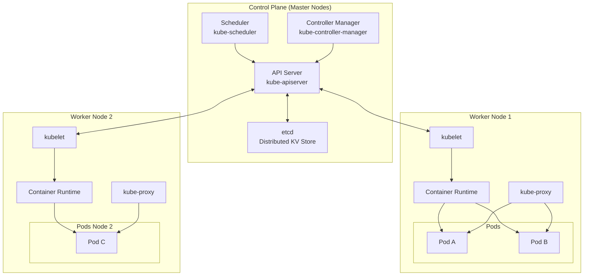
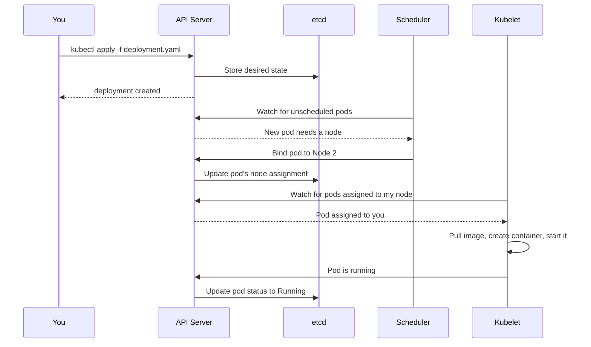
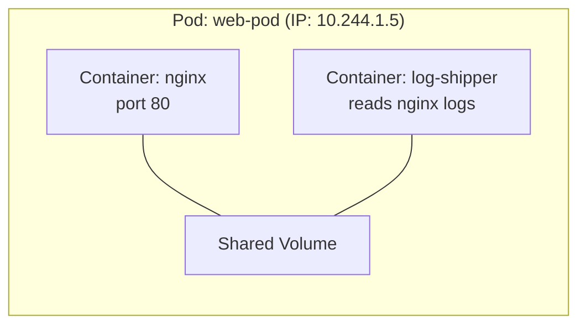
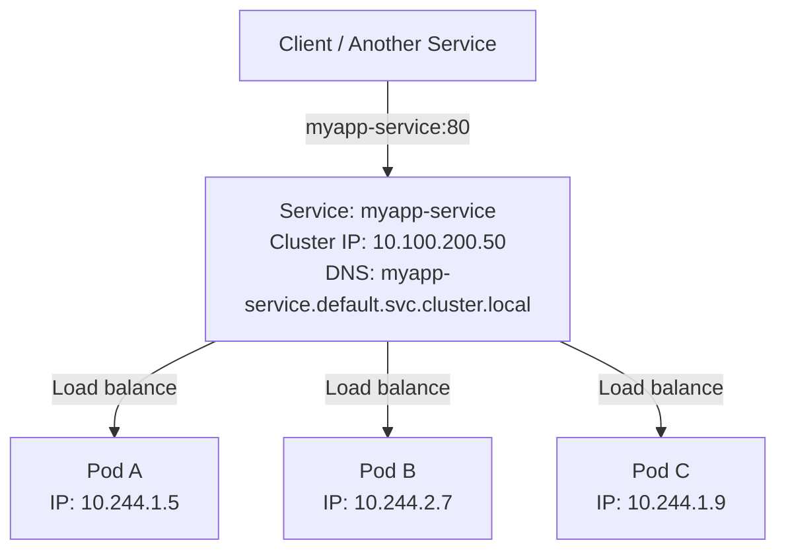
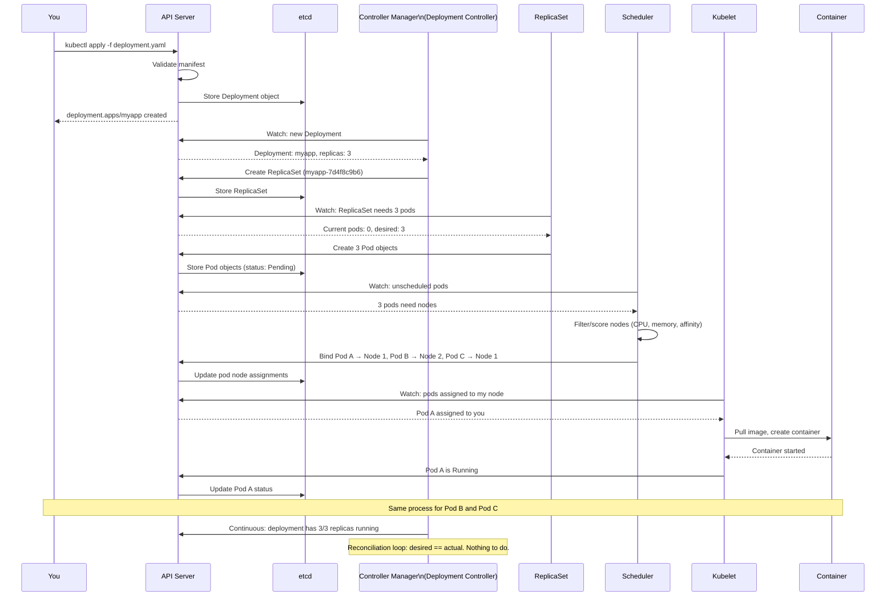
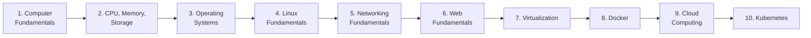

# Kubernetes

## Learning Objectives

By the end of this lesson, you will be able to:

- Explain what Kubernetes is and what problem it solves.
- Describe the architecture of a Kubernetes cluster: control plane and worker nodes.
- Define pods, deployments, services, and ConfigMaps, and explain how they relate.
- Understand the declarative model: you describe the desired state, Kubernetes makes it happen.
- Read and write basic Kubernetes YAML manifests.
- Explain how Kubernetes achieves self-healing, scaling, and rolling updates.
- Connect Kubernetes concepts to every previous lesson in this course.

---

## Introduction

In Lesson 8, you learned to package an application into a Docker container. In Lesson 9, you learned to run that container on a cloud virtual machine. You can SSH into the VM, type `docker run`, and your application is live.

Now scale this up. You have 50 containers running 12 different services across 8 virtual machines. One VM crashes. Traffic spikes on two services. You need to deploy a new version without downtime. You need to keep secrets secure. You need to know which container is running where and whether it is healthy.

You could write scripts to handle all of this. Many teams did, in the early days of containers. But managing containers at scale is a distributed systems problem, and distributed systems are hard. Race conditions, partial failures, network partitions, state reconciliation—these are problems that take teams of engineers years to solve correctly.

**Kubernetes** (often abbreviated **K8s**) is the open-source platform that solves these problems. It was born from Google's internal system called Borg, which had been orchestrating billions of containers for over a decade. Google open-sourced it in 2014, and it quickly became the industry standard for container orchestration.

Kubernetes does not run your application. It runs your containers. It decides which machine each container goes on. It restarts containers that crash. It scales them up and down. It routes traffic to them. It rolls out new versions without downtime. It keeps secrets and configuration out of your code. You tell Kubernetes what you *want*, and it continuously works to make that the reality.

This lesson is the culmination of everything you have learned. Every concept—from CPU scheduling to DNS resolution, from Linux processes to HTTP APIs, from virtual machines to Docker images—comes together in Kubernetes.

---

## Why This Matters

Kubernetes is the operating system of the cloud. Just as Linux manages processes on one machine, Kubernetes manages containers across many machines. It is the platform on which modern applications are deployed, scaled, and operated.

| Without Kubernetes knowledge...     | You cannot...                                                             |
|-------------------------------------|---------------------------------------------------------------------------|
| Pods, deployments, services         | Understand how a cloud-native application is structured and connected.    |
| Declarative configuration           | Adopt infrastructure-as-code or GitOps workflows.                         |
| Control plane and worker nodes      | Debug why a cluster is not scheduling pods or why a service is unreachable. |
| Self-healing and scaling            | Build systems that recover from failures without human intervention.      |
| The Kubernetes ecosystem            | Navigate the landscape of cloud-native tools (Helm, Istio, Prometheus).   |

Kubernetes is complex. But it is complex for a reason: it solves genuinely hard problems that every distributed application faces. Understanding *why* it is complex—what problems each component solves—turns it from a mystery into a tool.

---

## Core Concepts

### What Problem Does Kubernetes Solve?

Before Kubernetes, deploying containers at scale required manually (or through custom scripts) handling:

| Problem                       | Manual Solution                               | Kubernetes Solution                          |
|-------------------------------|-----------------------------------------------|----------------------------------------------|
| **Placement**                 | Decide which server runs which container      | Scheduler places pods on nodes with available resources |
| **Service discovery**         | Track IPs and ports; update config files      | Services provide stable DNS names and IPs    |
| **Load balancing**            | Configure nginx/HAProxy; update on changes    | Services and Ingress distribute traffic automatically |
| **Health checking**           | Write monitoring scripts; restart on failure  | Liveness and readiness probes; auto-restart |
| **Scaling**                   | Manually add instances; update load balancer  | Horizontal Pod Autoscaler; replica count changes |
| **Rolling updates**           | Drain traffic, deploy, test, re-enable        | Deployments roll out new versions with zero downtime |
| **Configuration management**  | Environment files, config scripts             | ConfigMaps and Secrets injected as env vars or files |
| **Secret management**         | Hardcoded or in separate, unencrypted files   | Secrets (base64-encoded, RBAC-protected)      |
| **Resource management**       | Guess and hope                                | Requests and limits per container; enforced by cgroups |

Kubernetes takes all of these operational concerns and builds them into the platform. You describe what you want; the platform handles how.

### Cluster Architecture

A Kubernetes cluster consists of two types of machines:



#### Control Plane Components

| Component              | Role                                                                          |
|------------------------|-------------------------------------------------------------------------------|
| **API Server**         | The front door. Every interaction with the cluster goes through the API.      |
| **etcd**               | A distributed key-value store that holds the entire cluster state.             |
| **Scheduler**          | Watches for new pods and assigns them to worker nodes based on resource availability, constraints, and policies. |
| **Controller Manager** | Runs controllers—loops that continuously reconcile the actual state with the desired state. |

The control plane makes global decisions about the cluster (scheduling, scaling, updating) and responds to cluster events. In production, the control plane runs across multiple nodes for high availability.

#### Worker Node Components

| Component             | Role                                                                          |
|-----------------------|-------------------------------------------------------------------------------|
| **kubelet**           | The Kubernetes agent on each node. It communicates with the API server and ensures containers are running as specified. |
| **kube-proxy**        | A network proxy that maintains network rules, enabling communication to pods from inside or outside the cluster. |
| **Container Runtime** | The software that runs containers (containerd, CRI-O). Docker was the original but is no longer the default. |

#### Communication Flow

Every action in Kubernetes follows this pattern:



Everything is **declarative**. You do not tell Kubernetes *how* to place a pod; you describe the pod's requirements, and the scheduler decides. You do not restart failed containers manually; you declare that you want three replicas, and the controller manager ensures there are always three.

### Pods: The Atomic Unit

A **pod** is the smallest deployable unit in Kubernetes. It is a group of one or more containers that share:

- **Network namespace:** All containers in a pod share the same IP address and port space. They communicate via `localhost`.
- **Storage volumes:** Volumes mounted in the pod are accessible to all containers.
- **Lifecycle:** Containers in a pod are scheduled together on the same node, started together, and stopped together.



Most pods run a single container. Multi-container pods are used for helper patterns: a sidecar that ships logs, a proxy that handles TLS, an init container that sets up configuration before the main container starts.

> **Pod ≠ container.** A pod is a wrapper around one or more containers. When you scale an application, you scale pods, not containers directly. When a pod dies, all its containers die together. This grouping is intentional: it keeps tightly-coupled processes together while isolating everything else.

### Deployments: Managing Pod Lifecycles

You rarely create pods directly. Instead, you create a **Deployment**, which manages a set of identical pods:

```yaml
apiVersion: apps/v1
kind: Deployment
metadata:
  name: myapp
spec:
  replicas: 3
  selector:
    matchLabels:
      app: myapp
  template:
    metadata:
      labels:
        app: myapp
    spec:
      containers:
        - name: app
          image: myapp:1.0.0
          ports:
            - containerPort: 8080
          resources:
            requests:
              memory: "128Mi"
              cpu: "250m"
            limits:
              memory: "256Mi"
              cpu: "500m"
```

A Deployment provides:

| Capability         | How It Works                                                              |
|--------------------|---------------------------------------------------------------------------|
| **Replication**    | Guarantees the specified number of pod replicas are always running.       |
| **Rolling updates**| Gradually replaces old pods with new ones when you change the image tag.  |
| **Rollback**       | Reverts to a previous version if a deployment fails.                      |
| **Self-healing**   | If a pod crashes or a node fails, the Deployment creates replacement pods. |

> **The controller pattern:** A Deployment controller continuously compares the desired state (3 replicas of `myapp:1.0.0`) with the actual state (what pods exist right now). If there is a difference, it takes action—creating, deleting, or updating pods—until reality matches the specification. This reconciliation loop runs forever, making the system self-healing.

### Services: Stable Networking for Ephemeral Pods

Pods are mortal. They are created, destroyed, and replaced constantly. Each pod gets its own IP address, but that IP changes every time the pod restarts. You cannot rely on pod IPs.

A **Service** solves this by providing a stable IP address and DNS name that routes traffic to a set of pods:

```yaml
apiVersion: v1
kind: Service
metadata:
  name: myapp-service
spec:
  selector:
    app: myapp
  ports:
    - port: 80
      targetPort: 8080
  type: ClusterIP
```



The Service uses **label selectors** (`app: myapp`) to find its target pods. As pods come and go, the Service's endpoint list is updated automatically. Any pod with the matching label receives traffic.

Service types:

| Type           | Reachable From                           | Use Case                                    |
|----------------|------------------------------------------|---------------------------------------------|
| **ClusterIP**  | Only within the cluster                 | Internal communication between services     |
| **NodePort**   | The node's IP + a static port (30000–32767) | Development, debugging, simple external access |
| **LoadBalancer** | Externally via a cloud load balancer  | Production external access (integrates with cloud LB) |

### ConfigMaps and Secrets: Configuration Without Rebuilding

Hardcoding configuration into a container image is an anti-pattern. If your database URL changes, you should not need to rebuild and redeploy your image.

**ConfigMaps** store non-sensitive configuration as key-value pairs:

```yaml
apiVersion: v1
kind: ConfigMap
metadata:
  name: app-config
data:
  DATABASE_HOST: "db.internal"
  LOG_LEVEL: "info"
  MAX_CONNECTIONS: "100"
```

**Secrets** are similar but intended for sensitive data. They are base64-encoded and can be encrypted at rest:

```yaml
apiVersion: v1
kind: Secret
metadata:
  name: app-secrets
type: Opaque
data:
  DATABASE_PASSWORD: c3VwZXJzZWNyZXQ=   # base64 of "supersecret"
```

Both can be consumed by pods as environment variables or mounted as files:

```yaml
spec:
  containers:
    - name: app
      image: myapp:1.0.0
      envFrom:
        - configMapRef:
            name: app-config
        - secretRef:
            name: app-secrets
```

> **Cloud-native principle:** Configuration lives in the platform, not in the code. The same container image runs in development, staging, and production—only the ConfigMap and Secret values differ. This is the logical extension of the environment variable concepts from Lesson 4.

### Namespaces: Virtual Clusters

A **namespace** is a way to divide a single physical cluster into multiple virtual clusters. Resources in one namespace are isolated from resources in another:

```bash
kubectl get pods --namespace production
kubectl get pods --namespace staging
```

Namespaces let multiple teams share a cluster without colliding. You can set resource quotas per namespace (`staging` gets 8 CPUs; `production` gets 64), and RBAC policies per namespace (Team A cannot touch Team B's pods).

Common namespace patterns:
- `default` — where everything goes if you do not specify one.
- `kube-system` — Kubernetes internal components.
- `production`, `staging`, `development` — environment separation.
- Per-team namespaces: `team-payments`, `team-search`.

---

## How It Works

### A Deployment Lifecycle

Let us trace what happens when you deploy an application to Kubernetes:



Every step is a controller watching for changes and taking action to reconcile the actual state with the desired state. If Pod C crashes, the ReplicaSet controller notices (actual = 2, desired = 3) and creates a new pod. If Node 1 fails, the scheduler notices the pods on it are gone and reschedules them on healthy nodes. This is the **reconciliation loop**—the fundamental pattern that makes Kubernetes self-healing.

### Declarative vs Imperative

This is the most important philosophical shift in Kubernetes:

| Approach       | How It Works                                   | Example                                          |
|----------------|------------------------------------------------|--------------------------------------------------|
| **Imperative** | You tell the system *how* to do something.      | "Start a container. Now add another. Now stop the first one." |
| **Declarative**| You tell the system *what* you want.            | "I want 3 replicas of myapp:1.0.0 running at all times." |

With imperative management, you must handle every edge case yourself. What if a container is already running? What if it crashed? What if the port is occupied? Your script grows into a tangled mess.

With declarative management, you state the goal. Kubernetes continuously compares the goal to reality and takes whatever actions are necessary—create, delete, update, restart—to make them match. You do not worry about the steps; you only define the destination.

This is the same principle as infrastructure as code, GitOps, and every modern operations practice. You version-control YAML files, not runbooks.

---

## Real-World Example

### From Docker Compose to Kubernetes

In Lesson 8, you used Docker Compose to run a web application with a database. Here is that same application, translated to Kubernetes:

**Docker Compose:**
```yaml
services:
  web:
    build: .
    ports:
      - "8080:8080"
    environment:
      - DATABASE_URL=postgres://db:5432/myapp
  db:
    image: postgres:16
    volumes:
      - pgdata:/var/lib/postgresql/data
    environment:
      - POSTGRES_PASSWORD=secret
```

**Kubernetes manifests (three files):**

**`deployment.yaml`** — The web application:
```yaml
apiVersion: apps/v1
kind: Deployment
metadata:
  name: web
spec:
  replicas: 3
  selector:
    matchLabels:
      app: web
  template:
    metadata:
      labels:
        app: web
    spec:
      containers:
        - name: web
          image: myapp:1.0.0
          ports:
            - containerPort: 8080
          env:
            - name: DATABASE_URL
              valueFrom:
                secretKeyRef:
                  name: db-secret
                  key: url
          resources:
            requests:
              memory: "128Mi"
              cpu: "250m"
            limits:
              memory: "256Mi"
              cpu: "500m"
```

**`service.yaml`** — Expose the web app:
```yaml
apiVersion: v1
kind: Service
metadata:
  name: web-service
spec:
  selector:
    app: web
  ports:
    - port: 80
      targetPort: 8080
  type: LoadBalancer
```

**`database.yaml`** — The database (StatefulSet for stable identity + persistent storage):
```yaml
apiVersion: v1
kind: Service
metadata:
  name: db
spec:
  selector:
    app: db
  ports:
    - port: 5432
---
apiVersion: apps/v1
kind: StatefulSet
metadata:
  name: db
spec:
  serviceName: db
  replicas: 1
  selector:
    matchLabels:
      app: db
  template:
    metadata:
      labels:
        app: db
    spec:
      containers:
        - name: postgres
          image: postgres:16
          env:
            - name: POSTGRES_PASSWORD
              valueFrom:
                secretKeyRef:
                  name: db-secret
                  key: password
          volumeMounts:
            - name: data
              mountPath: /var/lib/postgresql/data
  volumeClaimTemplates:
    - metadata:
        name: data
      spec:
        accessModes: ["ReadWriteOnce"]
        resources:
          requests:
            storage: 20Gi
```

**Key differences from Docker Compose:**

1. **Web is a Deployment with 3 replicas**, not a single container. Kubernetes spreads them across nodes for fault tolerance.
2. **The Service provides a stable DNS name** (`web-service`). Other services reach the web app at `web-service:80`, regardless of which pods exist or where they run.
3. **The database uses a StatefulSet**, which gives it a stable identity and persistent storage. Unlike a Deployment, a StatefulSet's pods maintain their identity across restarts—essential for databases.
4. **Secrets are externalised.** The database password is not hardcoded in any manifest; it lives in a Kubernetes Secret, which can be managed separately and encrypted.
5. **Resource requests and limits** are explicit. Kubernetes uses these to schedule pods and enforce isolation via cgroups (Lesson 3 and Lesson 8).

```bash
# Deploy everything
kubectl apply -f deployment.yaml
kubectl apply -f service.yaml
kubectl apply -f database.yaml

# Check status
kubectl get pods
kubectl get services
kubectl get deployments

# Scale the web app
kubectl scale deployment web --replicas=10

# View logs
kubectl logs -l app=web --tail=50

# Delete everything
kubectl delete -f deployment.yaml
kubectl delete -f service.yaml
kubectl delete -f database.yaml
```

---

## Hands-On Examples

You will need a Kubernetes cluster. Options:
- **Docker Desktop:** Enable Kubernetes in Settings (simplest for learning).
- **Minikube:** `minikube start` (runs a single-node cluster locally).
- **kind:** `kind create cluster` (Kubernetes-in-Docker, fast and lightweight).
- **Cloud:** Managed Kubernetes (EKS, GKE, AKS)—free tiers available.

### Exercise 1: Verify Your Cluster

```bash
# Check cluster info
kubectl cluster-info

# List nodes (one node for Docker Desktop/Minikube)
kubectl get nodes

# List all namespaces
kubectl get namespaces

# See what is running in kube-system (control plane components)
kubectl get pods -n kube-system
```

### Exercise 2: Run Your First Pod

```bash
# Run an nginx pod
kubectl run my-nginx --image=nginx:alpine

# Check it
kubectl get pods

# Describe it (detailed info, including events)
kubectl describe pod my-nginx

# View logs
kubectl logs my-nginx

# Delete it
kubectl delete pod my-nginx
```

### Exercise 3: Create a Deployment and Service

Create `nginx-deploy.yaml`:

```yaml
apiVersion: apps/v1
kind: Deployment
metadata:
  name: nginx-deployment
spec:
  replicas: 3
  selector:
    matchLabels:
      app: nginx
  template:
    metadata:
      labels:
        app: nginx
    spec:
      containers:
        - name: nginx
          image: nginx:alpine
          ports:
            - containerPort: 80
---
apiVersion: v1
kind: Service
metadata:
  name: nginx-service
spec:
  selector:
    app: nginx
  ports:
    - port: 80
      targetPort: 80
  type: NodePort
```

```bash
# Apply the manifest
kubectl apply -f nginx-deploy.yaml

# See the deployment, pods, and service
kubectl get deployment nginx-deployment
kubectl get pods -l app=nginx
kubectl get service nginx-service

# Access the service (NodePort gives a port on your machine)
# For Docker Desktop/Minikube:
minikube service nginx-service    # Minikube
# or check the NodePort and use localhost:NODEPORT

# Scale up
kubectl scale deployment nginx-deployment --replicas=5
kubectl get pods -l app=nginx    # Now 5 pods

# Clean up
kubectl delete -f nginx-deploy.yaml
```

### Exercise 4: See Self-Healing in Action

```bash
# Deploy nginx with 3 replicas (from Exercise 3)
kubectl apply -f nginx-deploy.yaml

# In one terminal, watch pods
kubectl get pods -w

# In another terminal, delete a pod
kubectl delete pod <pod-name>

# Watch the pod get recreated automatically.
# The Deployment controller noticed desired=3, actual=2, and created a new pod.
# Press Ctrl+C to stop watching.
```

### Exercise 5: Perform a Rolling Update

```bash
# Update the nginx image to a different version
kubectl set image deployment/nginx-deployment nginx=nginx:1.25-alpine

# Watch the rollout
kubectl rollout status deployment/nginx-deployment
# Output: Waiting for rollout to finish... done.

# See the rollout history
kubectl rollout history deployment/nginx-deployment

# Rollback if needed
kubectl rollout undo deployment/nginx-deployment
```

During the rollout, Kubernetes gradually replaces old pods with new ones. At no point does the service become unavailable—traffic continues flowing to the remaining healthy pods while new ones start up.

---

## Common Misconceptions

### "Kubernetes is only for massive-scale applications."

Kubernetes makes sense even for small applications. The self-healing, declarative configuration, and built-in service discovery benefit a 3-pod application just as much as a 3,000-pod one. The overhead of running a cluster is real, but managed Kubernetes services (EKS, GKE, AKS) reduce it dramatically.

### "I need to understand every Kubernetes component to use it."

You need to understand pods, deployments, services, and ConfigMaps—the user-facing abstractions. The control plane internals (etcd consensus, scheduler scoring algorithms, controller reconciliation loops) are important for operators and advanced debugging, but you can deploy and scale applications knowing only the workload APIs.

### "Kubernetes replaces Docker."

Kubernetes orchestrates containers; Docker (and containerd, CRI-O) runs them. They operate at different layers. Kubernetes used Docker as its default runtime for years, but since version 1.24, it uses containerd directly via the CRI (Container Runtime Interface). Docker images still work; the runtime underneath is what changed.

### "If my pod crashes, Kubernetes will always fix it."

Kubernetes restarts pods that crash *due to application errors or node failures*. It does not fix the bug that caused the crash. A Deployment with 3 replicas will keep restarting a broken pod forever—each time it crashes, a new one starts. You need observability (logs, metrics, alerts) to detect and fix the root cause. Kubernetes gives you the safety net, not the cure.

### "Kubernetes is the final destination in cloud-native computing."

Kubernetes is a platform, not a destination. It solves container orchestration. It does not solve: CI/CD pipelines, monitoring and alerting, service meshes, policy enforcement, secret rotation, cost management, or developer experience. The cloud-native ecosystem layers these capabilities on top of Kubernetes through tools like Helm, Prometheus, Istio, ArgoCD, and many others. Kubernetes is the foundation; the ecosystem builds on it.

---

## Knowledge Check

1. What is the difference between a pod and a container?
2. Why do Kubernetes Services exist instead of applications connecting directly to pod IPs?
3. What does it mean that Kubernetes is "declarative"? How does this differ from imperative management?
4. What happens when a pod managed by a Deployment crashes?
5. Name the four main components of the Kubernetes control plane and the primary role of each.

> **Answers for self-review:**
> 1. A pod is the smallest deployable unit in Kubernetes. It can contain one or more containers that share a network namespace, storage volumes, and lifecycle. Most pods run a single container, but the pod abstraction allows helper containers (sidecars, init containers) to run alongside the main container.
> 2. Pod IPs are ephemeral—they change every time a pod restarts or is rescheduled. A Service provides a stable IP address and DNS name that routes traffic to matching pods based on labels. As pods come and go, the Service's endpoint list updates automatically.
> 3. Declarative means you describe the **desired state** (e.g., "I want 3 replicas of this image running"). Kubernetes continuously reconciles the actual state with the desired state, creating, updating, or deleting resources as needed. Imperative management means you issue explicit commands for each step (start this, stop that, update here).
> 4. The Deployment controller detects that the number of running pods (actual state) is less than the desired replica count. It automatically creates a new pod to replace the crashed one. This is the reconciliation loop: actual ≠ desired → take action.
> 5. **API Server** — the front door; all communication goes through it. **etcd** — distributed key-value store holding all cluster state. **Scheduler** — assigns pods to nodes based on resource availability and constraints. **Controller Manager** — runs controller loops that reconcile actual state with desired state (Deployment controller, ReplicaSet controller, etc.).

---

## Key Takeaways

- **Kubernetes orchestrates containers** across clusters of machines. It handles placement, scaling, networking, and self-healing so you do not have to.
- The **control plane** (API server, etcd, scheduler, controller manager) makes global decisions. **Worker nodes** (kubelet, kube-proxy, container runtime) run the actual workloads.
- A **pod** is the smallest unit—one or more containers sharing a network and storage. A **Deployment** manages pods, providing replication, rolling updates, and self-healing.
- A **Service** provides stable networking for ephemeral pods, using label selectors to route traffic automatically.
- **ConfigMaps** and **Secrets** externalise configuration so that the same image runs in every environment.
- Kubernetes is **declarative**: you specify the desired state in YAML manifests, and controllers continuously reconcile reality with that specification.
- **The reconciliation loop** (watch → compare → act) is the engine that makes Kubernetes self-healing, self-scaling, and resilient.
- Kubernetes is the foundation of the cloud-native ecosystem—not the end of the journey. Tools for observability, CI/CD, service mesh, and policy management layer on top.

---

## Where to Go from Here

You have completed the core learning path. You started by asking "what is a computer?" and you now understand how thousands of containers are orchestrated across the globe.

### The Journey So Far



Every concept you learned builds on the one before it. When a Kubernetes pod crashes because of a memory limit, you understand it is cgroups (Lesson 8) enforcing a limit on RAM (Lesson 2) managed by the kernel (Lesson 3) on a Linux node (Lesson 4) running as a VM (Lesson 7) in a cloud region (Lesson 9). The stack is deep, but you now see all of it.

### Recommended Next Steps

- **Get hands-on.** The best way to solidify these concepts is to build. Deploy a real application to Kubernetes. Break it and fix it. Experiment.
- **Learn a cloud provider deeply.** Pick AWS, GCP, or Azure and learn its core services beyond the categories covered here.
- **Study infrastructure as code.** Terraform, Pulumi, or CloudFormation—provision your infrastructure declaratively, the same way Kubernetes manages workloads.
- **Explore the cloud-native ecosystem.** Helm (package management), Prometheus (monitoring), Istio (service mesh), ArgoCD (GitOps), and more.
- **Contribute to this course.** Found an error? Have an idea for a new lesson? Open an issue or a pull request. This is an open-source project, and it gets better with every contribution.

Thank you for taking this journey from Linux to cloud native.
